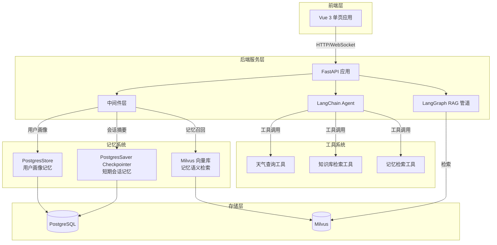
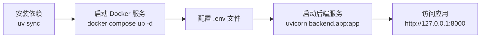

SuperMew 是一个基于 LangChain Agent 与 LangGraph RAG 技术构建的智能对话系统实验项目。本项目作为学习和改进原始项目的实验场，系统性地探索了大语言模型 Agent 架构、三层记忆系统、混合检索以及 RAG 管道的最佳工程实践。项目名称中的 "Mew" 取自猫咪叫声，寓意系统如同灵动的小猫般具备智能交互能力。

Sources: [README.md](README.md#L1-L15), [CLAUDE.md](CLAUDE.md#L1-L10)

## 系统架构总览

SuperMew 采用分层架构设计，将对话引擎、记忆系统、检索系统与外部工具解耦分离。整个系统由 FastAPI 后端服务驱动，通过 LangChain Agent 协调用户对话与各类工具的交互，配合 Milvus 向量数据库实现语义检索，PostgreSQL 数据库持久化会话状态与用户画像。



Sources: [backend/app.py](backend/app.py#L1-L62), [backend/agent.py](backend/agent.py#L1-L50)

## 技术栈概览

项目选用现代化的技术栈组合，在保证功能完整性的同时注重开发效率与可维护性。以下是各层级的技术选型详情：

| 层级 | 技术选型 | 用途说明 |
|------|----------|----------|
| **后端框架** | FastAPI | 高性能异步 API 框架，支持自动文档生成 |
| **Agent 框架** | LangChain + LangGraph | Agent 编排与状态机工作流管理 |
| **对话模型** | OpenAI 兼容 API | 支持 SiliconFlow 等第三方服务商 |
| **向量数据库** | Milvus v2.5 | 混合检索与向量相似度计算 |
| **关系数据库** | PostgreSQL 16 | 会话持久化与用户画像存储 |
| **前端框架** | Vue 3 (CDN) | 响应式单页应用，无需构建工具 |
| **文档处理** | PyMuPDF / python-docx | PDF 与 Word 文档解析 |
| **容器化** | Docker Compose | Milvus 与 PostgreSQL 服务编排 |

Sources: [docker-compose.yml](docker-compose.yml#L1-L94), [backend/config.py](backend/config.py#L1-L58)

## 核心能力矩阵

SuperMew 项目围绕四大核心能力进行构建，每项能力都对应具体的技术实现模块：

| 能力维度 | 核心特性 | 技术实现 |
|----------|----------|----------|
| **Agent 智能体** | 多工具协调、对话记忆、会话持久化 | `agent.py` + `tools.py` |
| **三层记忆架构** | 短期会话、用户画像、语义记忆 | `middleware.py` + `memory_vector_store.py` |
| **RAG 检索系统** | 混合检索、Auto-merging、查询重写 | `rag_pipeline.py` + `milvus_client.py` |
| **文档处理** | 多格式支持、三级分块、向量化存储 | `document_loader.py` + `milvus_writer.py` |

Sources: [backend/rag_pipeline.py](backend/rag_pipeline.py#L1-L100), [backend/middleware.py](backend/middleware.py#L1-L100)

## 项目目录结构

项目采用前后端分离的目录结构，后端代码组织遵循功能模块化原则：

```
SuperMew/
├── backend/                      # 后端核心代码
│   ├── app.py                   # FastAPI 应用入口
│   ├── agent.py                 # Agent 实例与检查点管理
│   ├── api.py                   # REST API 路由定义
│   ├── config.py                # 环境配置与参数管理
│   ├── middleware.py            # 中间件：记忆摘要、用户画像、系统提示词
│   ├── tools.py                 # Agent 可调用工具集
│   ├── rag_pipeline.py         # LangGraph RAG 工作流
│   ├── rag_utils.py            # 检索工具、查询重写、HyDE 生成
│   ├── embedding.py            # 向量化服务（稠密+BM25稀疏）
│   ├── milvus_client.py        # Milvus 混合检索客户端
│   ├── milvus_writer.py        # 向量数据写入器
│   ├── memory_vector_store.py  # 记忆向量存储管理
│   ├── parent_chunk_store.py    # 父级分块文档存储
│   ├── document_loader.py       # PDF/Word 文档解析
│   ├── schemas.py              # Pydantic 数据模型
│   └── soul/
│       └── soul.md             # Agent 系统提示词
├── frontend/                    # 前端单页应用
│   ├── index.html              # 页面入口
│   ├── script.js               # Vue 3 应用逻辑
│   └── style.css               # 样式表
├── docker-compose.yml          # Milvus + PostgreSQL 服务编排
├── .env.example                # 环境变量模板
└── main.py                     # 应用启动入口
```

Sources: [CLAUDE.md](CLAUDE.md#L10-L30)

## 快速启动流程

项目提供了简洁的本地部署方式，支持使用 `uv` 包管理器或传统 `pip` 进行依赖安装：



项目依赖 Python 3.12+ 版本，Docker Compose 用于启动 Milvus 向量数据库与 PostgreSQL 数据库。详细的环境配置步骤请参考 [快速启动](2-kuai-su-qi-dong) 页面。

Sources: [README.md](README.md#L17-L50)

## 关键创新亮点

SuperMew 项目在工程实践中积累了多项技术创新，这些设计决策均基于实际评测数据的验证：

| 创新点 | 实现方式 | 解决的问题 |
|--------|----------|------------|
| **三层记忆架构** | PostgresSaver + PostgresStore + Milvus | 兼顾上下文、结构和语义检索 |
| **自动摘要钩子** | `@after_model` 装饰器 + LLM 提取 | 无需手动触发自动总结 |
| **用户画像持久化** | LLM 结构化提取 + PostgresStore | 跨会话记住用户信息 |
| **混合检索落地** | 稠密向量 + BM25 稀疏向量 + RRF | 兼顾语义与关键词匹配 |
| **三级分块 + Auto-merging** | 叶子块检索 + 父块合并 | 平衡精确度与上下文完整性 |
| **流式输出** | SSE + ReadableStream | 打字机效果的实时响应 |
| **查询重写体系** | Step-Back + HyDE 策略路由 | 提升模糊/复杂查询的检索效果 |

Sources: [README.md](README.md#L60-L80)

## 评测实验结果

项目使用 CMRC 2018、CMRC 2019 和 HotpotQA 公开数据集对 RAG 检索模块进行了系统性消融评测，主要发现如下：

| 实验结论 | 数据支撑 | 工程意义 |
|----------|----------|----------|
| RRF(k=60) 融合已足够强 | Cross-Encoder 重排无额外收益 | 减少外部 API 依赖 |
| Auto-merge 对填空题有正向作用 | CMRC 2019 禁用后 MRR 下降 13.7% | 上下文扩展是关键 |
| HyDE 未带来正向收益 | 三个数据集 MRR 均轻微下降 | 假设文档引入语义偏差 |

详细评测数据与分析请参考 [评测指标说明](17-ping-ce-zhi-biao-shuo-ming) 页面。

Sources: [README.md](README.md#L100-L140)

## 下一步学习路径

完成本页面阅读后，建议按照以下顺序继续深入学习：

| 顺序 | 页面 | 内容预告 |
|------|------|----------|
| 1 | [快速启动](2-kuai-su-qi-dong) | 本地部署的具体操作步骤 |
| 2 | [环境准备与依赖安装](3-huan-jing-zhun-bei-yu-yi-lai-an-zhuang) | Python 环境、uv 包管理、Docker 配置 |
| 3 | [系统架构总览](5-xi-tong-jia-gou-zong-lan) | 完整的技术架构图与模块关系 |
| 4 | [三层记忆架构](6-san-ceng-ji-yi-jia-gou) | 深入理解记忆系统的设计原理 |