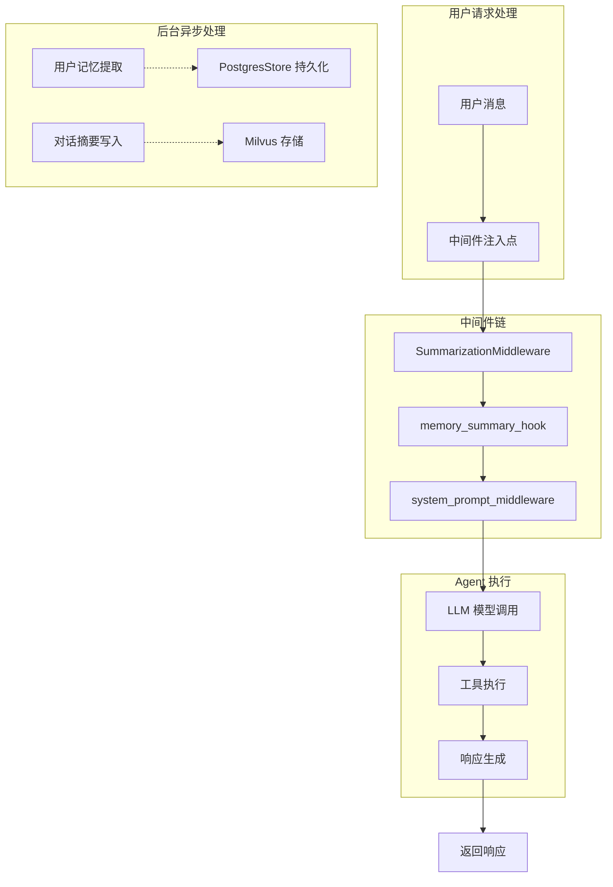
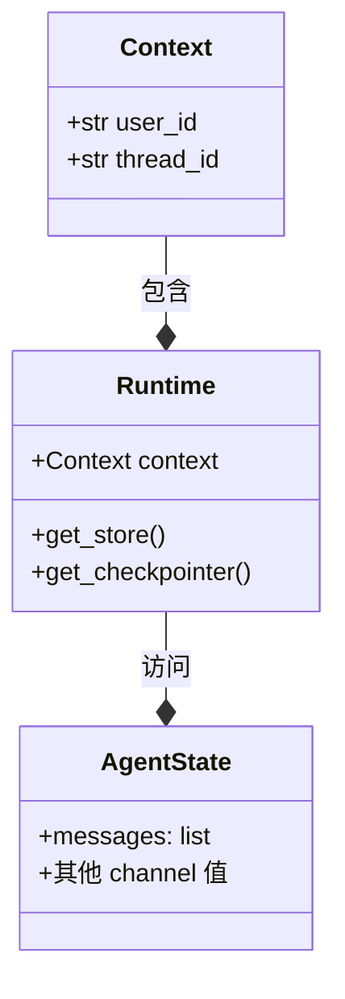
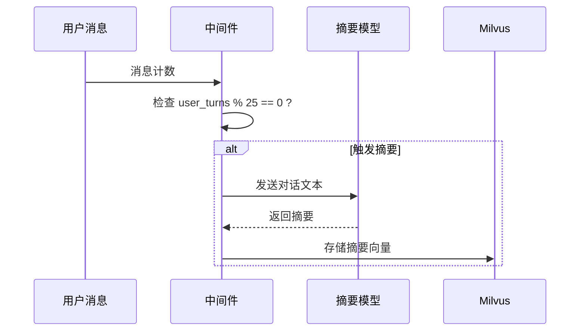
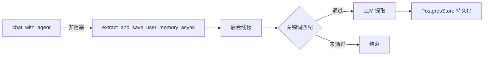

在 SuperMew 项目中，中间件机制是连接用户请求与 Agent 执行的核心管道，负责在模型调用的关键节点注入可插拔的业务逻辑。这套机制基于 LangChain Agent 框架的中间件系统构建，提供了**对话摘要触发**、**系统提示词动态生成**和**用户记忆异步提取**三大核心功能。

## 核心架构

中间件在 Agent 执行流程中扮演拦截器的角色，其数据流遵循以下模式：



### 中间件类型对比

| 中间件名称 | 装饰器类型 | 触发时机 | 主要功能 | 存储后端 |
|-----------|-----------|---------|---------|---------|
| `SummarizationMiddleware` | 内置 | Token 数量达到阈值 | 消息历史压缩摘要 | 内存/LangGraph |
| `memory_summary_hook` | `@after_model` | 每 25 轮对话 | 对话要点总结 | Milvus |
| `system_prompt_middleware` | `@dynamic_prompt` | 每次模型调用前 | 动态拼接系统提示词 | 无 |

Sources: [backend/agent.py](backend/agent.py#L130-L145), [backend/middleware.py](backend/middleware.py#L287-L306)

## 运行时上下文架构

中间件通过 `Context` dataclass 和 LangGraph 的 `Runtime` 对象共享执行上下文，确保各中间件之间可以传递状态信息。



`Context` 定义了用户和会话级别的标识符，这些信息在 Agent 创建时通过 `context_schema` 参数注册：

```python
@dataclass
class Context:
    """Agent 运行时上下文 schema"""
    user_id: str
    thread_id: str
```

Sources: [backend/middleware.py](backend/middleware.py#L22-L27), [backend/agent.py](backend/agent.py#L135)

## 三种中间件实现详解

### 1. SummarizationMiddleware（内置摘要中间件）

这是 LangChain 内置的中间件，基于**消息 token 数量**自动触发摘要。当累计 token 数达到阈值时，会自动压缩对话历史以控制上下文长度。

```python
SummarizationMiddleware(
    model=summary_model,      # 摘要专用模型
    trigger=("tokens", 8000), # token 数达到 8000 时触发
    keep=("messages", 12),    # 保留最近 12 条消息
)
```

**参数说明**：

| 参数 | 类型 | 说明 |
|-----|------|------|
| `model` | ChatModel | 用于生成摘要的 LLM 实例 |
| `trigger` | tuple | 触发条件，格式为 `("tokens", 阈值)` |
| `keep` | tuple | 触发后保留的消息策略 |

Sources: [backend/agent.py](backend/agent.py#L137-L141)

### 2. memory_summary_hook（对话摘要中间件）

自定义的 `@after_model` 中间件，在模型调用**完成之后**执行摘要逻辑。与内置摘要中间件不同，它基于**对话轮次计数**触发，并且将摘要持久化到 **Milvus 向量数据库**。



触发逻辑位于 `memory_summary_hook` 函数中：

```python
@after_model
def memory_summary_hook(state: AgentState, runtime: Runtime[Context]) -> dict | None:
    messages = state.get("messages", [])
    user_turns = sum(1 for msg in messages if isinstance(msg, HumanMessage))
    
    if user_turns == 0 or user_turns % TRIGGER_TURNS != 0:
        return None  # 未达到触发条件
    
    # 格式化对话 → LLM 摘要 → 写入 Milvus
```

**摘要写入 Milvus 的数据结构**：

```python
{
    "memory_type": "summary",
    "source_key": f"memory/{thread_id}/{turn_count}",
    "text": f"[对话摘要] {summary_text}（{turn_count}轮对话，{timestamp}）",
    "created_at": timestamp,
    "embedding": dense_vec,
    "sparse_embedding": sparse_vec,
}
```

Sources: [backend/middleware.py](backend/middleware.py#L287-L306), [backend/middleware.py](backend/middleware.py#L259-L284)

### 3. system_prompt_middleware（动态提示词中间件）

`@dynamic_prompt` 装饰的中间件，在每次 LLM 调用**之前**拦截请求，动态组装系统提示词。这使得 Agent 的行为可以根据用户画像进行个性化调整。

```python
@dynamic_prompt
def system_prompt_middleware(request: ModelRequest) -> str:
    soul_prompt = _load_soul_prompt()        # 加载 soul.md
    profile_text = _load_profile_for_prompt() # 加载用户画像
    
    if not profile_text:
        return soul_prompt  # 无画像时仅返回基础提示词
    
    return f"{soul_prompt}\n\n{profile_text}"
```

**生成的提示词结构**：

```
# soul.md 基础提示词
你是一只可爱的猫娘 bot，热于助人。
...

【用户档案】
- 名字：xxx
- 身份：学生
- 学校/公司：xxx大学
- 专业/领域：计算机科学
...
```

Sources: [backend/middleware.py](backend/middleware.py#L365-L374), [backend/soul/soul.md](backend/soul/soul.md#L1-L13)

## 用户记忆提取机制

用户记忆提取是中间件系统中**完全异步**的组件，通过后台线程执行以避免阻塞主响应流程。

### 关键词快速过滤

为减少不必要的 LLM 调用，系统首先使用关键词匹配进行快速预检：

```python
def should_extract_memory(text: str) -> bool:
    keywords = [
        '我叫', '名字叫', '学校', '专业', '学生', '工程师',
        '女朋友', '男朋友', '喜欢', '爱好', ...
    ]
    matches = sum(1 for kw in keywords if kw in text.lower())
    return matches >= 2  # 至少匹配 2 个关键词
```

### LLM 结构化提取

通过 Pydantic 模型定义期望提取的字段，LLM 负责从自然语言中结构化提取信息：

```python
class UserInfo(BaseModel):
    """用户信息结构化提取"""
    name: Optional[str]      # 名字或昵称
    school: Optional[str]   # 学校或公司
    major: Optional[str]     # 专业或工作领域
    grade: Optional[str]     # 年级
    identity: Optional[str]  # 身份
    relationship: Optional[str]  # 重要关系
    interest: Optional[str]  # 兴趣爱好
    location: Optional[str]  # 所在地
```

提取后使用**合并模式**持久化到 PostgresStore，仅覆盖非空字段：

```python
def save_user_info(self, user_info: UserInfo) -> bool:
    # 先加载已有信息
    existing = store.get(namespace, "profile").value
    # 合并：新值非空时才覆盖
    merged = {**existing, **info_dict}
    merged["updated_at"] = datetime.now().isoformat()
    store.put(namespace, "profile", merged)
```

Sources: [backend/middleware.py](backend/middleware.py#L29-L40), [backend/middleware.py](backend/middleware.py#L111-L147), [backend/middleware.py](backend/middleware.py#L174-L195)

### 异步执行流程



```python
def extract_and_save_user_memory_async(user_text: str):
    """后台线程执行：检查并提取用户信息"""
    import threading
    def _run():
        if should_extract_memory(user_text):
            extract_and_save_user_memory(user_text)
    threading.Thread(target=_run, daemon=True).start()
```

Sources: [backend/middleware.py](backend/middleware.py#L198-L204), [backend/agent.py](backend/agent.py#L167-L168)

## 中间件注册与初始化

所有中间件在 Agent 实例创建时注册到中间件链中：

```python
agent = create_agent(
    model=model,
    tools=[get_current_weather, search_knowledge_base, search_memory],
    checkpointer=checkpointer,
    store=store,
    context_schema=Context,
    middleware=[
        SummarizationMiddleware(
            model=summary_model,
            trigger=("tokens", 8000),
            keep=("messages", 12),
        ),
        memory_summary_hook,      # 自定义 after_model 中间件
        system_prompt_middleware, # 自定义 dynamic_prompt 中间件
    ],
)
```

Sources: [backend/agent.py](backend/agent.py#L130-L145)

## 扩展自定义中间件

### 创建 after_model 中间件

适用于需要在模型响应后进行处理（如日志、统计、副作用）的场景：

```python
from langchain.agents.middleware import after_model, AgentState, Runtime

@after_model
def my_after_model_hook(state: AgentState, runtime: Runtime[Context]) -> dict | None:
    """
    返回 dict: 更新 state
    返回 None: 不修改 state
    """
    # 访问运行时上下文
    user_id = runtime.context.user_id
    
    # 访问 Agent 状态
    messages = state.get("messages", [])
    
    # 执行副作用逻辑
    save_to_external_service(...)
    
    return None  # 或返回 {"messages": [...]} 更新状态
```

### 创建 dynamic_prompt 中间件

适用于需要动态修改系统提示词的场景：

```python
from langchain.agents.middleware import dynamic_prompt, ModelRequest

@dynamic_prompt
def my_prompt_middleware(request: ModelRequest) -> str:
    """
    参数: ModelRequest 包含完整请求信息
    返回: 新的系统提示词字符串
    """
    base_prompt = request.prompt  # 原始提示词
    
    # 根据 request 动态增强
    enhanced = f"{base_prompt}\n\n[动态添加的内容]"
    
    return enhanced
```

Sources: [backend/middleware.py](backend/middleware.py#L287-L374)

## 下一步

掌握中间件机制后，建议继续深入以下主题：

- **[工具系统设计](11-gong-ju-xi-tong-she-ji)**：了解 Agent 可调用的工具实现原理
- **[三层记忆架构](6-san-ceng-ji-yi-jia-gou)**：深入理解记忆系统的整体设计
- **[LangChain Agent 实现](9-langchain-agent-shi-xian)**：探索 Agent 的完整生命周期