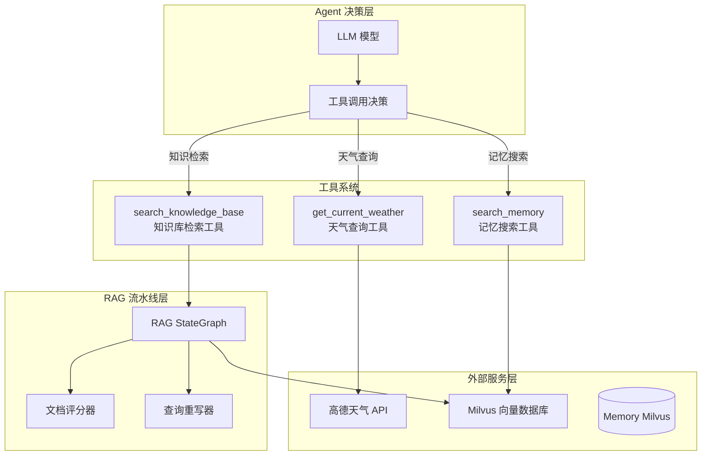
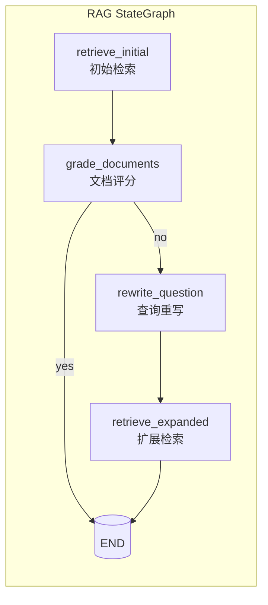

工具系统是 SuperMew Agent 实现外部能力扩展的核心模块，负责将各类外部服务（天气 API、知识库检索、记忆搜索）以标准化的工具接口暴露给 LangChain Agent。本页将深入解析工具的定义机制、注册流程、调用防护以及与 RAG 流水线的协作方式。

## 系统架构概览

工具系统在 SuperMew 中的定位介于 Agent 决策层与外部服务层之间。当 Agent 判断需要调用外部能力时，工具系统负责解析工具描述、执行具体逻辑、并返回结构化结果。



**核心文件关联**：
- 工具定义：[backend/tools.py](backend/tools.py#L1-L206)
- Agent 注册：[backend/agent.py](backend/agent.py#L130-L145)
- RAG 流水线：[backend/rag_pipeline.py](backend/rag_pipeline.py#L357-L380)

## 工具定义与注册机制

### LangChain @tool 装饰器

SuperMew 基于 LangChain Core 的 `@tool` 装饰器定义工具，这种方式确保了工具具备标准的函数签名和可被 LLM 理解的 JSON Schema 描述。

```python
@tool("search_knowledge_base")
def search_knowledge_base(query: str) -> str:
    """Search for information in the knowledge base using hybrid retrieval (dense + sparse vectors)."""
    # ... 工具实现
```

LangChain 会自动从函数签名 (`query: str`) 和文档字符串生成工具的 JSON Schema，LLM 即可根据此描述决定何时调用工具。

### 工具注册流程

工具在 Agent 实例化时通过 `create_agent()` 函数注册：

```python
agent = create_agent(
    model=model,
    tools=[get_current_weather, search_knowledge_base, search_memory],  # 工具列表
    checkpointer=checkpointer,
    store=store,
    context_schema=Context,
    middleware=[...],
)
```

Sources: [backend/agent.py](backend/agent.py#L130-L145)

## 内置工具详解

### 天气查询工具

`get_current_weather` 工具封装了高德地图天气 API，提供实时天气和天气预报查询能力。

**功能特性**：
- 支持实时天气 (`extensions=base`) 和天气预报 (`extensions=all`) 两种模式
- 自动校验 API 配置，未配置时返回友好提示
- 完整的异常处理（超时、网络错误、数据解析错误）

**参数说明**：

| 参数 | 类型 | 默认值 | 说明 |
|------|------|--------|------|
| location | str | 必填 | 查询城市名称 |
| extensions | str | "base" | 查询类型：`base` 实时天气，`all` 天气预报 |

Sources: [backend/tools.py](backend/tools.py#L62-L120)

### 知识库检索工具

`search_knowledge_base` 是 RAG 系统的核心入口工具，通过调用 `run_rag_graph()` 启动完整的检索-评估-重写流程。

**调用防护机制**：为避免单轮对话中无限调用知识库造成资源浪费，工具内部实现了严格的调用计数守卫：

```python
@tool("search_knowledge_base")
def search_knowledge_base(query: str) -> str:
    global _KNOWLEDGE_TOOL_CALLS_THIS_TURN
    if _KNOWLEDGE_TOOL_CALLS_THIS_TURN >= 1:
        return (
            "TOOL_CALL_LIMIT_REACHED: search_knowledge_base has already been called once in this turn. "
            "Use the existing retrieval result and provide the final answer directly."
        )
    _KNOWLEDGE_TOOL_CALLS_THIS_TURN += 1
    # ... 实际检索逻辑
```

每轮对话开始时通过 `reset_tool_call_guards()` 重置计数：

```python
def reset_tool_call_guards():
    """每轮对话开始时重置工具调用计数。"""
    global _KNOWLEDGE_TOOL_CALLS_THIS_TURN
    _KNOWLEDGE_TOOL_CALLS_THIS_TURN = 0
```

Sources: [backend/tools.py](backend/tools.py#L166-L206)

### 记忆搜索工具

`search_memory` 工具提供跨会话的对话历史检索能力，使用混合检索（稠密向量 + 稀疏向量）结合 RRF 融合策略。

**检索流程**：
1. 生成查询的稠密向量表示和稀疏向量表示
2. 调用 `MemoryVectorStore.hybrid_search()` 执行混合检索
3. 格式化结果返回给 Agent

```python
@tool("search_memory")
def search_memory(query: str) -> str:
    store = MemoryVectorStore()
    store.init_collection()
    embedder = EmbeddingService()
    
    dense_vec = embedder.get_embeddings([query])[0]
    sparse_vec = embedder.get_sparse_embedding(query)
    results = store.hybrid_search(dense_vec, sparse_vec, top_k=MEMORY_TOP_K)
    
    # 格式化返回结果...
```

Sources: [backend/tools.py](backend/tools.py#L123-L163)

## RAG 流水线协作

### LangGraph StateGraph 架构

`search_knowledge_base` 工具调用的 `run_rag_graph()` 函数构建了一个基于 LangGraph 的状态机流水线：



**状态定义**：

```python
class RAGState(TypedDict):
    question: str           # 原始问题
    query: str              # 处理后的查询
    context: str            # 格式化后的上下文
    docs: List[dict]        # 检索到的文档列表
    route: Optional[str]    # 路由决策
    expansion_type: Optional[str]    # 扩展策略
    expanded_query: Optional[str]   # 扩展后的查询
    step_back_question: Optional[str]
    step_back_answer: Optional[str]
    hypothetical_doc: Optional[str]
    rag_trace: Optional[dict]  # 追踪信息
```

Sources: [backend/rag_pipeline.py](backend/rag_pipeline.py#L69-L82)

### 查询扩展策略

RAG 流水线支持三种查询扩展策略，由路由器模型动态选择：

| 策略 | 适用场景 | 核心机制 |
|------|----------|----------|
| `step_back` | 包含具体名称、日期等细节的问题 | 生成抽象的"退步问题"理解通用概念 |
| `hyde` | 模糊、概念性、需要解释的问题 | 生成假设性文档辅助检索 |
| `complex` | 多步骤、需要综合多种信息的复杂问题 | 同时执行 step_back 和 hyde |

**策略选择 Prompt**：

```python
prompt = (
    "请根据用户问题选择最合适的查询扩展策略，仅输出策略名。\n"
    "- step_back：包含具体名称、日期、代码等细节，需要先理解通用概念的问题。\n"
    "- hyde：模糊、概念性、需要解释或定义的问题。\n"
    "- complex：多步骤、需要分解或综合多种信息的复杂问题。\n"
    f"用户问题：{question}"
)
```

Sources: [backend/rag_pipeline.py](backend/rag_pipeline.py#L186-L205)

### 检索追踪机制

RAG 流水线通过 `emit_rag_step()` 向前端实时推送检索进度：

```python
def emit_rag_step(icon: str, label: str, detail: str = ""):
    """向队列发送一个 RAG 检索步骤。支持跨线程安全调用。"""
    global _RAG_STEP_QUEUE, _RAG_STEP_LOOP
    if _RAG_STEP_QUEUE is not None and _RAG_STEP_LOOP is not None:
        step = {"icon": icon, "label": label, "detail": detail}
        try:
            if not _RAG_STEP_LOOP.is_closed():
                _RAG_STEP_LOOP.call_soon_threadsafe(_RAG_STEP_QUEUE.put_nowait, step)
        except Exception:
            pass
```

工具层和 RAG 流水线层均使用此机制报告进度：

```python
emit_rag_step("🔍", "正在检索知识库...", f"查询: {query[:50]}")
emit_rag_step("🧱", "三级分块检索", f"叶子层 L{level} 召回，候选 {candidate_k}")
emit_rag_step("📊", "正在评估文档相关性...")
emit_rag_step("✏️", "正在重写查询...")
```

Sources: [backend/tools.py](backend/tools.py#L50-L59), [backend/rag_pipeline.py](backend/rag_pipeline.py#L96-L148)

## 工具调用生命周期

### 对话轮次初始化

每次用户发起对话时，系统会执行完整的工具调用状态初始化：

```python
def chat_with_agent(user_text: str, user_id: str = "default_user", session_id: str = "default_session"):
    config = {"configurable": {"thread_id": f"{user_id}_{session_id}"}, "recursion_limit": 8}
    
    # 清理可能残留的 RAG 上下文，避免跨请求污染
    get_last_rag_context(clear=True)
    reset_tool_call_guards()
    
    # ... Agent 调用
```

Sources: [backend/agent.py](backend/agent.py#L155-L178)

### 响应结果封装

工具执行结果通过 `rag_trace` 结构传递给前端，用于展示详细的检索过程：

```python
return {
    "response": response_content,
    "rag_trace": rag_trace,  # 包含扩展策略、检索模式、重排信息等
}
```

Sources: [backend/agent.py](backend/agent.py#L197-L200)

## 扩展工具指南

如需为 SuperMew 添加新的外部工具，建议遵循以下模式：

1. **使用 `@tool` 装饰器定义工具函数**
2. **添加中文描述供 LLM 理解使用场景**
3. **如需防护机制，使用全局计数器模式**
4. **通过 `emit_rag_step()` 报告执行进度（可选）**

```python
from langchain_core.tools import tool

@tool("my_custom_tool")
def my_custom_tool(param: str) -> str:
    """描述此工具的用途和使用场景，LLM 会根据此描述决定是否调用。"""
    # 工具实现
    result = do_something(param)
    emit_rag_step("🔧", "自定义工具执行中...", param)
    return result
```

然后在 `create_agent_instance()` 中将新工具添加到列表：

```python
agent = create_agent(
    model=model,
    tools=[get_current_weather, search_knowledge_base, search_memory, my_custom_tool],
    # ...
)
```

## 下一步

完成工具系统学习后，建议继续以下页面：

- [中间件机制](10-zhong-jian-jian-ji-zhi) — 了解工具系统与中间件的协作方式
- [混合检索原理](12-hun-he-jian-suo-yuan-li) — 深入理解知识库检索的技术细节
- [LangChain Agent 实现](9-langchain-agent-shi-xian) — 掌握 Agent 的完整实现