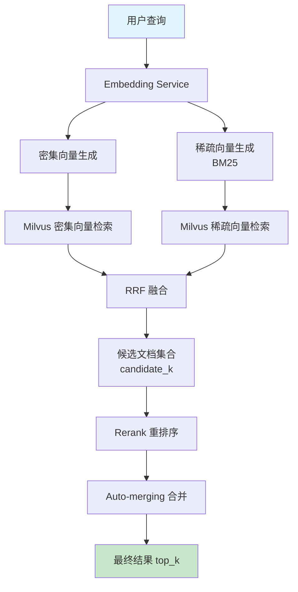
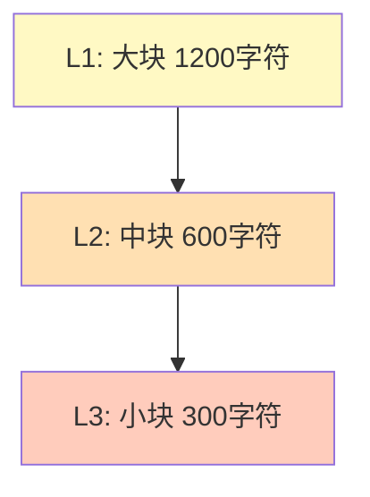
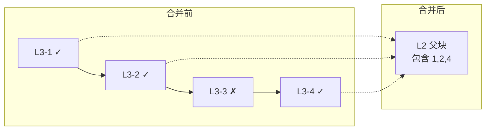
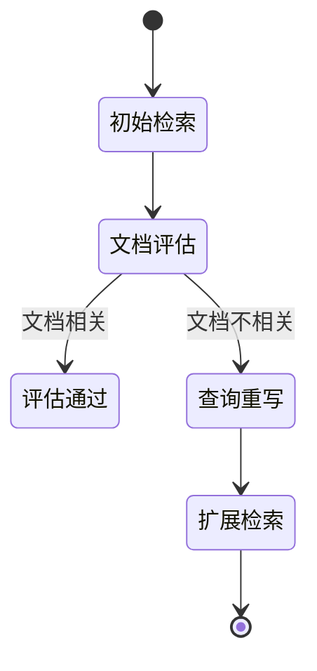

混合检索是 SuperMew RAG 系统中最核心的检索策略，通过融合**语义相似度检索**与**关键词匹配检索**，实现对用户查询的全面文档召回。本页面详细解析从查询向量化到最终结果返回的完整技术链路。

## 核心架构概览

混合检索系统由多个组件协同工作完成查询处理。下图展示从用户输入到最终结果的全流程：



## 双路向量检索机制

混合检索的核心在于同时维护**密集向量**和**稀疏向量**两种检索通道。Milvus 集合的 schema 设计体现了这一理念。

### 密集向量（语义检索）

密集向量由 embedding 模型将文本转换为高维浮点数向量。本系统使用 Qwen3-Embedding-4B 模型生成 2560 维的密集向量，能够捕捉文本的深层语义关系。向量化服务通过调用远程 API 完成文本到向量的转换，支持批量处理以提高效率。

```python
# backend/milvus_client.py#L15-L27
def init_collection(self, dense_dim: int = 2560):
    schema.add_field("dense_embedding", DataType.FLOAT_VECTOR, dim=dense_dim)
    # 密集向量索引 - 使用 HNSW（更适合混合检索）
    index_params.add_index(
        field_name="dense_embedding",
        index_type="HNSW",
        metric_type="IP",
        params={"M": 16, "efConstruction": 256}
    )
```

密集向量检索使用 HNSW（Hierarchical Navigable Small World）索引算法，通过度量向量的内积（IP）计算相似度。HNSW 算法在召回率和检索速度之间取得了良好的平衡，适合高维向量的近似最近邻搜索。

Sources: [milvus_client.py](backend/milvus_client.py#L15-L27)

### 稀疏向量（关键词检索）

稀疏向量采用 BM25（Best Matching 25）算法生成。BM25 是一种经典的信息检索模型，通过统计词频（TF）和逆文档频率（IDF）计算每个词对文档的贡献度。稀疏向量以 `{index: score}` 的字典形式存储，仅记录非零权重的词项。

```python
# backend/embedding.py#L113-L148
def get_sparse_embedding(self, text: str) -> dict:
    tokens = self.tokenize(text)
    doc_len = len(tokens)
    tf = Counter(tokens)
    
    for token, freq in tf.items():
        # 计算 IDF
        df = self._doc_freq.get(token, 0)
        idf = math.log((self._total_docs - df + 0.5) / (df + 0.5) + 1)
        
        # 计算 BM25 分数
        numerator = freq * (self.k1 + 1)
        denominator = freq + self.k1 * (1 - self.b + self.b * doc_len / max(self._avg_doc_len, 1))
        score = idf * numerator / denominator
```

BM25 的参数 k1（词频饱和参数）和 b（文档长度归一化参数）分别设为 1.5 和 0.75，这两个值在大多数场景下表现稳定。稀疏向量使用 `SPARSE_INVERTED_INDEX` 索引类型，专门优化稀疏向量的倒排索引查询。

Sources: [embedding.py](backend/embedding.py#L113-L148)

## RRF 融合算法

当查询同时执行密集向量和稀疏向量检索后，系统使用 **RRF（Reciprocal Rank Fusion）** 算法将两组结果融合为单一排序列表。RRF 的核心思想是：对同一文档在不同检索通道中的排名取倒数并求和，排名越高（即名次越靠前），贡献的分数越大。

```python
# backend/milvus_client.py#L154-L163
# 使用 RRF 排序算法融合结果
reranker = RRFRanker(k=rrf_k)

results = self.client.hybrid_search(
    collection_name=self.collection_name,
    reqs=[dense_search, sparse_search],
    ranker=reranker,
    limit=top_k,
    output_fields=output_fields
)
```

RRF 算法中参数 `k` 默认为 60，其作用是平滑不同排名之间的差异。k 值越大，高排名文档的优势越被稀释；k 值越小，排名越靠前的文档优势越明显。Milvus 客户端通过 `RRFRanker` 类实现该算法，无需手动计算。

Sources: [milvus_client.py](backend/milvus_client.py#L154-L163)

## 三层分块与层级检索

系统采用三层滑动窗口分块策略，将文档按层级组织为父子关系。这种设计使得检索可以先在细粒度层快速定位相关片段，再通过合并操作获取更大上下文。



### 分块层级关系

| 层级 | 分块大小 | 父级引用 | 用途 |
|------|----------|----------|------|
| L1 | ~1200 字符 | 无（根节点） | 提供完整段落上下文 |
| L2 | ~600 字符 | L1 | 段落内主题聚合 |
| L3 | ~300 字符 | L2 | 精确匹配与细粒度检索 |

每个分块通过 `chunk_id`、`parent_chunk_id` 和 `root_chunk_id` 建立层级关联。分块 ID 采用 `{filename}::p{page}::l{level}::{index}` 的命名格式，便于追溯来源。

```python
# backend/document_loader.py#L39-L41
@staticmethod
def _build_chunk_id(filename: str, page_number: int, level: int, index: int) -> str:
    return f"{filename}::p{page_number}::l{level}::{index}"
```

Sources: [document_loader.py](backend/document_loader.py#L39-L41)

### 层级检索配置

检索时默认从 L3（叶子层）开始，配置文件通过 `LEAF_RETRIEVE_LEVEL` 环境变量控制。这一设计确保细粒度检索的高召回率：

```python
# backend/rag_utils.py#L241
filter_expr = f"chunk_level == {LEAF_RETRIEVE_LEVEL}"
```

## Auto-merging 合并机制

Auto-merging 是混合检索流程中的关键后处理步骤。当多个相邻的 L3 分块都被检索命中的，系统会将它们合并到对应的父级 L2/L1 块，以提供更完整的上下文。



合并逻辑通过 `_merge_to_parent_level` 函数实现，仅当同一父块的子块命中数达到阈值（默认 `AUTO_MERGE_THRESHOLD=2`）时才触发合并：

```python
# backend/rag_utils.py#L31-L70
def _merge_to_parent_level(docs: List[dict], threshold: int = 2) -> Tuple[List[dict], int]:
    groups: Dict[str, List[dict]] = defaultdict(list)
    for doc in docs:
        parent_id = (doc.get("parent_chunk_id") or "").strip()
        if parent_id:
            groups[parent_id].append(doc)

    merge_parent_ids = [parent_id for parent_id, children in groups.items() if len(children) >= threshold]
    if not merge_parent_ids:
        return docs, 0

    parent_docs = _parent_chunk_store.get_documents_by_ids(merge_parent_ids)
    parent_map = {item.get("chunk_id", ""): item for item in parent_docs if item.get("chunk_id")}
```

合并采用两阶段执行：L3 → L2 → L1。这意味着如果多个 L2 块都达到合并阈值，它们会被进一步合并到 L1 父块。整个过程的合并步数记录在 `auto_merge_steps` 元数据中。

Sources: [rag_utils.py](backend/rag_utils.py#L31-L70)

## 完整检索流程

`retrieve_documents` 函数是检索流程的入口，整合了向量化、混合检索、重排序和合并的全过程：

```python
# backend/rag_utils.py#L237-L259
def retrieve_documents(query: str, top_k: int = 5, milvus_manager=None, candidate_k: int = None) -> Dict[str, Any]:
    mm = milvus_manager or _milvus_manager
    if candidate_k is None:
        candidate_k = max(top_k * 3, top_k)  # 候选数量放大以保证合并后仍有足够结果
    filter_expr = f"chunk_level == {LEAF_RETRIEVE_LEVEL}"
    
    # 1. 向量化查询
    dense_embeddings = _embedding_service.get_embeddings([query])
    dense_embedding = dense_embeddings[0]
    sparse_embedding = _embedding_service.get_sparse_embedding(query)

    # 2. 混合检索
    retrieved = mm.hybrid_retrieve(
        dense_embedding=dense_embedding,
        sparse_embedding=sparse_embedding,
        top_k=candidate_k,
        filter_expr=filter_expr,
    )
    
    # 3. 重排序
    reranked, rerank_meta = _rerank_documents(query=query, docs=retrieved, top_k=top_k)
    
    # 4. Auto-merging 合并
    merged_docs, merge_meta = _auto_merge_documents(docs=reranked, top_k=top_k)
    
    return {"docs": merged_docs, "meta": {**rerank_meta, **merge_meta}}
```

关键参数说明：

| 参数 | 默认值 | 说明 |
|------|--------|------|
| `top_k` | 5 | 最终返回的文档数量 |
| `candidate_k` | max(top_k*3, top_k) | 候选放大因子，确保合并后仍有足够结果 |
| `rrf_k` | 60 | RRF 融合参数，控制排名平滑度 |
| `AUTO_MERGE_THRESHOLD` | 2 | 触发合并的最小子块命中数 |

## 重排序与降级策略

### 外部重排序

检索结果会经过可选的重排序阶段。如果配置了 `RERANK_MODEL` 和 `RERANK_BINDING_HOST`，系统会将候选文档发送给重排序模型进行语义级别的二次排序：

```python
# backend/rag_utils.py#L100-L155
def _rerank_documents(query: str, docs: List[dict], top_k: int) -> Tuple[List[dict], Dict[str, Any]]:
    payload = {
        "model": RERANK_MODEL,
        "query": query,
        "documents": [doc.get("text", "") for doc in docs],
        "top_n": min(top_k, len(docs)),
    }
    response = requests.post(rerank_endpoint, headers=headers, json=payload, timeout=15)
    items = response.json().get("results", [])
```

重排序使用 Qwen/Qwen3-Reranker-4B 模型，返回每个文档与查询的相关性分数，按分数从高到低重新排列。

### 降级回退

当混合检索失败时，系统会自动降级为纯密集向量检索：

```python
# backend/rag_utils.py#L261-L275
try:
    # 混合检索（密集 + 稀疏）
    retrieved = mm.hybrid_retrieve(...)
except Exception:
    # 降级：仅使用密集向量
    retrieved = mm.dense_retrieve(
        dense_embedding=dense_embedding,
        top_k=candidate_k,
        filter_expr=filter_expr,
    )
    rerank_meta["retrieval_mode"] = "dense_fallback"
```

降级模式将 `retrieval_mode` 设置为 `dense_fallback`，便于后续监控和调试。

## 与 RAG Pipeline 的集成

在 RAG 流程中，初始检索通过 `retrieve_initial` 节点完成。如果文档相关性评估未通过，管道会触发查询重写和扩展检索：



扩展检索阶段支持三种策略：Step-back（退步问题）、HyDE（假设性文档）和 Complex（复合策略）。各策略产生的额外查询会与原始查询一起执行多路召回，最终合并去重。

---

## 下一步

完成混合检索原理的学习后，建议继续深入以下内容：

- [Auto-merging 分块合并](13-auto-merging-fen-kuai-he-bing) — 深入了解层级合并的实现细节与调优策略
- [向量化服务](15-xiang-liang-hua-fu-wu) — 查看 embedding 模型的具体配置与批量处理优化
- [Milvus 集合管理](16-milvus-ji-he-guan-li) — 了解向量索引的选型与性能调优