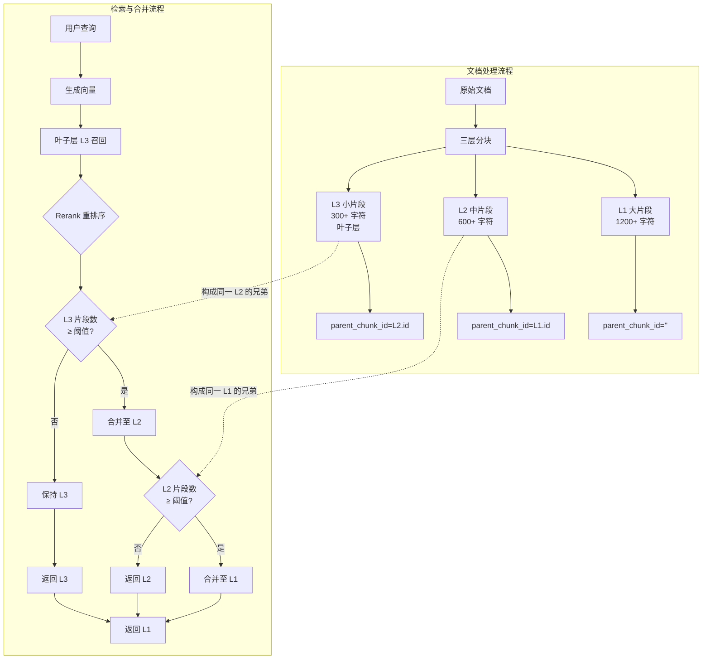

Auto-merging 分块合并是 SuperMew RAG 系统中实现**层级化上下文恢复**的核心机制。它通过三层嵌套分块结构，在检索时智能地将多个相关小片段"合并"为更大的父级片段，从而在精确匹配与语义完整性之间取得平衡。

## 架构概览

Auto-merging 系统的核心设计理念是**"先精确召回，再智能扩展"**。系统在文档入库时建立三层嵌套的分块层级，在检索时从最小的叶子层（L3）开始召回，再根据相关性阈值决定是否向上合并为更大的父级片段。

