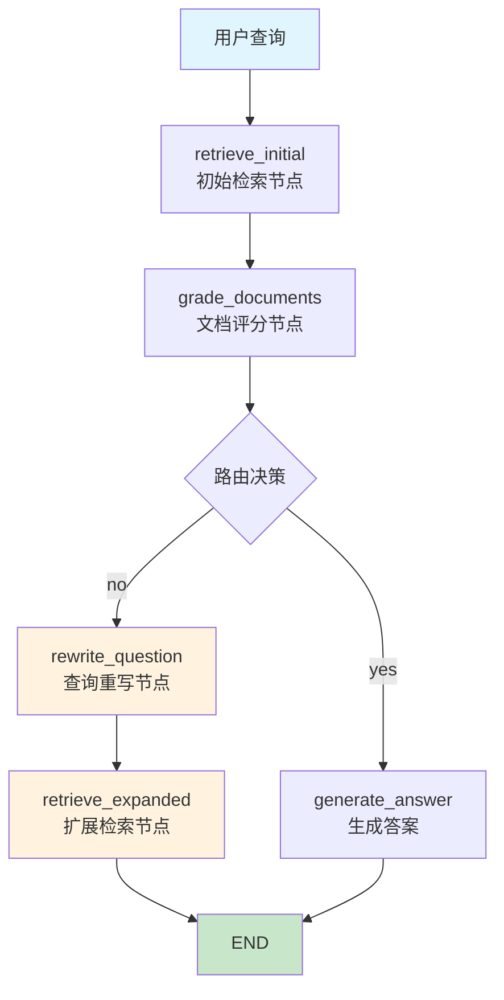
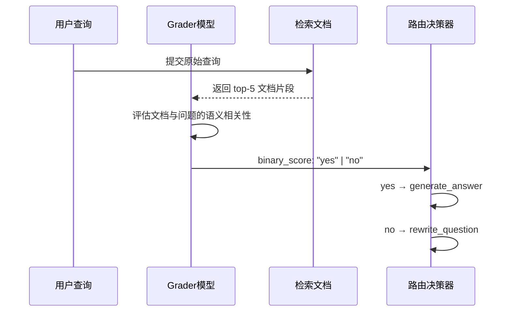
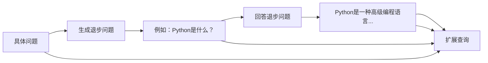
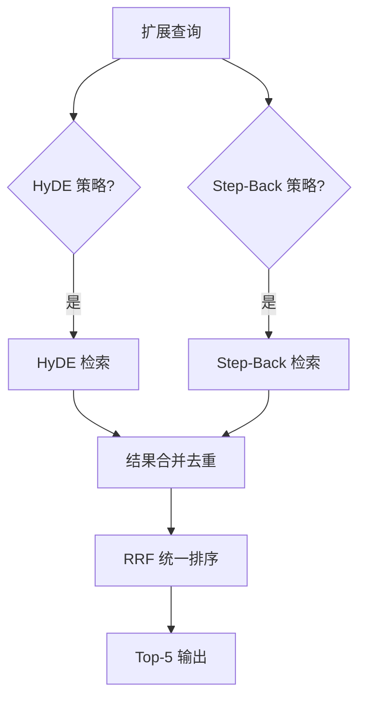
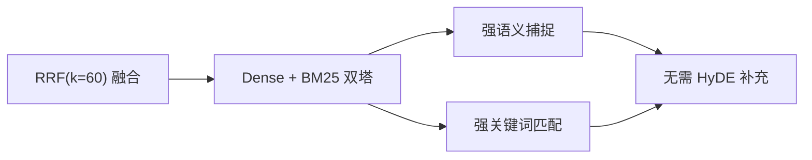

本页面详细说明 SuperMew 系统中**查询重写（Query Rewrite）**与**查询路由（Query Routing）**的实现机制。这是 RAG 检索流程中的关键环节，负责在初始检索结果不佳时，通过智能策略扩展和优化查询语句，从而提升检索质量。

## 系统架构总览

查询重写与路由模块基于 **LangGraph 状态机**构建，采用**条件分支路由**机制实现自适应检索策略选择。该模块与 [混合检索原理](12-hun-he-jian-suo-yuan-li) 中的 RRF 融合技术协同工作，构成完整的检索增强管道。



**核心设计原则**：首次检索优先使用原始查询，仅在评分节点判定相关性不足时触发重写策略，避免不必要的 LLM 调用开销。

Sources: [rag_pipeline.py](backend/rag_pipeline.py#L1-L100)

---

## RAG 状态架构

系统定义了 `RAGState` 数据结构来追踪整个检索流程的中间状态：

```python
class RAGState(TypedDict):
    question: str           # 原始用户问题
    query: str              # 当前使用的查询语句
    context: str            # 格式化后的上下文
    docs: List[dict]         # 检索到的文档列表
    route: Optional[str]     # 当前路由决策
    expansion_type: Optional[str]  # 选用的扩展策略
    expanded_query: Optional[str]  # 扩展后的查询
    step_back_question: Optional[str]  # 退步问题
    step_back_answer: Optional[str]    # 退步答案
    hypothetical_doc: Optional[str]   # HyDE 假设文档
    rag_trace: Optional[dict]          # 完整追踪信息
```

**状态流转特性**：
- **可逆性**：重写后的扩展查询不会覆盖原始查询，保留完整审计能力
- **可追踪**：通过 `rag_trace` 字段记录每个阶段的决策依据和中间产物
- **可回退**：当所有扩展策略均失败时，可回退到初始检索结果

Sources: [rag_pipeline.py](backend/rag_pipeline.py#L58-L80)

---

## 文档评分节点

### 评分机制

`grade_documents_node` 使用独立的 **Grader 模型** 对初始检索结果进行二元相关性评分：



**评分提示词模板**：
```
You are a grader assessing relevance of a retrieved document to a user question.
Here is the retrieved document: {context}
Here is the user question: {question}
If the document contains keyword(s) or semantic meaning related to the user question,
grade it as relevant. Give a binary score 'yes' or 'no'.
```

**评分结果映射**：
| 评分结果 | 路由目标 | 说明 |
|----------|----------|------|
| `yes` | `generate_answer` | 直接进入答案生成阶段 |
| `no` | `rewrite_question` | 触发查询重写流程 |

当 Grader 模型未配置时，系统默认判定为 `no`，强制进入重写流程以确保检索质量。

Sources: [rag_pipeline.py](backend/rag_pipeline.py#L98-L135)

---

## 查询重写节点

### 策略选择器

`rewrite_question_node` 是查询重写的核心节点，负责根据问题特征智能选择最优扩展策略：

```python
class RewriteStrategy(BaseModel):
    """选择查询扩展策略"""
    strategy: Literal["step_back", "hyde", "complex"]
```

**三种扩展策略对比**：

| 策略 | 适用场景 | 核心原理 | LLM 调用次数 |
|------|----------|----------|--------------|
| `step_back` | 包含具体名称、日期、代码等细节的问题 | 生成抽象退步问题，理解底层概念 | 2次（退步+回答） |
| `hyde` | 模糊、概念性、需要解释定义的问题 | 生成假设性文档作为检索锚点 | 1次（假设文档） |
| `complex` | 多步骤、需分解或综合的复杂问题 | 同时执行 step_back + hyde | 3次 |

**策略选择提示词**：
```
请根据用户问题选择最合适的查询扩展策略，仅输出策略名。
- step_back：包含具体名称、日期、代码等细节，需要先理解通用概念的问题。
- hyde：模糊、概念性、需要解释或定义的问题。
- complex：多步骤、需要分解或综合多种信息的复杂问题。
用户问题：{question}
```

当 Router 模型不可用时，系统默认降级为 `step_back` 策略。

Sources: [rag_pipeline.py](backend/rag_pipeline.py#L137-L180), [rag_pipeline.py](backend/rag_pipeline.py#L210-L235)

---

## 扩展策略详解

### Step-Back 策略

**Step-Back Expansion**（退步扩展）通过将具体问题抽象为更高层次的通用问题来增强检索：

```python
def step_back_expand(query: str) -> dict:
    step_back_question = _generate_step_back_question(query)
    step_back_answer = _answer_step_back_question(step_back_question)
    expanded_query = f"{query}\n\n退步问题：{step_back_question}\n退步问题答案：{step_back_answer}"
    return {...}
```

**工作流程**：



**退步问题生成提示词**：
```
请将用户的具体问题抽象成更高层次、更概括的"退步问题"，
用于探寻背后的通用原理或核心概念。只输出退步问题一句话，不要解释。
```

**退步答案生成提示词**：
```
请简要回答以下退步问题，提供通用原理/背景知识，
控制在120字以内。只输出答案，不要列出推理过程。
```

Sources: [rag_utils.py](backend/rag_utils.py#L118-L170)

### HyDE 策略

**Hypothetical Document Embeddings**（假设性文档嵌入）通过 LLM 生成"理想答案文档"来引导检索：

```python
def generate_hypothetical_document(query: str) -> str:
    prompt = (
        "请基于用户问题生成一段'假设性文档'，内容应像真实资料片段，"
        "用于帮助检索相关信息。文档可以包含合理推测，但需与问题语义相关。"
        "只输出文档正文，不要标题或解释。\n"
        f"用户问题：{query}"
    )
    return model.invoke(prompt).content
```

**HyDE 的设计假设**：
- 生成的假设文档在语义空间上与真实相关文档更接近
- 通过"答案猜测"可以弥合查询与文档之间的语义鸿沟

Sources: [rag_utils.py](backend/rag_utils.py#L206-L225)

### Complex 复合策略

对于多跳问答等复杂问题，系统采用 **Step-Back + HyDE** 双重扩展：

```python
if strategy in ("hyde", "complex"):
    hypothetical_doc = generate_hypothetical_document(question)
    
if strategy in ("step_back", "complex"):
    step_back = step_back_expand(question)
    expanded_query = step_back.get("expanded_query")
```

复合策略会同时生成：
1. 假设性文档（用于 HyDE 检索）
2. 退步问题与答案（用于 Step-Back 检索）
3. 两路检索结果合并后统一去重排序

Sources: [rag_pipeline.py](backend/rag_pipeline.py#L237-L280)

---

## 扩展检索节点

`retrieve_expanded` 节点执行扩展查询的多路检索与结果融合：



**结果合并策略**：
- 多路检索结果按 `(filename, page_number, text)` 三元组去重
- 使用 `rrf_rank` 字段统一重排，避免出现 1,2,3,4,5,4,5 之类的重复排名
- 记录每路检索的详细元数据（auto_merge、rerank 等）

Sources: [rag_pipeline.py](backend/rag_pipeline.py#L280-L360)

---

## 评测实验与结论

### 实验配置

系统在三个标准数据集上进行了系统性的查询重写效果评测：

| 数据集 | 任务类型 | Query-Doc Gap | 预期 HyDE 效果 |
|--------|----------|---------------|----------------|
| CMRC 2018 | 阅读理解 | 小 | 负向 |
| CMRC 2019 | 填空题 | 小 | 负向 |
| HotpotQA | 多跳问答 | 大 | 待验证 |

**评测配置**：
- 假设文档 → Hybrid Search → RRF(k=60, top-20) → Cross-Encoder rerank → Auto-merge → Top-5
- HyDE 模型：`zai-org/GLM-4.5-Air`（SiliconFlow）

### 实验结果

**CMRC 2018 阅读理解（n=87）**：

| 实验 | P@5 | R@5 | MRR | NDCG@5 |
|------|------|------|------|--------|
| Baseline | 0.2023 | 0.3343 | 0.5565 | 0.3143 |
| **HyDE** | 0.1977 | 0.3266 | 0.5523 | 0.3101 |
| 变化 | -2.3% | -2.3% | -0.8% | -1.3% |

**CMRC 2019 填空题（n=51）**：

| 实验 | P@5 | R@5 | MRR | NDCG@5 |
|------|------|------|------|--------|
| Baseline | 0.2510 | 0.3693 | 0.9314 | 0.4899 |
| **HyDE** | 0.2510 | 0.3693 | 0.9020 | 0.4797 |
| 变化 | 0% | 0% | -3.2% | -2.1% |

**HotpotQA 多跳问答（n=100）**：

| 实验 | P@5 | R@5 | MRR | NDCG@5 |
|------|------|------|------|--------|
| Baseline | 0.364 | 0.7575 | 0.7990 | 0.6955 |
| **HyDE** | 0.358 | 0.7425 | 0.7828 | 0.6837 |
| 变化 | -1.6% | -2.0% | -2.0% | -1.7% |

### 核心发现

**RRF(k=60) 融合已经是检索天花板**。无论数据集的 Query-Doc Gap 大小如何，HyDE 在当前检索配置下均未能带来正向收益。这一结论跨越了不同任务类型：



**可能原因**：
1. RRF(k=60) 融合已经足够强，HyDE 无法进一步提升
2. `zai-org/GLM-4.5-Air` 生成的假设文档质量不够高
3. 评测数据集的 query 与相关文档语义相关性本已较高

Sources: [eval_results/report-2026-04-03-hyde.md](eval_results/report-2026-04-03-hyde.md#L1-L90), [eval_results/report-2026-04-03-hotpotqa-hyde.md](eval_results/report-2026-04-03-hotpotqa-hyde.md#L1-L81)

---

## 配置参数说明

查询重写与路由模块通过环境变量进行配置：

| 参数 | 默认值 | 说明 |
|------|--------|------|
| `GRADE_MODEL` | `Qwen/Qwen3.5-122B-A10B` | 文档评分模型 |
| `MODEL` | `Qwen/Qwen3.5-122B-A10B` | 重写路由模型 |
| `AUTO_MERGE_ENABLED` | `true` | 是否启用自动合并 |
| `AUTO_MERGE_THRESHOLD` | `2` | 自动合并阈值 |
| `LEAF_RETRIEVE_LEVEL` | `3` | 叶子节点检索层级 |

Sources: [config.py](backend/config.py#L1-L58)

---

## 追踪与可观测性

系统通过 `emit_rag_step()` 函数提供实时的检索步骤追踪：

```python
def emit_rag_step(icon: str, label: str, detail: str = ""):
    """向队列发送一个 RAG 检索步骤"""
    step = {"icon": icon, "label": label, "detail": detail}
    _RAG_STEP_LOOP.call_soon_threadsafe(_RAG_STEP_QUEUE.put_nowait, step)
```

**追踪输出示例**：
```
🔍 正在检索知识库... 查询: Python是什么...
🧱 三级分块检索 叶子层 L3 召回，候选 15
🧩 Auto-merging 合并 启用: True，应用: True，替换片段: 2
✅ 检索完成，找到 5 个片段
📊 正在评估文档相关性...
⚠️ 文档相关性不足，将重写查询 评分: no
✏️ 正在重写查询...
🧠 使用策略: step_back 生成退步问题
📝 HyDE 假设性文档生成中...
🔄 使用扩展查询重新检索... 策略: complex
✅ 扩展检索完成，共 8 个片段
```

Sources: [tools.py](backend/tools.py#L48-L70)

---

## 与 Agent 的集成

查询重写模块通过 `search_knowledge_base` 工具与 LangChain Agent 集成：

```python
@tool("search_knowledge_base")
def search_knowledge_base(query: str) -> str:
    """使用混合检索搜索知识库"""
    rag_result = run_rag_graph(query)
    # ... 格式化输出
```

**集成流程**：
1. Agent 调用 `search_knowledge_base` 工具
2. 工具内部执行 `run_rag_graph()` 状态机
3. 状态机自动完成：初始检索 → 评分 → 条件路由 → 扩展检索
4. 最终结果通过 `_set_last_rag_context()` 保存追踪信息

Sources: [tools.py](backend/tools.py#L95-L140), [agent.py](backend/agent.py#L1-L100)

---

## 后续优化建议

基于当前评测结果，建议从以下方向优化查询重写模块：

| 优化方向 | 具体措施 | 预期收益 |
|----------|----------|----------|
| **HyDE 模型升级** | 尝试更大参数模型（Qwen3-72B、GPT-4o） | 提升假设文档质量 |
| **条件触发机制** | 仅在 Query-Doc Gap 较大时启用 HyDE | 减少不必要的 LLM 调用 |
| **策略组合优化** | HyDE + Step-Back 顺序调优 | 平衡语义扩展与概念理解 |
| **多跳场景专用** | 为 HotpotQA 等多跳数据集设计专用检索链 | 提升复杂推理场景效果 |

---

## 相关文档

- [混合检索原理](12-hun-he-jian-suo-yuan-li) — 了解 RRF 融合与混合检索机制
- [Auto-merging 分块合并](13-auto-merging-fen-kuai-he-bing) — 了解层级合并策略
- [向量化服务](15-xiang-liang-hua-fu-wu) — 了解 Embedding 服务配置
- [评测指标说明](17-ping-ce-zhi-biao-shuo-ming) — 了解 P@K、MRR、NDCG 等指标