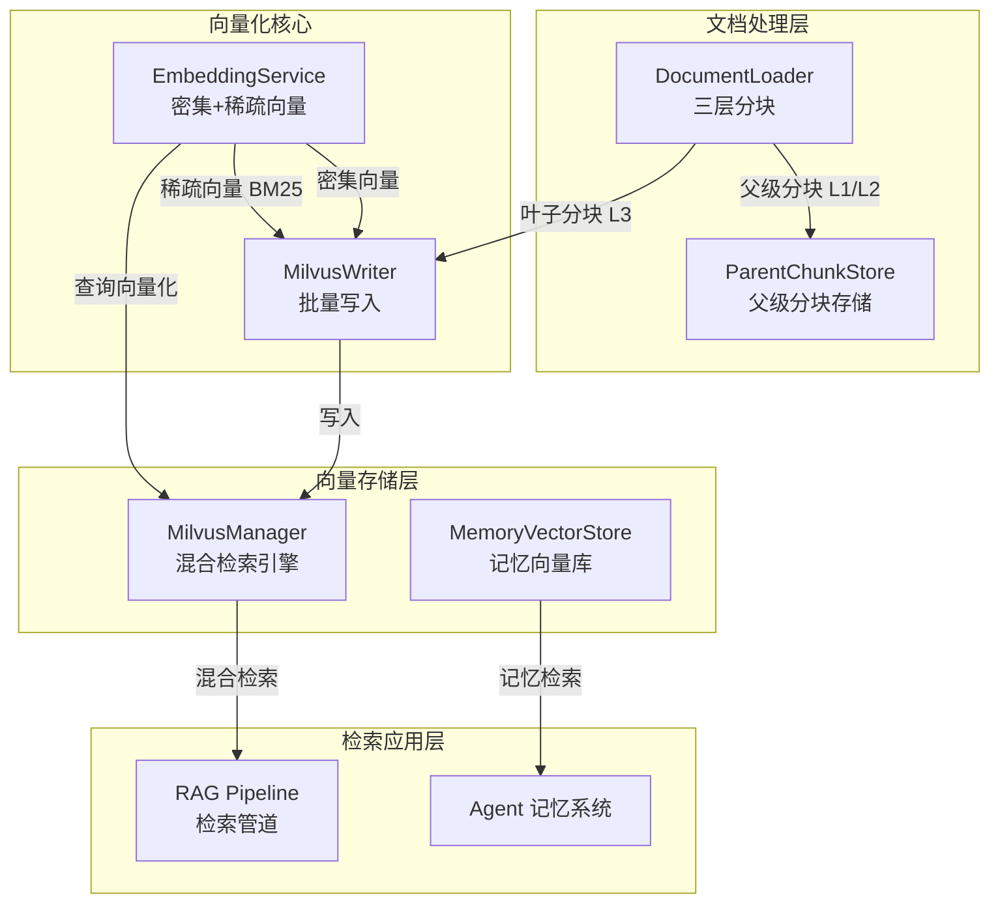
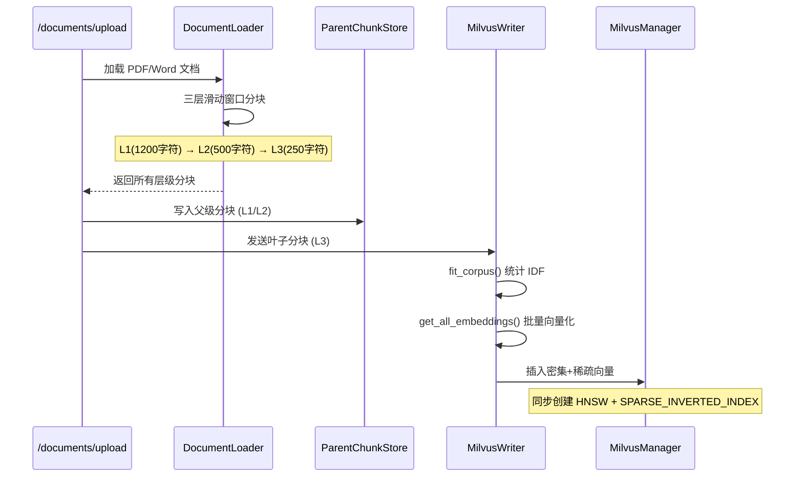
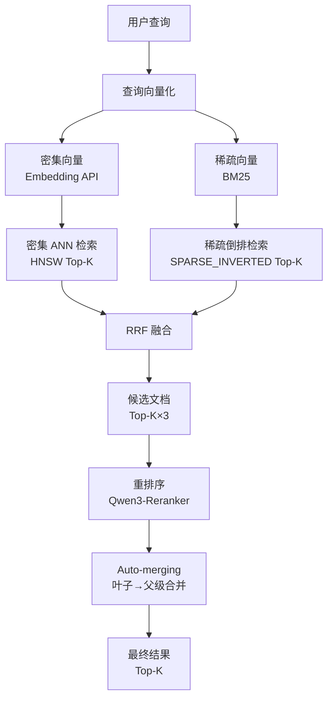

向量化服务是 SuperMew RAG 系统的核心基础设施，负责将文本内容转换为高维向量表示，支持语义相似度检索与关键词匹配的双轨检索能力。该服务采用**密集向量 + 稀疏向量混合检索**架构，通过 RRF（Reciprocal Rank Fusion）算法融合两种向量的检索结果，实现检索质量的显著提升。

## 系统架构总览

向量化服务由四个核心组件构成，形成完整的向量生成、存储与检索闭环。



Sources: [backend/embedding.py](backend/embedding.py#L1-L167), [backend/milvus_client.py](backend/milvus_client.py#L1-L243)

## 核心组件详解

### EmbeddingService — 文本向量化引擎

`EmbeddingService` 类实现文本的双轨向量化方案，同时生成用于语义匹配的**密集向量**和用于关键词匹配的**稀疏向量**。

#### 密集向量生成

密集向量通过调用外部嵌入 API 生成，支持 Qwen3-Embedding-4B 等主流嵌入模型。服务通过 HTTP POST 请求将文本批量发送到嵌入端点，接收高维浮点向量表示。

```python
def get_embeddings(self, texts: list[str]) -> list[list[float]]:
    headers = {
        "Authorization": f"Bearer {self.api_key}",
        "Content-Type": "application/json"
    }
    data = {
        "model": self.embedder,
        "input": texts,
        "encoding_format": "float"
    }
    response = requests.post(f"{self.base_url}/embeddings", headers=headers, json=data)
    return [item["embedding"] for item in response.json()["data"]]
```
Sources: [backend/embedding.py](backend/embedding.py#L31-L53)

#### 稀疏向量生成（BM25）

稀疏向量基于经典 BM25 算法实现，适用于精确关键词匹配场景。系统首先通过 `fit_corpus()` 方法统计语料库的 IDF（逆文档频率），然后对单条文本计算 BM25 分数。

BM25 的核心公式为：

```
score = IDF(token) × (tf × (k1 + 1)) / (tf + k1 × (1 - b + b × doc_len / avg_doc_len))
```

其中关键参数配置为：`k1 = 1.5`（词频饱和参数）、`b = 0.75`（文档长度归一化参数）。稀疏向量以字典格式返回，键为词汇表索引，值为 BM25 分数。

Sources: [backend/embedding.py](backend/embedding.py#L18-L149)

#### 混合分词器

系统实现了一套支持中英文混合的分词器，采用字符级中文切分和单词级英文切分的策略。

```python
def tokenize(self, text: str) -> list[str]:
    tokens = []
    chinese_pattern = re.compile(r'[\u4e00-\u9fff]')  # Unicode 中文字符范围
    english_pattern = re.compile(r'[a-zA-Z]+')
    # 中文字符单独成 token，英文单词按正则匹配提取
```
Sources: [backend/embedding.py](backend/embedding.py#L55-L87)

### MilvusManager — 混合检索引擎

`MilvusManager` 封装了 Milvus 向量数据库的操作，提供集合管理、混合检索和降级检索能力。

#### 集合 schema 设计

主集合 `embeddings_collection` 的 schema 同时容纳密集向量和稀疏向量字段：

| 字段名 | 数据类型 | 说明 |
|--------|----------|------|
| `dense_embedding` | FLOAT_VECTOR (dim=2560) | 密集语义向量 |
| `sparse_embedding` | SPARSE_FLOAT_VECTOR | 稀疏 BM25 向量 |
| `text` | VARCHAR (2000) | 原始文本内容 |
| `filename` | VARCHAR (255) | 源文件名 |
| `chunk_id` | VARCHAR (512) | 分块唯一标识 |
| `parent_chunk_id` | VARCHAR (512) | 父级分块 ID（Auto-merging 用） |
| `root_chunk_id` | VARCHAR (512) | 根分块 ID |
| `chunk_level` | INT64 | 分块层级 (1/2/3) |

Sources: [backend/milvus_client.py](backend/milvus_client.py#L15-L69)

#### 双索引策略

为密集向量和稀疏向量分别创建了专用索引：

```python
# 密集向量：HNSW 索引（支持高效 ANN 检索）
index_params.add_index(
    field_name="dense_embedding",
    index_type="HNSW",
    metric_type="IP",  # 内积度量
    params={"M": 16, "efConstruction": 256}
)

# 稀疏向量：SPARSE_INVERTED_INDEX（倒排索引）
index_params.add_index(
    field_name="sparse_embedding",
    index_type="SPARSE_INVERTED_INDEX",
    metric_type="IP",
    params={"drop_ratio_build": 0.2}
)
```
Sources: [backend/milvus_client.py](backend/milvus_client.py#L46-L63)

#### 混合检索实现

混合检索通过 Milvus 的 `hybrid_search` 方法实现，同时发起密集向量 ANN 搜索和稀疏向量搜索请求，然后使用 RRF 算法融合结果。

```python
def hybrid_retrieve(self, dense_embedding, sparse_embedding, top_k=5, rrf_k=60):
    # 构建密集向量搜索请求
    dense_search = AnnSearchRequest(
        data=[dense_embedding],
        anns_field="dense_embedding",
        param={"metric_type": "IP", "params": {"ef": 64}},
        limit=top_k * 2,
    )
    
    # 构建稀疏向量搜索请求
    sparse_search = AnnSearchRequest(
        data=[sparse_embedding],
        anns_field="sparse_embedding",
        param={"metric_type": "IP", "params": {"drop_ratio_search": 0.2}},
        limit=top_k * 2,
    )
    
    # RRF 融合（k=60 为默认融合参数）
    reranker = RRFRanker(k=rrf_k)
    return self.client.hybrid_search(reqs=[dense_search, sparse_search], ranker=reranker)
```
Sources: [backend/milvus_client.py](backend/milvus_client.py#L107-L163)

**RRF 融合公式**：`score(doc) = Σ 1/(k + rank_i(doc))`，其中 `k` 为融合参数（默认60），`rank_i` 为各检索引擎的结果排名。

### MilvusWriter — 文档向量化写入器

`MilvusWriter` 协调文档的批量向量化与写入流程，确保向量生成的语料一致性。

```python
def write_documents(self, documents: list[dict], batch_size: int = 50):
    self.milvus_manager.init_collection()
    
    # 先拟合语料库（计算全局 IDF）
    all_texts = [doc["text"] for doc in documents]
    self.embedding_service.fit_corpus(all_texts)
    
    # 分批处理
    for i in range(0, total, batch_size):
        batch = documents[i:i + batch_size]
        texts = [doc["text"] for doc in batch]
        
        # 同时生成密集和稀疏向量
        dense_embeddings, sparse_embeddings = self.embedding_service.get_all_embeddings(texts)
        
        # 构造插入数据并写入
        self.milvus_manager.insert(insert_data)
```
Sources: [backend/milvus_writer.py](backend/milvus_writer.py#L13-L54)

关键设计点：**先 fit_corpus 再生成向量**。通过预先统计语料库的文档频率，确保所有文档的 BM25 稀疏向量使用统一的 IDF 值，保证相对公平的可比性。

### MemoryVectorStore — 记忆向量存储

独立的记忆向量库专门用于存储用户画像和会话摘要等记忆信息，采用与主知识库相同的混合检索架构，但使用独立的 collection。

```python
class MemoryVectorStore:
    def __init__(self, collection_name="user_memory"):
        self.collection_name = collection_name
        self.client = MilvusClient(uri=f"http://{host}:{port}")
    
    def hybrid_search(self, dense_embedding, sparse_embedding, top_k=5):
        # 与主检索库相同的 RRF 融合逻辑
```
Sources: [backend/memory_vector_store.py](backend/memory_vector_store.py#L1-L144)

## 向量化流程

### 文档上传与向量化

文档上传后经过完整的向量化流程：



Sources: [backend/api.py](backend/api.py#L197-L251)

### 查询向量化与检索

用户查询的处理流程包含查询向量化、混合检索、重排序和 Auto-merging 四个阶段：



Sources: [backend/rag_utils.py](backend/rag_utils.py#L237-L296)

## 配置参数

向量化服务的关键配置项位于 `backend/config.py`：

| 配置项 | 默认值 | 说明 |
|--------|--------|------|
| `EMBEDDER` | `Qwen/Qwen3-Embedding-4B` | 嵌入模型 |
| `MILVUS_HOST` | `127.0.0.1` | Milvus 服务地址 |
| `MILVUS_PORT` | `19530` | Milvus 端口 |
| `MILVUS_COLLECTION` | `embeddings_collection` | 主集合名称 |
| `MEMORY_COLLECTION_NAME` | `user_memory` | 记忆集合名称 |
| `MEMORY_TOP_K` | `5` | 记忆检索候选数 |
Sources: [backend/config.py](backend/config.py#L1-L58)

## 相关文档

- [混合检索原理](12-hun-he-jian-suo-yuan-li) — 深入理解 RRF 融合与混合检索策略
- [Auto-merging 分块合并](13-auto-merging-fen-kuai-he-bing) — 三层分块与智能合并机制
- [Milvus 集合管理](16-milvus-ji-he-guan-li) — 集合的生命周期管理与监控