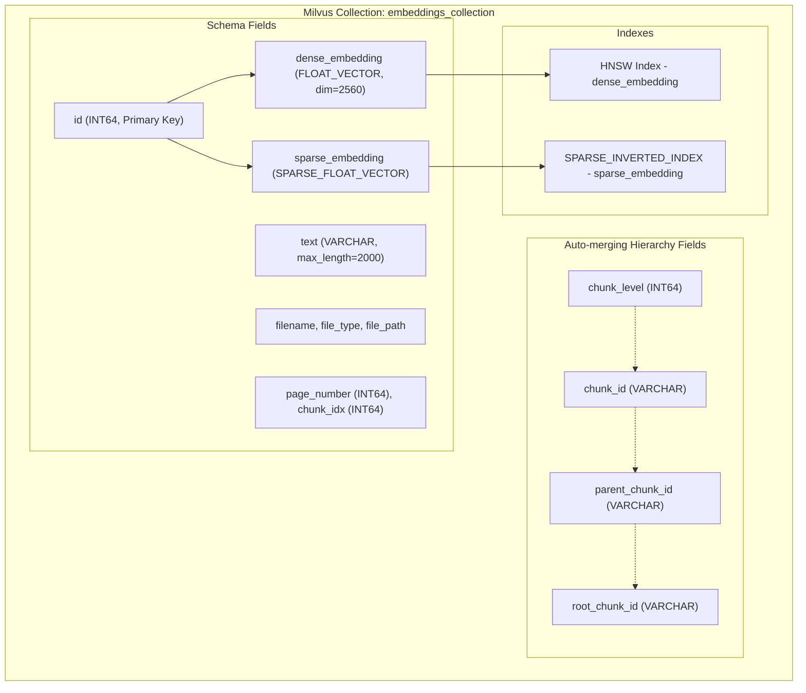
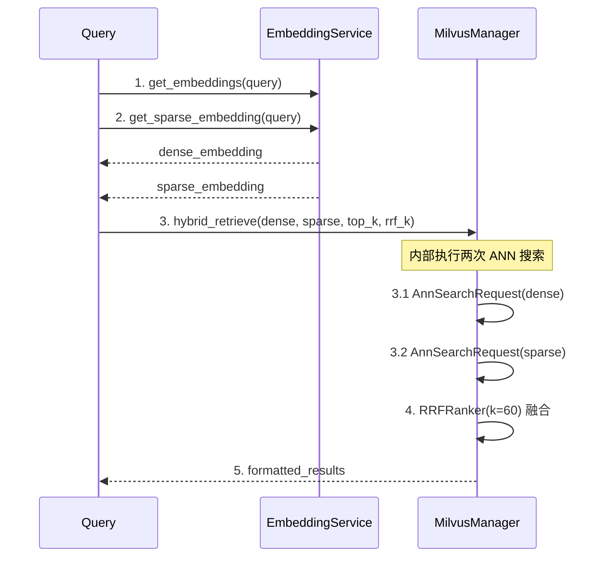
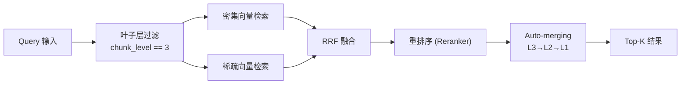

本文档详细介绍 SuperMew 项目中 Milvus 向量数据库的集合设计、Schema 定义、索引配置以及与检索系统的集成关系。该集合采用**密集向量 + 稀疏向量混合检索架构**，同时支持 [Auto-merging 分块合并](13-auto-merging-fen-kuai-he-bing) 功能所需的三层级联关系存储。

## 集合架构概览



## Schema 设计详解

### 核心字段定义

Milvus 集合 Schema 在 `MilvusManager.init_collection()` 方法中初始化，包含两大类字段：

**向量字段**用于语义检索，定义于 [milvus_client.py 第 21-30 行](backend/milvus_client.py#L21-L30)：

| 字段名 | 数据类型 | 维度/长度 | 用途说明 |
|--------|----------|-----------|----------|
| `dense_embedding` | FLOAT_VECTOR | 2560 | 来自 Embedding 模型的密集向量，捕捉语义相似性 |
| `sparse_embedding` | SPARSE_FLOAT_VECTOR | 动态 | BM25 稀疏向量，捕捉关键词匹配能力 |

**元数据字段**用于文档溯源，定义于 [milvus_client.py 第 32-38 行](backend/milvus_client.py#L32-L38)：

| 字段名 | 数据类型 | 最大长度 | 用途说明 |
|--------|----------|----------|----------|
| `text` | VARCHAR | 2000 | 文档片段原始文本内容 |
| `filename` | VARCHAR | 255 | 源文件名 |
| `file_type` | VARCHAR | 50 | 文件类型（PDF/Word） |
| `file_path` | VARCHAR | 1024 | 完整文件路径 |
| `page_number` | INT64 | - | 页码 |
| `chunk_idx` | INT64 | - | 全局分块索引 |

### Auto-merging 层级的支撑字段

为支持三级分块合并，系统定义了层级关系字段，定义于 [milvus_client.py 第 40-44 行](backend/milvus_client.py#L40-L44)：

| 字段名 | 数据类型 | 层级含义 |
|--------|----------|----------|
| `chunk_id` | VARCHAR | 当前分块唯一标识 |
| `parent_chunk_id` | VARCHAR | 父级分块 ID（L3→L2→L1） |
| `root_chunk_id` | VARCHAR | 根级分块 ID（L1 的 chunk_id） |
| `chunk_level` | INT64 | 层级标识：1=L1大块, 2=L2中块, 3=L3小块 |

分块 ID 生成规则在 [document_loader.py 第 40-41 行](backend/document_loader.py#L40-L41) 定义：

```python
chunk_id = f"{filename}::p{page_number}::l{level}::{index}"
# 示例: "技术文档.pdf::p3::l2::5"
```

检索时通过 `filter_expr` 仅查询叶子层（L3），合并逻辑利用父子关系向上聚合，详见 [Auto-merging 分块合并](13-auto-merging-fen-kuai-he-bing)。

## 索引配置

### 双索引策略

系统为两种向量分别创建索引，优化不同的检索场景：

**密集向量索引**配置于 [milvus_client.py 第 50-55 行](backend/milvus_client.py#L50-L55)：

```python
index_params.add_index(
    field_name="dense_embedding",
    index_type="HNSW",
    metric_type="IP",
    params={"M": 16, "efConstruction": 256}
)
```

**稀疏向量索引**配置于 [milvus_client.py 第 57-63 行](backend/milvus_client.py#L57-L63)：

```python
index_params.add_index(
    field_name="sparse_embedding",
    index_type="SPARSE_INVERTED_INDEX",
    metric_type="IP",
    params={"drop_ratio_build": 0.2}
)
```

### 索引参数解析

| 参数 | 密集向量 | 稀疏向量 | 说明 |
|------|----------|----------|------|
| `index_type` | HNSW | SPARSE_INVERTED_INDEX | HNSW 适合高维稠密向量；倒排索引适合稀疏 BM25 向量 |
| `metric_type` | IP | IP | 内积相似度，值越大相似度越高 |
| `M` | 16 | - | HNSW 图的邻居数，影响精度与内存平衡 |
| `efConstruction` | 256 | - | 构建时的搜索范围，影响索引质量 |
| `drop_ratio_build` | - | 0.2 | 构建时丢弃 20% 的低权重词项，减少噪音 |

## 集合生命周期管理

### 初始化流程

集合初始化由 `MilvusWriter.write_documents()` 方法触发，流程定义于 [milvus_writer.py 第 22 行](backend/milvus_writer.py#L22)：

```python
self.milvus_manager.init_collection()
```

完整写入流程包括：

1. **集合初始化检查** — `has_collection()` 判断是否已存在
2. **语料库拟合** — `embedding_service.fit_corpus()` 计算全局 IDF
3. **批量向量化** — 同时生成密集向量和稀疏向量
4. **数据插入** — `milvus_manager.insert()` 批量写入

### 集合存在性检查

集合查询方法定义于 [milvus_client.py 第 235-237 行](backend/milvus_client.py#L235-L237)：

```python
def has_collection(self) -> bool:
    """检查集合是否存在"""
    return self.client.has_collection(self.collection_name)
```

### 集合删除

集合删除方法定义于 [milvus_client.py 第 239-242 行](backend/milvus_client.py#L239-L242)，用于重建 Schema：

```python
def drop_collection(self):
    """删除集合（用于重建 schema）"""
    if self.client.has_collection(self.collection_name):
        self.client.drop_collection(self.collection_name)
```

## 检索操作

### 混合检索机制

混合检索使用 RRF（Reciprocal Rank Fusion）算法融合密集向量和稀疏向量的检索结果，核心实现于 [milvus_client.py 第 107-183 行](backend/milvus_client.py#L107-L183)。

**检索流程**：



### RRF 参数说明

| 参数 | 默认值 | 作用 |
|------|--------|------|
| `top_k` | 5 | 返回结果数量 |
| `rrf_k` | 60 | RRF 排名算法的平滑参数，影响多候选结果融合时的排序稳定性 |
| `ef` | 64 | HNSW 搜索时的动态搜索范围 |
| `drop_ratio_search` | 0.2 | 搜索时忽略低权重词项的比例 |

### 密集向量检索（降级模式）

当稀疏向量不可用时，系统自动降级为仅密集向量检索，定义于 [milvus_client.py 第 185-226 行](backend/milvus_client.py#L185-L226)。

降级触发条件在 [rag_utils.py 第 261-275 行](backend/rag_utils.py#L261-L275) 的异常处理中：

```python
except Exception:
    # 降级到 dense_retrieve
    retrieved = mm.dense_retrieve(...)
    rerank_meta["retrieval_mode"] = "dense_fallback"
```

## 数据操作接口

### 插入数据

插入接口定义于 [milvus_client.py 第 71-73 行](backend/milvus_client.py#L71-L73)：

```python
def insert(self, data: list[dict]):
    """插入数据到 Milvus"""
    return self.client.insert(self.collection_name, data)
```

批量写入数据结构在 [milvus_writer.py 第 36-52 行](backend/milvus_writer.py#L36-L52) 定义：

```python
insert_data = [
    {
        "dense_embedding": dense_emb,
        "sparse_embedding": sparse_emb,
        "text": doc["text"][:1999],
        "filename": doc["filename"],
        "file_type": doc["file_type"],
        "file_path": doc.get("file_path", ""),
        "page_number": doc.get("page_number", 0),
        "chunk_idx": doc.get("chunk_idx", 0),
        "chunk_id": doc.get("chunk_id", ""),
        "parent_chunk_id": doc.get("parent_chunk_id", ""),
        "root_chunk_id": doc.get("root_chunk_id", ""),
        "chunk_level": doc.get("chunk_level", 0),
    }
    for doc, dense_emb, sparse_emb in zip(batch, dense_embeddings, sparse_embeddings)
]
```

### 条件查询

查询接口定义于 [milvus_client.py 第 75-82 行](backend/milvus_client.py#L75-L82)：

```python
def query(self, filter_expr: str = "", output_fields: list[str] = None, limit: int = 10000):
    """查询数据"""
    return self.client.query(
        collection_name=self.collection_name,
        filter=filter_expr,
        output_fields=output_fields or ["filename", "file_type"],
        limit=limit
    )
```

### 按 ID 批量查询

用于 Auto-merging 场景下拉取父级分块，定义于 [milvus_client.py 第 84-105 行](backend/milvus_client.py#L84-L105)：

```python
def get_chunks_by_ids(self, chunk_ids: list[str]) -> list[dict]:
    """根据 chunk_id 批量查询分块（用于 Auto-merging 拉取父块）"""
    ids = [item for item in chunk_ids if item]
    if not ids:
        return []
    quoted_ids = ", ".join([f'"{item}"' for item in ids])
    filter_expr = f"chunk_id in [{quoted_ids}]"
    return self.query(...)
```

### 删除数据

删除接口定义于 [milvus_client.py 第 228-233 行](backend/milvus_client.py#L228-L233)：

```python
def delete(self, filter_expr: str):
    """删除数据"""
    return self.client.delete(
        collection_name=self.collection_name,
        filter=filter_expr
    )
```

## 配置参数

Milvus 相关配置定义于 [config.py 第 27-30 行](backend/config.py#L27-L30)：

| 配置项 | 默认值 | 说明 |
|--------|--------|------|
| `MILVUS_HOST` | 127.0.0.1 | Milvus 服务地址 |
| `MILVUS_PORT` | 19530 | Milvus 服务端口 |
| `MILVUS_COLLECTION` | embeddings_collection | 默认集合名称 |

Auto-merging 相关配置定义于 [config.py 第 32-35 行](backend/config.py#L32-L35)：

| 配置项 | 默认值 | 说明 |
|--------|--------|------|
| `AUTO_MERGE_ENABLED` | true | 是否启用自动合并 |
| `AUTO_MERGE_THRESHOLD` | 2 | 合并阈值：子块数量达到此值则触发合并 |
| `LEAF_RETRIEVE_LEVEL` | 3 | 检索层级：仅检索 L3 叶子层 |

## 与检索系统的集成

### 全局单例初始化

检索依赖在 [rag_utils.py 第 17-19 行](backend/rag_utils.py#L17-L19) 全局初始化：

```python
_embedding_service = EmbeddingService()
_milvus_manager = MilvusManager()
_parent_chunk_store = ParentChunkStore()
```

### 检索管道集成

完整检索流程定义于 [rag_utils.py 第 237-295 行](backend/rag_utils.py#L237-L295)，包含以下步骤：



检索时通过 `retrieve_documents()` 函数调用 `hybrid_retrieve()`，该函数进一步调用 `milvus_manager.hybrid_search()` 执行多向量融合搜索。

## 进阶主题

### 向量维度配置

密集向量维度由 Embedding 模型决定，当前配置为 2560 维，对应 [config.py 第 19 行](backend/config.py#L19) 中定义的 `Qwen/Qwen3-Embedding-4B` 模型。若更换 Embedding 模型，需同步调整 [milvus_client.py 第 27 行](backend/milvus_client.py#L27) 的 `dense_dim` 参数。

### 稀疏向量生成

稀疏向量采用 BM25 算法生成，实现在 [embedding.py 第 113-149 行](backend/embedding.py#L113-L149)。关键参数包括词频饱和参数 `k1=1.5` 和文档长度归一化参数 `b=0.75`，这些参数影响 BM25 对长文档的处理效果。