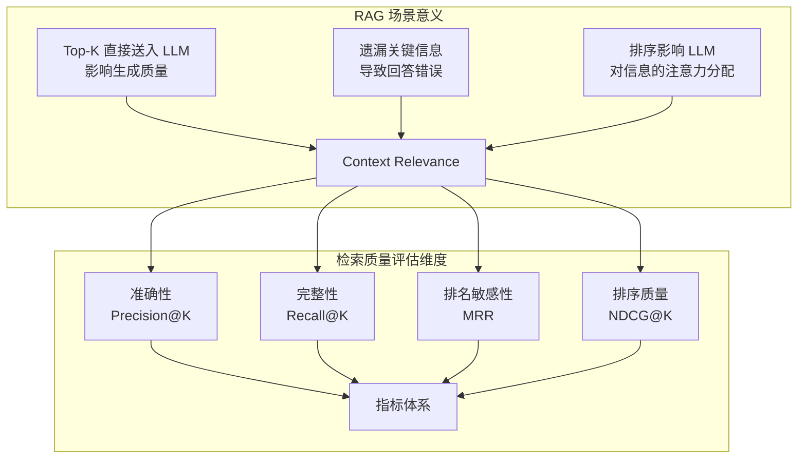
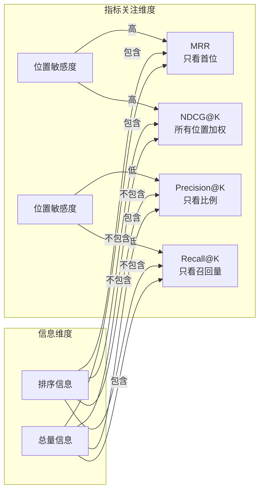
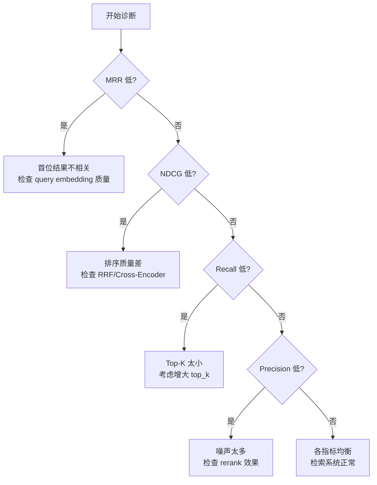

本文档详细介绍 SuperMew 项目中 RAG 检索系统的评测指标体系，涵盖指标定义、计算公式、物理意义及代码实现。通过系统化的指标分析，帮助开发者理解检索质量的评估方法。

## 1. 指标体系概览

RAG 检索评测的核心问题是：**给定一个查询，系统返回的 Top-K 文档有多好？** SuperMew 项目采用四个互补的指标从不同维度评估检索质量。



**指标选择原则**：单一指标无法全面反映检索系统的好坏，四个指标互补使用可完整刻画检索性能。

| 指标 | 回答的问题 | 对 RAG 的敏感度 | 公式复杂度 |
|------|-----------|----------------|-----------|
| **Precision@K** | "返回的 K 个结果里，有多少是真正相关的？" | 中等（忽略排序） | 简单 |
| **Recall@K** | "所有相关文档中，有多少被召回了？" | 中等（忽略排序） | 简单 |
| **MRR** | "第一个相关结果排得有多靠前？" | **最高**（RAG 最关注首位） | 中等 |
| **NDCG@K** | "返回结果的排序质量有多好？" | 中等（考虑所有位置） | 较高 |

Sources: [eval_utils.py](backend/eval/eval_utils.py#L1-L69), [report-2026-04-03.md](eval_results/report-2026-04-03.md#L1-L50)

---

## 2. Precision@K（精确率 @ K）

### 2.1 定义与公式

**定义**：在返回的 Top-K 结果中，有多少比例是相关的。

$$\text{Precision@K} = \frac{\text{Top-K 中相关文档数}}{K}$$

### 2.2 物理意义

假设系统返回 5 个结果，其中 2 个相关，则 Precision@5 = 2/5 = 0.4。**该指标衡量返回结果的"干净程度"——越高说明噪声越少。**

```
返回结果: [相关 ✓, 噪声 ✗, 噪声 ✗, 相关 ✓, 噪声 ✗]
                              ↑
                          Precision@5 = 2/5 = 0.4
```

### 2.3 在 RAG 场景的意义

RAG 生成时会将所有召回的 Chunk 拼给 LLM 作为上下文。如果 Precision 低，意味着塞给 LLM 大量无关背景，反而影响生成质量。本项目 CMRC 2018 数据集的 Precision@5 ≈ 0.20，说明平均每 5 个结果中约 1 个包含答案片段。

### 2.4 代码实现

```python
def compute_precision(pred_chunk_ids: List[str], gt_chunk_ids: Set[str], k: int) -> float:
    """Precision@K: 预测结果中相关文档的比例"""
    top_k = pred_chunk_ids[:k]
    if not top_k:
        return 0.0
    return sum(1 for cid in top_k if cid in gt_chunk_ids) / k
```

Sources: [eval_utils.py](backend/eval/eval_utils.py#L7-L13)

---

## 3. Recall@K（召回率 @ K）

### 3.1 定义与公式

**定义**：所有相关文档中，有多少比例被返回了。

$$\text{Recall@K} = \frac{\text{Top-K 中相关文档数}}{\text{全部相关文档数}}$$

### 3.2 物理意义

假设某问题有 10 个相关 Chunk，返回 Top-5 中召回了 3 个，则 Recall@5 = 3/10 = 0.3。**该指标衡量系统"找全"的能力——越高说明越不容易漏掉重要信息。**

```
全部相关 Chunk: 10 个
    
召回的 Top-5:   [相关 ✓, 噪声 ✗, 相关 ✓, 噪声 ✗, 相关 ✓]
                                              ↑
                              Recall@5 = 3/10 = 0.3
```

### 3.3 在 RAG 场景的意义

漏掉相关 Context 会直接导致 LLM 回答错误。本项目当前 Recall@5 ≈ 0.34，说明约 2/3 的相关 Chunk 没有被召回到 Top-5。可以通过增大 Top-K 来提升 Recall，但会增加 LLM 的上下文长度。

### 3.4 代码实现

```python
def compute_recall(pred_chunk_ids: List[str], gt_chunk_ids: Set[str], k: int) -> float:
    """Recall@K: 召回的相关文档占全部相关文档的比例"""
    top_k = pred_chunk_ids[:k]
    if not gt_chunk_ids:
        return 0.0
    return sum(1 for cid in top_k if cid in gt_chunk_ids) / len(gt_chunk_ids)
```

Sources: [eval_utils.py](backend/eval/eval_utils.py#L15-L21)

---

## 4. MRR（平均倒数排名，Mean Reciprocal Rank）

### 4.1 定义与公式

**定义**：所有查询中，第一个相关文档排名的倒数之均值。

$$\text{MRR} = \frac{1}{N} \sum_{i=1}^{N} \frac{1}{\text{rank}_i}$$

其中 $\text{rank}_i$ 是第 $i$ 个查询的第一个相关文档的排名位置。如果第一个结果就命中，排名为 1，倒数为 1.0。

### 4.2 物理意义

- MRR = 1.0：所有查询的第一个结果都是相关的（完美）
- MRR = 0.5：平均第一个相关结果排在第 2 位
- MRR = 0.9：平均第一个相关结果排在第 1.1 位左右

```
查询 1: [相关 ✓, 噪声 ✗, ...] → rank=1 → 1/1 = 1.0
查询 2: [噪声 ✗, 相关 ✓, ...] → rank=2 → 1/2 = 0.5
查询 3: [噪声 ✗, 噪声 ✗, 相关 ✓] → rank=3 → 1/3 = 0.33
                    ↑
              MRR = (1.0 + 0.5 + 0.33) / 3 ≈ 0.61
```

### 4.3 为什么 MRR 对 RAG 最敏感？

1. **RAG 生成只取 Top-K 送入 LLM**：第一个结果的位置直接决定上下文的核心内容
2. **对排序错误更敏感**：如果第一个结果是噪声，MRR 直接从 1.0 跌到 0.5
3. **语义检索天然擅长这个**：稠密向量擅长语义匹配，相关结果往往排在很前面

本项目评测结果显示：CMRC 2018 Baseline MRR = 0.5767，说明平均第一个相关 Chunk 排在第 1.7 位左右。

### 4.4 代码实现

```python
def compute_mrr(pred_chunk_ids: List[str], gt_chunk_ids: Set[str], k: int) -> float:
    """MRR: 第一个相关文档排名的倒数均值"""
    for i, cid in enumerate(pred_chunk_ids[:k], 1):
        if cid in gt_chunk_ids:
            return 1.0 / i
    return 0.0
```

Sources: [eval_utils.py](backend/eval/eval_utils.py#L23-L28)

---

## 5. NDCG@K（标准化折扣累积增益 @ K）

### 5.1 定义与公式

DCG（Discounted Cumulative Gain）衡量排序质量：

$$\text{DCG@K} = \sum_{i=1}^{K} \frac{\text{rel}_i}{\log_2(i+1)}$$

其中 $\text{rel}_i$ 是第 $i$ 个结果的相关度（相关=1，不相关=0）。

NDCG 是 DCG 与理想 DCG（IDCG）的比值，标准化到 [0,1]：

$$\text{NDCG@K} = \frac{\text{DCG@K}}{\text{IDCG@K}}$$

### 5.2 与 MRR 的区别

| 维度 | MRR | NDCG |
|------|-----|------|
| 关注点 | 只看第一个相关文档的位置 | 考虑**所有位置**的排序质量 |
| 权重 | 无权重差异 | top 结果权重大，bottom 权重小 |
| 适用场景 | 首个结果至关重要的场景 | 整体排序质量评估 |

```
NDCG 折扣因子：位置越靠后，贡献越小
位置 1: 1/log2(2) = 1.0    （完全保留）
位置 2: 1/log2(3) = 0.63   （折扣 37%）
位置 3: 1/log2(4) = 0.5    （折扣 50%）
位置 5: 1/log2(6) = 0.39   （折扣 61%）
```

### 5.3 代码实现

```python
def _dcg_at_k(relevances: List[int], k: int) -> float:
    """DCG@K: 折扣累积增益"""
    dcg = 0.0
    for i, rel in enumerate(relevances[:k], 1):
        dcg += rel / np.log2(i + 1)
    return dcg

def compute_ndcg(pred_chunk_ids: List[str], gt_chunk_ids: Set[str], k: int) -> float:
    """NDCG@K: 标准化折扣累积增益"""
    relevances = [1 if cid in gt_chunk_ids else 0 for cid in pred_chunk_ids[:k]]
    actual_dcg = _dcg_at_k(relevances, k)
    ideal_relevances = [1] * min(len(gt_chunk_ids), k)
    ideal_dcg = _dcg_at_k(ideal_relevances, k)
    if ideal_dcg == 0:
        return 0.0
    return actual_dcg / ideal_dcg
```

Sources: [eval_utils.py](backend/eval/eval_utils.py#L30-L45)

---

## 6. 指标关系与互补性

### 6.1 四指标的关系图谱



### 6.2 指标互补矩阵

| 指标 | 包含排序信息 | 包含总量信息 | 位置敏感度 | 适合场景 |
|------|-------------|-------------|-----------|---------|
| **Precision@K** | ❌ | ✅ (Top-K) | 低 | 注重结果准确性 |
| **Recall@K** | ❌ | ✅ (全部) | 低 | 注重不遗漏 |
| **MRR** | ✅ | ❌ | **最高** | RAG 场景首选 |
| **NDCG@K** | ✅ | ✅ | 高 | 综合排序评估 |

### 6.3 指标解读指南



Sources: [eval_utils.py](backend/eval/eval_utils.py#L47-L69), [report-2026-04-03.md](eval_results/report-2026-04-03.md#L50-L80)

---

## 7. 评测配置参数

### 7.1 核心配置项

| 参数 | 默认值 | 说明 |
|------|-------|------|
| `TOP_K` | 5 | 输出结果数量，NDCG/P@K/R@K 的 K 值 |
| `RRF_TOP_K` | 20 | RRF 融合阶段候选数量 |
| `OVERLAP_THRESHOLD` | 0.3 | Ground Truth 的 3-gram 重叠度阈值 |
| `CHUNK_SIZE` | 1024 | L2 层分块大小 |
| `CHUNK_OVERLAP` | 128 | 分块重叠大小 |

### 7.2 评测配置代码

```python
# backend/eval/eval_config.py
TOP_K = 5
RRF_TOP_K = 20         # RRF 融合阶段取 20 条候选
OVERLAP_THRESHOLD = 0.3
CHUNK_SIZE = 1024
CHUNK_OVERLAP = 128
```

Sources: [eval_config.py](backend/eval/eval_config.py#L1-L18)

---

## 8. Ground Truth 构建方法

### 8.1 相关文档判定标准

项目使用 **3-gram 重叠度**判断 Chunk 是否与答案相关：

```python
def compute_answer_overlap(chunk_text: str, answer: str, threshold: float = 0.3) -> bool:
    """判断 chunk 与 answer 的 n-gram 重叠度是否超过阈值"""
    def get_ngrams(text: str, n: int = 3) -> set:
        text = text.lower()
        if len(text) < n:
            return {text}
        return set(text[i:i+n] for i in range(len(text) - n + 1))
    
    chunk_ngrams = get_ngrams(chunk_text)
    answer_ngrams = get_ngrams(answer)
    if not answer_ngrams:
        return False
    overlap = len(chunk_ngrams & answer_ngrams)
    return overlap / len(answer_ngrams) >= threshold
```

### 8.2 Ground Truth 格式

```json
{
  "DEV_0_QUERY_0": ["DEV_0_QUERY_0::l1::0", "DEV_0_QUERY_0::l2::0", "DEV_0_QUERY_0::l3::0"],
  "DEV_0_QUERY_1": ["DEV_0_QUERY_1::l1::0", "DEV_0_QUERY_1::l2::0", "DEV_0_QUERY_1::l3::0"]
}
```

Chunk ID 格式：`{question_id}::l{level}::{index}`，支持 L1/L2/L3 三层分块。

Sources: [eval_indexer.py](backend/eval/eval_indexer.py#L90-L115)

---

## 9. 评测结果解读

### 9.1 各数据集典型指标范围

| 数据集 | 任务类型 | P@5 | R@5 | MRR | NDCG@5 |
|--------|---------|-----|-----|-----|--------|
| CMRC 2018 | 阅读理解 | ~0.20 | ~0.34 | ~0.56 | ~0.32 |
| CMRC 2019 | 填空题 | ~0.25 | ~0.37 | ~0.90 | ~0.48 |
| HotpotQA | 多跳问答 | ~0.36 | ~0.76 | ~0.80 | ~0.70 |

### 9.2 指标阈值参考

| 指标范围 | 质量评级 | 建议行动 |
|---------|---------|---------|
| MRR ≥ 0.9 | 优秀 | 检索系统工作良好 |
| MRR 0.7-0.9 | 良好 | 可接受，考虑优化 |
| MRR 0.5-0.7 | 一般 | 需要分析瓶颈 |
| MRR < 0.5 | 较差 | 检索流程存在显著问题 |

### 9.3 典型评测结果

```
CMRC 2018 Baseline:
  P@5=0.2089  R@5=0.3407  MRR=0.5767  NDCG@5=0.3259

CMRC 2019 Baseline:
  P@5=0.2484  R@5=0.3660  MRR=0.9020  NDCG@5=0.4778

HotpotQA Baseline:
  P@5=0.366   R@5=0.7595  MRR=0.7998  NDCG@5=0.6974
```

Sources: [eval_results](eval_results/cmrc2018_2026-04-03_14-48-32_metrics.csv), [eval_retrieval.py](backend/eval/eval_retrieval.py#L1-L163)

---

## 10. 下一步

完成指标理解后，可以继续学习评测脚本的使用方法：

- [评测脚本使用](18-ping-ce-jiao-ben-shi-yong) — 了解如何运行评测实验