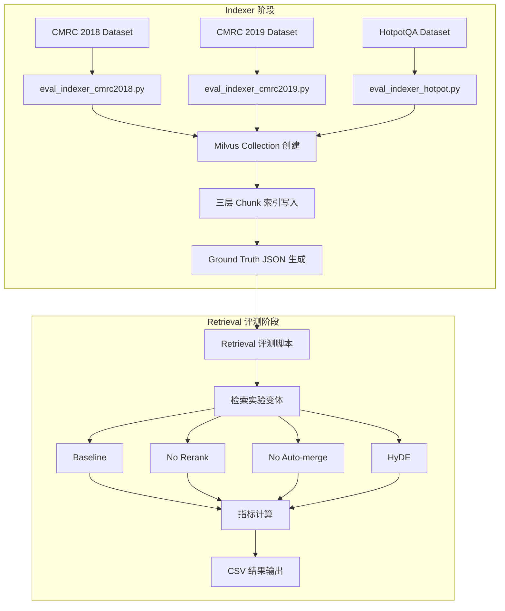

本文档详细说明 SuperMew 项目中 RAG 检索评测脚本的使用方法，包括脚本架构、配置参数、运行流程及结果解读。

## 评测系统架构

评测系统由 **Indexer 脚本** 和 **Retrieval 评测脚本** 两大组件构成，分别负责数据索引构建和检索性能评估。



Sources: [backend/eval/eval_retrieval_cmrc2018.py](backend/eval/eval_retrieval_cmrc2018.py#L1-L100), [backend/eval/eval_indexer.py](backend/eval/eval_indexer.py#L1-L100)

## 脚本文件清单

评测相关脚本位于 `backend/eval/` 目录下，按功能分为两类：

| 脚本类型 | 文件 | 用途 |
|---------|------|------|
| **Indexer** | `eval_indexer.py` | 通用索引构建（含 CMRC 2019） |
| | `eval_indexer_cmrc2018.py` | CMRC 2018 专用索引 |
| | `eval_indexer_cmrc2019.py` | CMRC 2019 专用索引 |
| | `eval_indexer_hotpot.py` | HotpotQA 专用索引 |
| **Retrieval** | `eval_retrieval.py` | 通用检索评测 |
| | `eval_retrieval_cmrc2018.py` | CMRC 2018 检索评测（含 HyDE） |
| | `eval_retrieval_cmrc2019.py` | CMRC 2019 检索评测（含 HyDE） |
| | `eval_retrieval_hotpot.py` | HotpotQA 检索评测（含 HyDE） |
| **公共模块** | `eval_config.py` | 通用配置 |
| | `eval_utils.py` | 指标计算工具 |

Sources: [backend/eval/eval_config.py](backend/eval/eval_config.py#L1-L18), [backend/eval/eval_utils.py](backend/eval/eval_utils.py#L1-L69)

## 核心配置参数

### 通用配置 (eval_config.py)

```python
DATASET_PATH = BASE_DIR / "data" / "cmrc2018_dev_50.json"
EVAL_COLLECTION = "eval_cmrc2018"
PARENT_CHUNK_STORE_PATH = BASE_DIR / "data" / "eval_parent_chunks_2018.json"

CHUNK_SIZE = 1024        # L2 层 chunk 大小
CHUNK_OVERLAP = 128      # L2 层重叠大小
TOP_K = 5                # 最终输出结果数
RRF_TOP_K = 20           # RRF 融合阶段候选数
OVERLAP_THRESHOLD = 0.3  # Ground Truth 生成的重叠度阈值
RESULTS_DIR = BASE_DIR / "eval_results"
```

Sources: [backend/eval/eval_config.py](backend/eval/eval_config.py#L1-L18)

### 检索配置参数说明

| 参数 | 默认值 | 说明 |
|------|--------|------|
| `TOP_K` | 5 | 最终输出的检索结果数量 |
| `RRF_TOP_K` | 20 | RRF 融合阶段保留的候选文档数 |
| `OVERLAP_THRESHOLD` | 0.3 | 判断 Chunk 与答案相关性的 3-gram 重叠度阈值 |
| `CHUNK_SIZE` | 1024 | L2 层 chunk 字符数 |
| `LEAF_RETRIEVE_LEVEL` | 3 | 检索叶子层级别（配置于 `config.py`）|

Sources: [backend/config.py](backend/config.py#L34-L36), [backend/eval/eval_config.py](backend/eval/eval_config.py#L13-L15)

## 检索实验变体

每个 Retrieval 评测脚本支持以下几种检索策略对比：

### 实验策略对比表

| 实验名称 | 检索流程 | 适用场景 |
|---------|---------|---------|
| **baseline** | RRF(20) → Cross-Encoder Rerank → Auto-merge → Top-5 | 完整流程对比基准 |
| **no_rerank** | RRF(20) → RRF 排序 → Auto-merge → Top-5 | 验证重排序贡献 |
| **no_auto_merge** | RRF(20) → Cross-Encoder Rerank → 直接输出 Top-5 | 验证自动合并贡献 |
| **hyde** | 假设文档生成 → 完整 RRF 流程 | 验证 HyDE 假设文档检索 |

Sources: [backend/eval/eval_retrieval_cmrc2018.py](backend/eval/eval_retrieval_cmrc2018.py#L49-L82), [backend/eval/eval_retrieval_cmrc2019.py](backend/eval/eval_retrieval_cmrc2019.py#L49-L82)

### HyDE 检索流程

HyDE（Hypothetical Document Embeddings）通过 LLM 生成假设性文档来增强检索：


Sources: [backend/eval/eval_retrieval_cmrc2018.py](backend/eval/eval_retrieval_cmrc2018.py#L84-L104), [backend/eval/eval_retrieval_cmrc2019.py](backend/eval/eval_retrieval_cmrc2019.py#L84-L104)

## 评测指标详解

### 指标计算函数

```python
# eval_utils.py
def compute_precision(pred_chunk_ids, gt_chunk_ids, k) -> float:
    """Precision@K: 预测结果中相关文档的比例"""
    
def compute_recall(pred_chunk_ids, gt_chunk_ids, k) -> float:
    """Recall@K: 召回的相关文档占全部相关文档的比例"""
    
def compute_mrr(pred_chunk_ids, gt_chunk_ids, k) -> float:
    """MRR: 第一个相关文档排名的倒数均值"""
    
def compute_ndcg(pred_chunk_ids, gt_chunk_ids, k) -> float:
    """NDCG@K: 标准化折扣累积增益"""
```

Sources: [backend/eval/eval_utils.py](backend/eval/eval_utils.py#L4-L43)

### 指标含义对照表

| 指标 | 回答的问题 | RAG 场景重要性 |
|------|-----------|---------------|
| **Precision@K** | "返回的 K 个结果里，有多少是真正相关的？" | 控制噪声输入 |
| **Recall@K** | "所有相关文档中，有多少被召回了？" | 确保信息不遗漏 |
| **MRR** | "第一个相关结果排得有多靠前？" | **RAG 最敏感指标**，直接决定上下文质量 |
| **NDCG@K** | "返回结果的排序质量有多好？" | 综合考虑所有位置的加权质量 |

Sources: [eval_results/report-2026-04-03.md](eval_results/report-2026-04-03.md#L8-L18)

## 运行流程

### Step 1: 准备数据集

根据评测目标下载对应数据集：

| 数据集 | 下载地址 | 用途 |
|-------|---------|------|
| CMRC 2018 | [CMRC 2018 GitHub](https://github.com/ymcui/cmrc2018) | 阅读理解评测 |
| CMRC 2019 | [CMRC 2019 GitHub](https://github.com/ymcui/cmrc2019) | 填空题评测 |
| HotpotQA | HuggingFace 自动下载 | 多跳问答评测 |

将数据集放置于 `data/` 目录，例如 `data/cmrc2018_dev_100.json`。

### Step 2: 构建索引

```bash
# 切换到 backend 目录
cd backend

# CMRC 2018 索引构建
python -m eval.eval_indexer_cmrc2018

# CMRC 2019 索引构建
python -m eval.eval_indexer_cmrc2019

# HotpotQA 索引构建（自动从 HuggingFace 下载数据）
python -m eval.eval_indexer_hotpot
```

Indexer 脚本执行以下操作：

1. 加载数据集并解析 JSON 结构
2. 按三层分块策略（L1/L2/L3）切分文本
3. 调用 EmbeddingService 生成 dense 和 sparse embeddings
4. 创建 Milvus Collection 并写入索引
5. 生成 `ground_truth_*.json` 文件至 `eval_results/` 目录

Sources: [backend/eval/eval_indexer_cmrc2018.py](backend/eval/eval_indexer_cmrc2018.py#L100-L180), [backend/eval/eval_indexer.py](backend/eval/eval_indexer.py#L220-L300)

### Step 3: 运行检索评测

```bash
# CMRC 2018 检索评测（包含 HyDE 实验）
python -m eval.eval_retrieval_cmrc2018

# CMRC 2019 检索评测（包含 HyDE 实验）
python -m eval.eval_retrieval_cmrc2019

# HotpotQA 检索评测（包含 HyDE 实验）
python -m eval.eval_retrieval_hotpot
```

### Step 4: 查看结果

评测结果自动保存至 `eval_results/` 目录，文件命名格式为：

```
{数据集名}_{时间戳}_metrics.csv           # 常规实验结果
{数据集名}_hyde_{时间戳}_metrics.csv       # HyDE 实验结果
```

Sources: [backend/eval/eval_retrieval_cmrc2018.py](backend/eval/eval_retrieval_cmrc2018.py#L180-L210)

## 输出格式

### CSV 结果文件格式

```csv
experiment,precision,recall,mrr,ndcg,query_count
baseline,0.2089,0.3407,0.5767,0.3259,45
no_rerank,0.2089,0.3407,0.5767,0.3259,45
no_auto_merge,0.2089,0.3407,0.5537,0.3189,45
```

### HyDE 独立 CSV 格式

```csv
experiment,precision,recall,mrr,ndcg,query_count,hyde_success_rate
hyde,0.2023,0.3356,0.5537,0.3189,45,100/100
```

Sources: [backend/eval/eval_retrieval_cmrc2018.py](backend/eval/eval_retrieval_cmrc2018.py#L210-L225)

## Ground Truth 构建原理

Ground Truth 通过 **3-gram 重叠度** 自动判断 Chunk 与答案的相关性：

```python
def compute_overlap(chunk_text: str, answer: str, threshold: float = 0.3) -> bool:
    """3-gram 重叠度判断：超过阈值则标记为相关"""
    def ngrams(text: str, n: int = 3) -> set:
        text = text.lower()
        return {text[i:i+n] for i in range(max(0, len(text) - n + 1))}
    
    ng = ngrams(chunk_text)
    ag = ngrams(answer)
    return len(ng & ag) / len(ag) >= threshold if ag else False
```

当 Chunk 与任意答案的 3-gram 重叠度 ≥ 30% 时，标记为 relevant chunk。

Sources: [backend/eval/eval_indexer_cmrc2018.py](backend/eval/eval_indexer_cmrc2018.py#L85-L98)

## 各数据集特点与评测结论

| 数据集 | 任务类型 | Baseline MRR | HyDE 效果 | 关键发现 |
|-------|---------|-------------|----------|---------|
| CMRC 2018 | 阅读理解 | 0.5767 | -0.8% | 检索相对容易，HyDE 无显著增益 |
| CMRC 2019 | 填空题 | 0.9020 | -3.2% | 填空题检索命中率高，HyDE 反而略降 |
| HotpotQA | 多跳问答 | 0.7990 | -2.0% | 语义 gap 大，但 HyDE 生成质量不稳定 |

Sources: [eval_results/report-2026-04-03-hotpotqa-hyde.md](eval_results/report-2026-04-03-hotpotqa-hyde.md#L30-L45)

## 常见问题排查

| 问题 | 可能原因 | 解决方案 |
|------|---------|---------|
| `FileNotFoundError: ground truth 未找到` | 未运行 Indexer 脚本 | 先执行对应数据集的 `eval_indexer_*.py` |
| `collection 不存在` | Milvus Collection 未创建 | 检查 Milvus 服务状态，重新运行 Indexer |
| HyDE 生成成功率低 | LLM API 调用失败 | 检查 `API_KEY` 和 `BASE_URL` 配置 |
| 指标全为 0 | 查询字段不匹配 | 确认数据集中的 `question_id` 字段名称 |

Sources: [backend/eval/eval_retrieval_cmrc2018.py](backend/eval/eval_retrieval_cmrc2018.py#L120-L130)

## 下一步

- 查看 [评测指标说明](17-ping-ce-zhi-biao-shuo-ming) 深入理解 Precision/Recall/MRR/NDCG 的数学原理
- 探索 [混合检索原理](12-hun-he-jian-suo-yuan-li) 了解 RRF 融合的核心算法
- 参考 [Auto-merging 分块合并](13-auto-merging-fen-kuai-he-bing) 理解分块合并机制