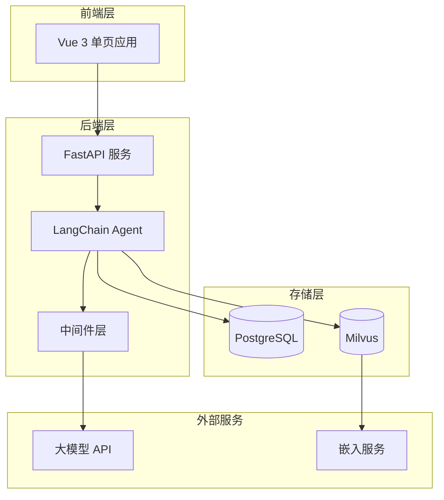
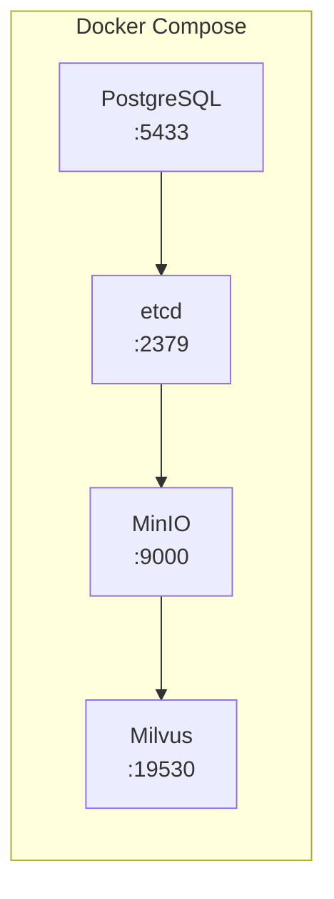
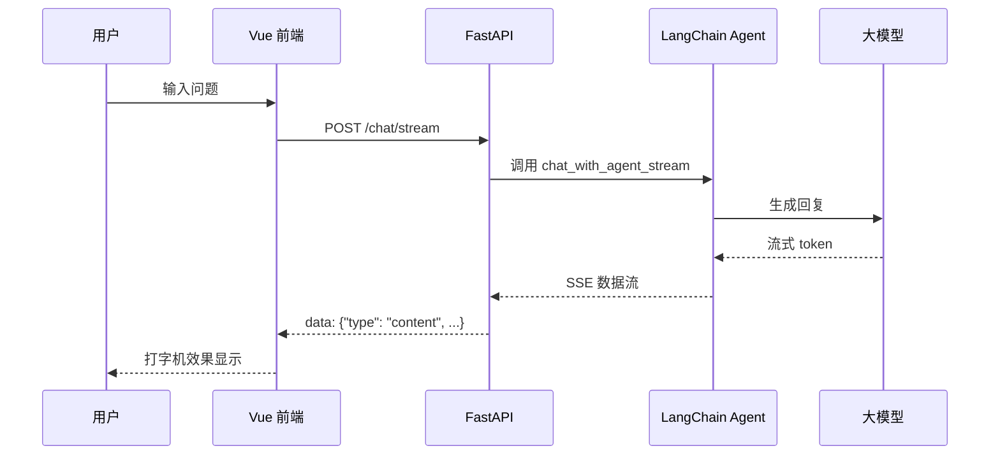

本文档为初级开发者提供 SuperMew 项目的完整启动指南，帮助您在最短时间内完成环境搭建并运行一个功能完整的 AI 助手原型。

## 系统架构概览

SuperMew 是一个基于 LangChain Agent 的智能对话系统，集成了 RAG 检索、三层记忆架构和流式输出等核心能力。在开始之前，让我们先了解整个系统的架构设计：



**核心组件说明**：

| 组件 | 技术选型 | 职责 |
|------|----------|------|
| 前端 | Vue 3 + CDN | 实时对话界面、流式输出展示 |
| 后端 | FastAPI + LangGraph | API 路由、Agent 编排、RAG 管道 |
| 会话存储 | PostgreSQL + PostgresSaver | 长期记忆持久化、checkpointer |
| 向量存储 | Milvus | 文档向量、用户记忆向量 |
| 大模型 | OpenAI 兼容 API | 对话生成、摘要提取 |
| 嵌入服务 | Qwen Embedding | 文本向量化、混合检索 |

Sources: [docker-compose.yml](docker-compose.yml#L1-L94), [config.py](backend/config.py#L1-L58)

## 环境准备

### 硬件与系统要求

| 要求 | 最低配置 | 推荐配置 |
|------|----------|----------|
| 操作系统 | Windows 10+ / macOS / Linux | Windows 11 / macOS Sonoma |
| Python | 3.12+ | 3.12+ |
| 内存 | 8GB | 16GB+ |
| 磁盘 | 10GB 可用空间 | 20GB+ SSD |
| Docker | Docker Desktop 4.x | 最新版本 |

Sources: [README.md](README.md#L8-L15)

### 安装 Python 环境

项目推荐使用 `uv` 作为包管理工具，它比传统 pip 更快、更可靠：

```bash
# 使用 pip 安装 uv（仅需一次）
pip install uv

# 验证安装
uv --version
```

对于 Windows 用户，也可以直接从 [GitHub Releases](https://github.com/astral-sh/uv/releases) 下载安装。

### 安装 Docker Desktop

1. 访问 [Docker 官网](https://www.docker.com/products/docker-desktop/) 下载 Docker Desktop
2. 安装并启动 Docker Desktop
3. 验证安装：

```bash
docker --version
docker compose version
```

Sources: [CLAUDE.md](CLAUDE.md#L1-L10)

## 项目初始化

### 1. 克隆项目代码

```bash
git clone https://github.com/your-repo/SuperMew.git
cd SuperMew
```

### 2. 安装依赖

```bash
# 使用 uv 安装（推荐）
uv sync

# 或使用传统 pip
python -m venv .venv
.venv\Scripts\activate  # Windows
source .venv/bin/activate  # macOS/Linux
pip install -e .
```

Sources: [README.md](README.md#L17-L30)

### 3. 配置环境变量

在项目根目录创建 `.env` 文件，复制以下模板：

```env
# ===== 通用 API 配置 =====
API_KEY=your_api_key
BASE_URL=https://api.siliconflow.cn/v1

# ===== 模型配置 =====
MODEL=Qwen/Qwen3.5-122B-A10B
EMBEDDER=Qwen/Qwen3-Embedding-4B
RERANK_MODEL=Qwen/Qwen3-Reranker-4B
RERANK_BINDING_HOST=https://api.siliconflow.cn/v1

# ===== Milvus =====
MILVUS_HOST=127.0.0.1
MILVUS_PORT=19530

# ===== PostgreSQL =====
POSTGRES_HOST=127.0.0.1
POSTGRES_PORT=5433
POSTGRES_USER=supermew
POSTGRES_PASSWORD=supermew123
POSTGRES_DB=supermew

# ===== Server =====
HOST=127.0.0.1
PORT=8000
```

**关键配置说明**：

| 配置项 | 说明 | 默认值 |
|--------|------|--------|
| `API_KEY` | 大模型 API 密钥 | 必填 |
| `MODEL` | 使用的模型名称 | Qwen/Qwen3.5-122B-A10B |
| `EMBEDDER` | 嵌入模型名称 | Qwen/Qwen3-Embedding-4B |
| `MILVUS_HOST` | Milvus 服务地址 | 127.0.0.1 |
| `POSTGRES_HOST` | PostgreSQL 地址 | 127.0.0.1 |

Sources: [.env.example](.env.example#L1-L82)

## 启动服务

### 步骤一：启动 Docker 依赖服务

项目使用 Docker Compose 管理 PostgreSQL 和 Milvus 等基础设施：

```bash
# 启动所有依赖服务（后台运行）
docker compose up -d

# 查看服务状态
docker compose ps
```

**启动的服务组件**：

| 容器名称 | 服务 | 端口 |
|----------|------|------|
| supermew-postgres | PostgreSQL | 5433 |
| milvus-etcd | etcd | 2379 |
| milvus-minio | MinIO 存储 | 9000/9001 |
| milvus-standalone | Milvus 向量库 | 19530/9091 |
| milvus-attu | Attu 管理界面 | 8080 |



Sources: [docker-compose.yml](docker-compose.yml#L1-L94)

### 步骤二：验证服务健康状态

```bash
# 检查 PostgreSQL
docker compose exec postgres pg_isready -U supermew

# 检查 Milvus 健康
curl http://localhost:9091/healthz
```

### 步骤三：启动后端服务

```bash
# 方式 A：使用项目入口脚本
uv run python main.py

# 方式 B：直接使用 uvicorn
uv run uvicorn backend.app:app --host 127.0.0.1 --port 8000 --reload
```

Sources: [main.py](main.py#L1-L24)

### 步骤四：访问应用

服务启动后，打开浏览器访问以下地址：

| 页面 | 地址 | 说明 |
|------|------|------|
| 主界面 | http://127.0.0.1:8000/ | 喵喵助手对话界面 |
| API 文档 | http://127.0.0.1:8000/docs | Swagger API 文档 |
| Milvus 管理 | http://127.0.0.1:8080 | Attu 向量管理界面 |

Sources: [README.md](README.md#L47-L52)

## 功能体验

### 基本对话

启动成功后，您将看到喵喵助手的界面：



1. 在输入框输入您的问题
2. 按 Enter 或点击发送按钮
3. 观察流式输出效果和 RAG 检索步骤

### 文档知识库

系统支持上传 PDF 和 Word 文档进行向量化检索：

1. 点击左侧菜单「设置」
2. 在文档管理区域选择文件
3. 点击「开始上传」

文档将被自动处理：
- 三级滑动窗口分块（L1: 2400 / L2: 1024 / L3: 512 tokens）
- 稠密向量 + BM25 稀疏向量同步生成
- 写入 Milvus 向量库

Sources: [api.py](backend/api.py#L115-L160)

### 会话历史

- 对话自动保存，可随时切换历史会话
- 点击左侧「历史记录」查看所有会话
- 支持会话删除

Sources: [agent.py](backend/agent.py#L60-L120)

## 项目结构速览

```
SuperMew/
├── backend/
│   ├── app.py              # FastAPI 入口 + 路由注册
│   ├── api.py             # 对话/会话/文档 API
│   ├── agent.py           # Agent 核心 + checkpointer
│   ├── middleware.py      # 记忆中间件
│   ├── config.py          # 环境变量配置
│   ├── tools.py           # 工具函数（天气/检索）
│   ├── rag_pipeline.py    # LangGraph RAG 工作流
│   ├── embedding.py       # 向量化服务
│   ├── milvus_client.py   # Milvus 检索客户端
│   └── milvus_writer.py   # Milvus 写入客户端
├── frontend/
│   ├── index.html         # Vue 3 单页入口
│   ├── script.js          # 前端逻辑
│   └── style.css          # 样式表
├── docker-compose.yml      # Docker 服务编排
├── main.py                # 应用启动入口
└── .env                   # 环境变量（需创建）
```

Sources: [CLAUDE.md](CLAUDE.md#L11-L30)

## 常见问题

### 1. Docker 服务启动失败

```bash
# 清理并重新启动
docker compose down -v
docker compose up -d

# 检查日志
docker compose logs -f
```

### 2. 端口被占用

| 端口 | 服务 | 解决方案 |
|------|------|----------|
| 8000 | 后端服务 | 修改 .env 中 PORT 值 |
| 5433 | PostgreSQL | 修改 docker-compose.yml 端口映射 |
| 19530 | Milvus | 修改 .env 中 MILVUS_PORT |

### 3. 模型 API 调用失败

检查 `.env` 配置：
- `API_KEY` 是否正确
- `BASE_URL` 是否与服务商要求一致
- `MODEL` 是否在服务商支持列表中

### 4. 向量检索无结果

首次使用需要上传文档：
1. 进入「设置」→「文档管理」
2. 上传 PDF 或 Word 文件
3. 等待向量化完成（查看上传进度）

## 下一步

完成快速启动后，建议继续阅读以下文档深入学习：

| 文档 | 内容 |
|------|------|
| [环境准备与依赖安装](3-huan-jing-zhun-bei-yu-yi-lai-an-zhuang) | 详细的依赖安装与配置 |
| [配置文件说明](4-pei-zhi-wen-jian-shuo-ming) | 所有配置项详解 |
| [系统架构总览](5-xi-tong-jia-gou-zong-lan) | 完整的系统架构分析 |
| [三层记忆架构](6-san-ceng-ji-yi-jia-gou) | 理解记忆系统设计 |

---

**享受探索 SuperMew 的旅程喵～** 🐱