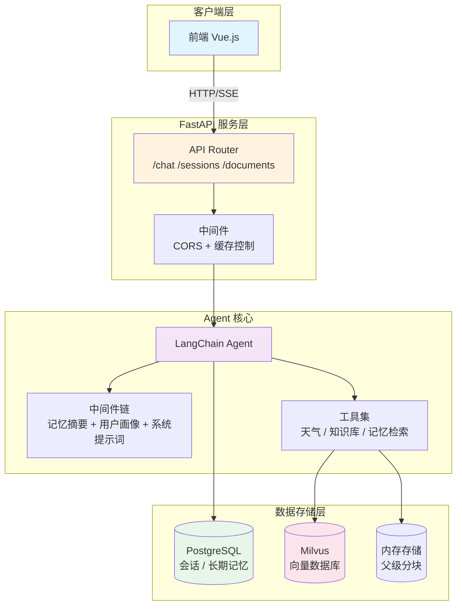
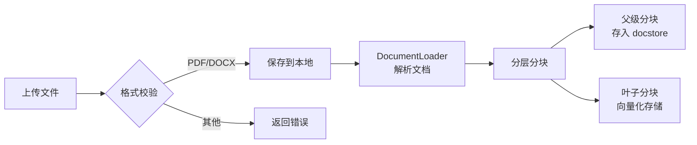

本文档详细说明 SuperMew 系统的后端 API 接口，包括聊天交互、会话管理、文档处理等功能。所有接口均基于 FastAPI 构建，默认部署在 `http://127.0.0.1:8000`。

## 系统架构概览



Sources: [backend/app.py](backend/app.py#L1-L62), [backend/api.py](backend/api.py#L1-L272)

## 服务配置

服务启动配置通过环境变量控制，核心配置项如下：

| 配置项 | 默认值 | 说明 |
|--------|--------|------|
| `HOST` | `127.0.0.1` | 服务监听地址 |
| `PORT` | `8000` | 服务监听端口 |
| `API_KEY` | - | 模型服务商 API 密钥 |
| `BASE_URL` | `https://api.siliconflow.cn/v1` | API 端点地址 |

Sources: [backend/config.py](backend/config.py#L41-L43), [.env.example](.env.example#L76-L77)

---

## 聊天接口

### 1. 流式聊天 `POST /chat/stream`

**推荐使用此接口**。采用 Server-Sent Events (SSE) 实现流式响应，支持实时显示 AI 输出和 RAG 检索步骤。

**请求示例 (JavaScript):**

```javascript
const response = await fetch('/chat/stream', {
    method: 'POST',
    headers: { 'Content-Type': 'application/json' },
    body: JSON.stringify({
        message: "用户问题内容",
        user_id: "user_abc123",
        session_id: "session_1704067200"
    })
});

// 处理 SSE 流
const reader = response.body.getReader();
const decoder = new TextDecoder();

while (true) {
    const { done, value } = await reader.read();
    if (done) break;
    
    const text = decoder.decode(value, { stream: true });
    // 解析 SSE 数据块...
}
```

Sources: [backend/api.py](backend/api.py#L139-L164), [frontend/script.js](frontend/script.js#L113-L170)

#### SSE 事件类型

流式响应包含以下事件类型：

| 事件类型 | 数据结构 | 说明 |
|----------|----------|------|
| `content` | `{"type": "content", "content": "文本片段"}` | AI 输出的文本内容 |
| `rag_step` | `{"type": "rag_step", "step": {...}}` | RAG 检索步骤详情 |
| `trace` | `{"type": "trace", "rag_trace": {...}}` | RAG 追踪信息汇总 |
| `error` | `{"type": "error", "content": "错误信息"}` | 错误提示 |
| `[DONE]` | - | 响应结束标记 |

Sources: [backend/agent.py](backend/agent.py#L287-L328)

#### RAG 追踪数据结构

当 RAG 流程完成后，会发送完整的追踪信息：

```json
{
    "tool_used": true,
    "tool_name": "search_knowledge_base",
    "query": "原始查询",
    "expanded_query": "扩展后的查询",
    "step_back_question": "回退问题",
    "retrieval_mode": "hybrid",
    "rerank_enabled": true,
    "rerank_applied": true,
    "auto_merge_enabled": true,
    "auto_merge_applied": true,
    "retrieved_chunks": [
        {
            "filename": "文档.pdf",
            "page_number": 3,
            "text": "文档块内容",
            "score": 0.85,
            "rerank_score": 0.92
        }
    ]
}
```

Sources: [backend/schemas.py](backend/schemas.py#L22-L54)

---

### 2. 非流式聊天 `POST /chat`

适用于不需要实时响应或 SSE 处理能力的场景。

**请求体:**

```json
{
    "message": "用户消息",
    "user_id": "default_user",
    "session_id": "default_session"
}
```

**响应体:**

```json
{
    "response": "AI 回复内容",
    "rag_trace": { ... }
}
```

Sources: [backend/api.py](backend/api.py#L113-L136), [backend/schemas.py](backend/schemas.py#L5-L9), [backend/schemas.py](backend/schemas.py#L56-L60)

---

## 会话管理接口

会话管理依赖 PostgreSQL 存储，支持多用户、多会话隔离。

### 3. 获取会话列表 `GET /sessions/{user_id}`

**路径参数:**

| 参数 | 类型 | 说明 |
|------|------|------|
| `user_id` | string | 用户唯一标识 |

**响应示例:**

```json
{
    "sessions": [
        {
            "session_id": "session_1704067200",
            "updated_at": "2024-01-01T12:00:00",
            "message_count": 15
        }
    ]
}
```

Sources: [backend/api.py](backend/api.py#L69-L90), [backend/agent.py](backend/agent.py#L91-L99)

---

### 4. 获取会话消息 `GET /sessions/{user_id}/{session_id}`

获取指定会话的所有历史消息。

**响应示例:**

```json
{
    "messages": [
        {
            "type": "human",
            "content": "用户消息",
            "timestamp": "2024-01-01T12:00:00",
            "rag_trace": null
        },
        {
            "type": "ai",
            "content": "AI 回复",
            "timestamp": "2024-01-01T12:00:01",
            "rag_trace": { ... }
        }
    ]
}
```

Sources: [backend/api.py](backend/api.py#L41-L66)

---

### 5. 删除会话 `DELETE /sessions/{user_id}/{session_id}`

删除指定会话，**同时清理以下数据:**

- PostgreSQL `conversations` 表中的会话记录
- PostgreSQL checkpointer 中的消息历史
- 内存中的会话状态

Sources: [backend/api.py](backend/api.py#L93-L110), [backend/agent.py](backend/agent.py#L101-L108), [backend/agent.py](backend/agent.py#L218-L221)

---

## 文档管理接口

文档管理涉及 PDF 和 Word 文档的上传、向量化和检索。

### 6. 获取文档列表 `GET /documents`

**响应示例:**

```json
{
    "documents": [
        {
            "filename": "技术文档.pdf",
            "file_type": ".pdf",
            "chunk_count": 42
        }
    ]
}
```

Sources: [backend/api.py](backend/api.py#L167-L194)

---

### 7. 上传文档 `POST /documents/upload`

**请求格式:** `multipart/form-data`

| 字段 | 类型 | 说明 |
|------|------|------|
| `file` | File | PDF 或 Word 文档 |

**处理流程:**



**响应示例:**

```json
{
    "filename": "技术文档.pdf",
    "chunks_processed": 36,
    "message": "成功上传并处理 技术文档.pdf，叶子分块 36 个，父级分块 8 个"
}
```

Sources: [backend/api.py](backend/api.py#L197-L251)

**注意事项:**
- 支持格式: `.pdf`, `.docx`, `.doc`
- 同名文件会先删除旧数据再上传新版本
- 上传后需等待向量构建完成

---

### 8. 删除文档 `DELETE /documents/{filename}`

**路径参数:**

| 参数 | 类型 | 说明 |
|------|------|------|
| `filename` | string | URL 编码的文件名 |

**响应示例:**

```json
{
    "filename": "技术文档.pdf",
    "chunks_deleted": 36,
    "message": "成功删除文档 技术文档.pdf 的向量数据（本地文件已保留）"
}
```

Sources: [backend/api.py](backend/api.py#L254-L270)

---

## 错误处理

API 采用标准 HTTP 状态码返回错误：

| 状态码 | 含义 | 响应格式 |
|--------|------|----------|
| `400` | 请求参数错误 | `{"detail": "错误描述"}` |
| `404` | 资源不存在 | `{"detail": "资源类型 资源ID 不存在"}` |
| `429` | 上游限流 | `{"detail": "上游模型服务触发限流..."}` |
| `500` | 服务器内部错误 | `{"detail": "错误描述"}` |

Sources: [backend/api.py](backend/api.py#L121-L136)

---

## CORS 配置

服务默认允许所有来源访问：

```python
CORSMiddleware(
    allow_origins=["*"],      # 生产环境建议限制具体域名
    allow_credentials=True,
    allow_methods=["*"],
    allow_headers=["*"],
)
```

Sources: [backend/app.py](backend/app.py#L20-L26)

---

## 请求示例汇总

### 完整对话流程

```bash
# 1. 发起流式对话
curl -X POST http://127.0.0.1:8000/chat/stream \
  -H "Content-Type: application/json" \
  -d '{"message": "你好", "user_id": "user1", "session_id": "sess1"}'

# 2. 查看会话列表
curl http://127.0.0.1:8000/sessions/user1

# 3. 获取历史消息
curl http://127.0.0.1:8000/sessions/user1/sess1

# 4. 删除会话
curl -X DELETE http://127.0.0.1:8000/sessions/user1/sess1

# 5. 查看已上传文档
curl http://127.0.0.1:8000/documents

# 6. 上传新文档
curl -X POST http://127.0.0.1:8000/documents/upload \
  -F "file=@/path/to/document.pdf"
```

---

## 相关文档

- [系统架构总览](5-xi-tong-jia-gou-zong-lan) - 了解更多系统组件
- [配置说明](4-pei-zhi-wen-jian-shuo-ming) - 环境变量详细配置
- [Docker 部署](19-docker-fu-wu-bu-shu) - 生产环境部署指南