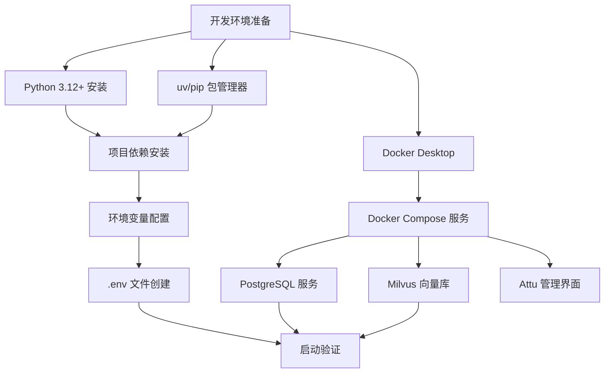
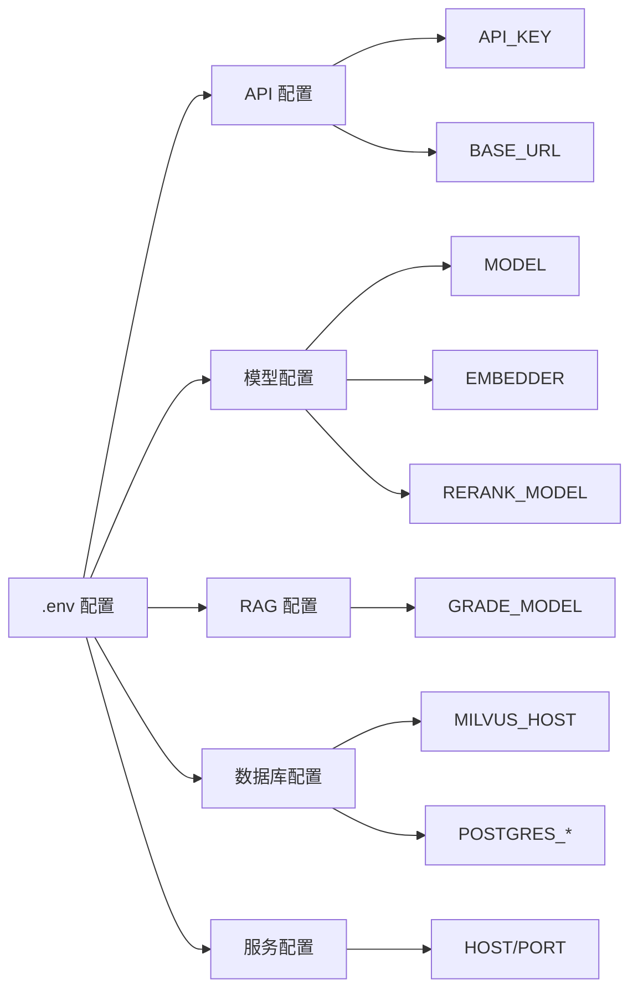
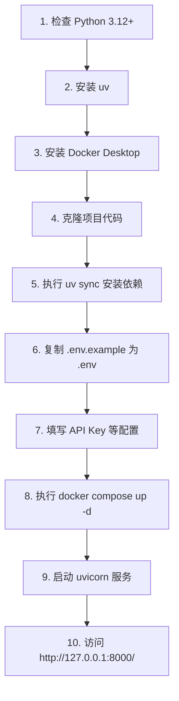

本文档面向初级开发者，详细介绍 SuperMew 项目运行所需的完整环境配置流程。通过阅读本指南，你将了解如何准备 Python 运行环境、安装项目依赖、配置 Docker 服务，以及设置必要的环境变量。

---

## 系统要求概览

SuperMew 是一个基于 LangChain Agent 与 LangGraph RAG 的智能助手项目，其运行依赖于三个层面的技术栈：Python 运行时环境、容器化向量数据库服务，以及外部大语言模型 API。

项目采用现代化的依赖管理方案，支持 Python 3.12 及以上版本。包管理工具推荐使用 `uv`（一个用 Rust 编写的极速 Python 包管理器），同时也兼容传统的 `pip` 方式。Docker 环境用于启动 Milvus 向量数据库及相关组件（etcd 配置存储、MinIO 对象存储），这是实现混合检索功能的基础设施。



---

## 前置条件检查

在开始安装之前，请确认你的系统已满足以下基本要求。以下表格列出了各项软件依赖的版本要求和建议配置：

| 组件类型 | 软件名称 | 最低版本 | 推荐版本 | 用途说明 |
|---------|---------|---------|---------|---------|
| 运行时 | Python | 3.12 | 3.12.x | 项目主语言环境 |
| 包管理 | uv | 0.4.x | 最新版 | 依赖安装与项目管理 |
| 容器化 | Docker | 24.0 | 24.0+ | 服务容器化部署 |
| 容器编排 | Docker Compose | 2.20 | 2.20+ | 多服务编排启动 |

### Windows 系统检查步骤

在 Windows 环境下，请按顺序执行以下命令进行环境检查：

**检查 Python 版本**：
打开命令提示符（CMD）或 PowerShell，输入以下命令查看已安装的 Python 版本：

```powershell
python --version
```

如果显示的版本低于 3.12，或者提示 "python 不是内部或外部命令"，则需要先安装 Python。

**检查 Docker 状态**：
```powershell
docker --version
docker compose version
```

Docker Desktop 需处于运行状态才能正常启动服务。如果尚未安装 Docker，请访问 [Docker 官方网站](https://www.docker.com/products/docker-desktop/) 下载安装包。

Sources: [.python-version](.python-version#L1-L2), [README.md](README.md#L12-L15)

---

## Python 环境安装

### 安装 Python 3.12

对于 Windows 用户，建议通过以下方式安装 Python：

**方式一：Python 官网下载**

1. 访问 [Python 官网下载页面](https://www.python.org/downloads/)
2. 选择 Python 3.12.x 版本的 Windows installer
3. 运行安装程序，**务必勾选 "Add Python to PATH"** 选项
4. 点击 "Install Now" 完成安装

**方式二：使用 WinGet（推荐）**

如果你使用 Windows 11 或已安装 Windows Package Manager，可以通过以下命令快速安装：

```powershell
winget install Python.Python.3.12
```

**方式三：使用 Scoop 包管理器**

```powershell
scoop install python
```

### 验证安装

安装完成后，重新打开命令提示符窗口，依次验证 Python 和 pip：

```powershell
python --version
pip --version
```

正常情况下应显示类似如下输出：
```
Python 3.12.4
pip 24.0 from C:\Python312\lib\site-packages\pip
```

Sources: [pyproject.toml](pyproject.toml#L7)

---

## 包管理器安装

### 安装 uv（推荐）

`uv` 是一个用 Rust 编写的极速 Python 包管理工具，其安装速度比传统 pip 快 10-100 倍。推荐使用以下方式安装：

**方式一：通过 pip 安装**：
```powershell
pip install uv
```

**方式二：通过官方安装脚本**：
```powershell
powershell -c "irm https://astral.sh/uv/install.ps1 | iex"
```

**方式三：通过 Scoop**：
```powershell
scoop install uv
```

安装完成后验证：
```powershell
uv --version
```

### uv 与 pip 对比

| 特性 | uv | pip |
|------|-----|-----|
| 安装速度 | 极快（Rust 实现） | 较慢 |
| 依赖解析 | 高效并行 | 顺序解析 |
| 虚拟环境 | 快速创建/切换 | 需手动管理 |
| 锁文件 | 自动生成 uv.lock | 需手动 pip freeze |
| 主流 IDE 支持 | 良好 | 完美 |

对于本项目，推荐使用 `uv` 以获得最佳开发体验。

Sources: [CLAUDE.md](CLAUDE.md#L6-L8)

---

## 项目依赖安装

### 克隆项目

首先获取 SuperMew 项目代码：

```powershell
git clone https://github.com/your-repo/SuperMew.git
cd SuperMew
```

### 使用 uv 安装依赖（推荐）

在项目根目录下执行以下命令，`uv sync` 会自动读取 `pyproject.toml` 并安装所有依赖：

```powershell
uv sync
```

该命令会：
1. 自动创建 `.venv` 虚拟环境
2. 根据 `pyproject.toml` 安装所有依赖
3. 生成 `uv.lock` 锁文件确保依赖版本一致
4. 安装可选依赖组（如 `study` 组）

### 使用 pip 安装依赖（备选）

如果选择使用 pip：

```powershell
# 创建虚拟环境
python -m venv .venv

# 激活虚拟环境
.venv\Scripts\activate

# 升级 pip
pip install -U pip

# 安装项目
pip install -e .
```

### 核心依赖说明

项目依赖主要分为以下几个类别：

| 依赖类别 | 核心包 | 版本要求 | 功能说明 |
|---------|-------|---------|---------|
| Web 框架 | fastapi, uvicorn | >=0.115.0 | API 服务与热重载 |
| LangChain | langchain, langgraph | >=0.2.31 | Agent 与 RAG 管道 |
| 向量数据库 | pymilvus | >=2.5.0 | Milvus 客户端连接 |
| 持久化存储 | langchain-postgres | >=0.0.17 | PostgreSQL checkpointer |
| 文档处理 | pypdf, docx2txt | >=4.3.1 | PDF/Word 文档加载 |
| 嵌入模型 | langchain-openai | >=0.1.22 | 文本向量化 |
| 可选依赖 | bilibili-api-python | >=17.0.0 | B站数据源（study 组） |
| 可选依赖 | chromadb | >=0.5.5 | 本地向量库（study 组） |

Sources: [pyproject.toml](pyproject.toml#L1-L35), [README.md](README.md#L18-L35)

---

## Docker 服务配置

SuperMew 依赖多个容器化服务，包括 PostgreSQL（用于 Agent 会话持久化）和 Milvus（用于向量检索）。这些服务通过 `docker-compose.yml` 统一管理。

### 启动 Docker 服务

在项目根目录下执行：

```powershell
docker compose up -d
```

这将启动以下四个服务容器：

| 服务名称 | 镜像 | 端口映射 | 功能说明 |
|---------|-----|---------|---------|
| supermew-postgres | postgres:16-alpine | 5433:5432 | 会话状态持久化存储 |
| milvus-etcd | quay.io/coreos/etcd:v3.5.18 | 无外部映射 | Milvus 配置存储 |
| milvus-minio | minio/minio:RELEASE.2024-05-28 | 9000:9000, 9001:9001 | 对象存储后端 |
| milvus-standalone | milvusdb/milvus:v2.5.14 | 19530:19530, 9091:9091 | 向量数据库主服务 |
| milvus-attu | zilliz/attu:v2.5.11 | 8080:3000 | Milvus Web 可视化管理 |

### 服务状态检查

**查看所有容器状态**：
```powershell
docker compose ps
```

**查看特定服务日志**：
```powershell
# 查看 Milvus 主服务日志
docker compose logs -f standalone

# 查看 PostgreSQL 日志
docker compose logs -f postgres
```

**健康检查端点**：

| 服务 | 健康检查地址 | 预期响应 |
|------|-------------|---------|
| Milvus | http://localhost:9091/healthz | HTTP 200 |
| PostgreSQL | pg_isready -U supermew | exit code 0 |
| MinIO | http://localhost:9000/minio/health/live | HTTP 200 |
| Attu | http://localhost:3000 | HTTP 200 |

### 停止服务

```powershell
# 停止所有服务（保留数据卷）
docker compose stop

# 停止并删除容器（保留数据卷）
docker compose down

# 完全清理（包括数据卷）
docker compose down -v
```

Sources: [docker-compose.yml](docker-compose.yml#L1-L94), [README.md](README.md#L50-L60)

---

## 环境变量配置

项目通过 `.env` 文件管理配置。首次运行前必须创建此文件。

### 创建 .env 文件

在项目根目录新建 `.env` 文件：

```powershell
copy .env.example .env
```

### 配置文件说明

`.env.example` 提供了完整的配置模板，主要分为以下几个配置区域：



#### 通用 API 配置

```env
# ===== 通用 API 配置 =====
# 选择一个服务商，取消对应注释并填入 API_KEY
# 注意：一次只使用一个服务商

# SiliconFlow（推荐国内使用）
API_KEY=your_siliconflow_api_key
BASE_URL=https://api.siliconflow.cn/v1

# 或使用其他服务商（按需取消注释）
# API_KEY=your_openrouter_api_key
# BASE_URL=https://openrouter.ai/api/v1
```

#### 模型配置

```env
# SiliconFlow 模型配置
MODEL=Qwen/Qwen3.5-122B-A10B
EMBEDDER=Qwen/Qwen3-Embedding-4B
RERANK_MODEL=Qwen/Qwen3-Reranker-4B
RERANK_BINDING_HOST=https://api.siliconflow.cn/v1/rerank
```

#### 数据库配置

```env
# Milvus 向量库
MILVUS_HOST=127.0.0.1
MILVUS_PORT=19530
MILVUS_COLLECTION=embeddings_collection

# PostgreSQL（由 Docker Compose 自动配置）
POSTGRES_HOST=127.0.0.1
POSTGRES_PORT=5433
POSTGRES_USER=supermew
POSTGRES_PASSWORD=supermew123
POSTGRES_DB=supermew
```

#### 服务配置

```env
# 服务器监听地址
HOST=127.0.0.1
PORT=8000

# 可选：天气 API
AMAP_WEATHER_API=https://restapi.amap.com/v3/weather/weatherInfo
AMAP_API_KEY=your_amap_api_key
```

### 配置加载机制

项目使用 `python-dotenv` 库加载配置，配置加载逻辑位于 `backend/config.py`：

```python
from pathlib import Path
from dotenv import load_dotenv

BASE_DIR = Path(__file__).resolve().parent.parent
load_dotenv(BASE_DIR / ".env", override=True)
```

配置会从项目根目录的 `.env` 文件读取，并覆盖系统环境变量中的同名变量。

Sources: [.env.example](.env.example#L1-L82), [backend/config.py](backend/config.py#L1-L10)

---

## 启动验证

完成以上所有步骤后，可以通过以下方式验证环境是否正确配置。

### 启动后端服务

```powershell
# 方式一：使用 uv run（自动使用虚拟环境）
uv run uvicorn backend.app:app --host 127.0.0.1 --port 8000 --reload

# 方式二：使用 Python 直接运行
python backend/app.py

# 方式三：使用 main.py 入口
python main.py
```

### 访问验证

服务启动后，在浏览器中访问以下地址：

| 地址 | 说明 |
|------|------|
| http://127.0.0.1:8000/ | 前端交互页面 |
| http://127.0.0.1:8000/docs | FastAPI 自动生成的 API 文档 |
| http://127.0.0.1:8080 | Attu 向量库管理界面 |
| http://127.0.0.1:9001 | MinIO 对象存储控制台 |

### 常见问题排查

| 问题现象 | 可能原因 | 解决方案 |
|---------|---------|---------|
| 端口被占用 | 8000 端口已被其他程序使用 | 修改 `.env` 中 PORT 值或停止占用程序 |
| Milvus 连接失败 | Docker 服务未启动 | 执行 `docker compose up -d` |
| API 调用超时 | 网络问题或 API Key 无效 | 检查网络连接和 API_KEY 配置 |
| PostgreSQL 连接失败 | 5433 端口未映射或容器未就绪 | 检查 `docker compose ps` 确认容器状态 |

---

## 快速启动流程总结

以下是完整的初始化流程，对于首次部署建议按顺序执行：



---

## 下一步学习

完成环境配置后，建议继续阅读以下文档：

- **[快速启动](2-kuai-su-qi-dong)**：了解项目的基本使用流程和功能演示
- **[配置文件说明](4-pei-zhi-wen-jian-shuo-ming)**：深入了解各配置项的详细含义和调优建议
- **[系统架构总览](5-xi-tong-jia-gou-zong-lan)**：了解项目的整体技术架构和模块关系

---