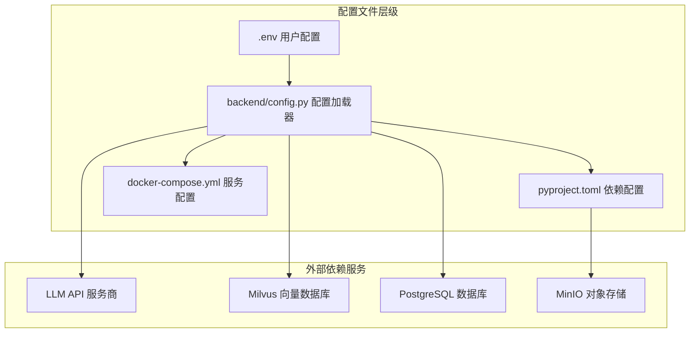
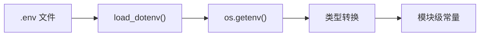
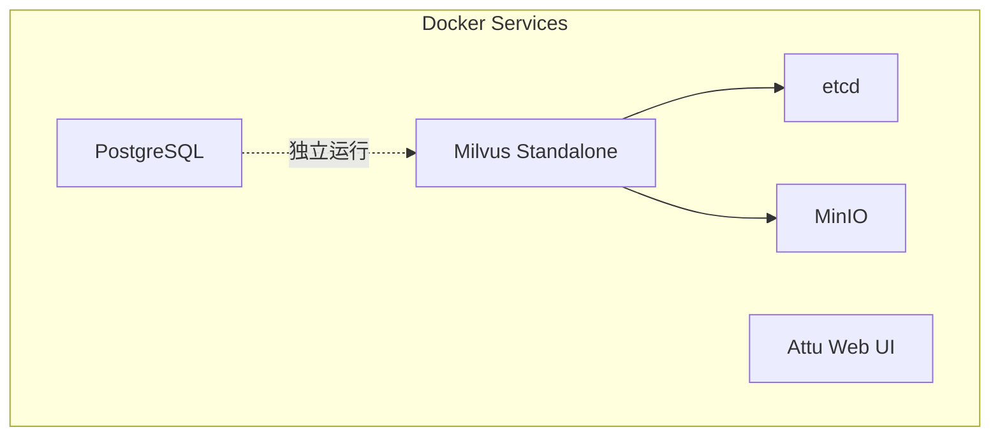

本文档详细介绍 SuperMew 项目的所有配置文件，帮助开发者理解每个配置项的作用及正确的配置方法。配置文件是连接代码与外部服务的桥梁，正确理解这些配置将让你能够灵活定制系统行为。

## 配置文件概览

SuperMew 项目涉及多个配置层级，从环境变量到 Docker 服务，每一层都有其特定的用途和配置方式。



配置文件在项目中的加载顺序为：`pyproject.toml` → `.env` → `docker-compose.yml`。环境变量配置文件优先级最高，可以覆盖所有硬编码的默认值。

Sources: [backend/config.py](backend/config.py#L1-L8), [.env.example](.env.example#L1-L82)

## 环境变量配置 (.env)

`.env` 文件是最主要的用户配置文件，位于项目根目录。项目提供了 `.env.example` 模板，你可以复制并重命名为 `.env` 后进行配置。

```bash
# 在项目根目录执行
cp .env.example .env
```

### API 服务商配置

SuperMew 支持多种 LLM 服务商，通过 `API_KEY` 和 `BASE_URL` 组合配置。推荐国内用户使用**硅基流动（SiliconFlow）**，它提供稳定的 API 访问和合理的价格。

```env
# ===== 通用 API 配置 =====
# 选择一个服务商，取消对应注释并填入 API_KEY
# 注意：一次只使用一个服务商

# --- SiliconFlow (硅基流动) - 推荐国内使用 ---
API_KEY=your_siliconflow_api_key
BASE_URL=https://api.siliconflow.cn/v1
```

**支持的 API 服务商对照表：**

| 服务商 | BASE_URL | 特点 |
|--------|----------|------|
| 硅基流动 | `https://api.siliconflow.cn/v1` | 推荐国内使用，支持多种模型 |
| OpenRouter | `https://openrouter.ai/api/v1` | 聚合多个模型 |
| DeepSeek | `https://api.deepseek.com/v1` | 性价比高 |
| OpenAI | `https://api.openai.com/v1` | 官方服务 |
| Anthropic | `https://api.anthropic.com/v1` | Claude 系列模型 |
| 火山引擎 | `https://ark.cn-beijing.volces.com/api/v3` | 豆包模型 |

Sources: [.env.example](.env.example#L1-L28)

### 模型配置

模型配置定义了系统使用的主模型、嵌入模型和重排序模型。不同服务商需要使用对应的模型名称。

```env
# --- SiliconFlow 模型 ---
MODEL=Qwen/Qwen3.5-122B-A10B
EMBEDDER=Qwen/Qwen3-Embedding-4B
RERANK_MODEL=Qwen/Qwen3-Reranker-4B
RERANK_BINDING_HOST=https://api.siliconflow.cn/v1/rerank
```

**模型配置参数说明：**

| 参数 | 用途 | 说明 |
|------|------|------|
| `MODEL` | 主对话模型 | 处理用户对话请求 |
| `EMBEDDER` | 向量化模型 | 将文本转换为向量用于检索 |
| `RERANK_MODEL` | 重排序模型 | 对检索结果进行二次排序（可选） |
| `RERANK_BINDING_HOST` | 重排序服务地址 | Rerank API 端点 |

> ⚠️ **重要提示**：如果你使用的服务商不支持 Rerank，可以不配置 `RERANK_MODEL` 和 `RERANK_BINDING_HOST`，系统会自动降级为纯稠密检索模式。

Sources: [.env.example](.env.example#L29-L57)

### RAG Pipeline 配置

RAG 管道使用专门的评分模型来判断检索结果的相关性。

```env
# ===== RAG Pipeline =====
GRADE_MODEL=Qwen/Qwen3.5-122B-A10B
```

`GRADE_MODEL` 用于 RAG 流程中的文档相关性评分。当系统检索到多个文档后，会使用这个模型判断哪些文档与用户问题真正相关。

Sources: [.env.example](.env.example#L58-L59)

### Milvus 向量数据库配置

Milvus 是系统的核心向量存储服务，用于存储文档嵌入向量和支持语义检索。

```env
# ===== Milvus =====
MILVUS_HOST=127.0.0.1
MILVUS_PORT=19530
MILVUS_COLLECTION=embeddings_collection
```

| 参数 | 默认值 | 说明 |
|------|--------|------|
| `MILVUS_HOST` | `127.0.0.1` | Milvus 服务地址，本地开发保持默认 |
| `MILVUS_PORT` | `19530` | Milvus 监听端口 |
| `MILVUS_COLLECTION` | `embeddings_collection` | 向量集合名称，可自定义 |

Sources: [.env.example](.env.example#L60-L64)

### Auto-merging 分块合并配置

Auto-merging 是系统的智能分块合并机制，当检索到的叶子分块满足一定条件时，会自动合并为更大的父级分块以获得更完整的上下文。

```env
# ===== Auto-merging =====
AUTO_MERGE_ENABLED=true
AUTO_MERGE_THRESHOLD=2
LEAF_RETRIEVE_LEVEL=3
```

| 参数 | 默认值 | 说明 |
|------|--------|------|
| `AUTO_MERGE_ENABLED` | `true` | 是否启用自动合并，设为 `false` 可禁用 |
| `AUTO_MERGE_THRESHOLD` | `2` | 触发合并的最小叶子块数量阈值 |
| `LEAF_RETRIEVE_LEVEL` | `3` | 叶子分块的层级深度 |

> 💡 **调优建议**：如果你的文档结构比较简单，可以将 `AUTO_MERGE_THRESHOLD` 设为 `1` 以获得更激进的合并效果；如果文档结构复杂，保持默认值 `2` 可避免过度合并。

Sources: [.env.example](.env.example#L65-L69)

### 服务器配置

```env
# ===== Server =====
HOST=127.0.0.1
PORT=8000
```

| 参数 | 默认值 | 说明 |
|------|--------|------|
| `HOST` | `127.0.0.1` | 服务监听地址，`0.0.0.0` 表示对外暴露 |
| `PORT` | `8000` | 服务监听端口 |

Sources: [.env.example](.env.example#L74-L77)

### 可选工具配置

系统支持扩展工具插件，例如天气查询功能。

```env
# ===== Tools (可选) =====
AMAP_WEATHER_API=https://restapi.amap.com/v3/weather/weatherInfo
AMAP_API_KEY=your_amap_api_key
```

> 💡 **说明**：工具配置是可选的。如果不配置天气工具，Agent 将无法使用天气查询功能，但不影响核心对话和 RAG 功能。

Sources: [.env.example](.env.example#L71-L73)

### LangSmith 追踪配置（可选）

LangSmith 是 LangChain 的调试和追踪平台，帮助开发者监控 Agent 执行过程。

```env
# ===== LangSmith Tracing (可选) =====
# LANGSMITH_TRACING=true
# LANGSMITH_API_KEY=your_langsmith_api_key
# LANGSMITH_PROJECT=SuperMew-Dev
```

> ⚠️ **注意**：LangSmith 是付费服务，个人开发者可免费获得基础额度。如不需要追踪功能，保持这些配置为注释状态即可。

Sources: [.env.example](.env.example#L79-L81)

## 配置加载器 (config.py)

`backend/config.py` 是配置加载器的核心实现，它负责从 `.env` 文件读取环境变量并提供类型安全的配置访问。



配置加载器的工作流程如上所示：它首先调用 `load_dotenv()` 从 `.env` 文件加载环境变量，然后通过 `os.getenv()` 读取各个配置项，并进行必要的类型转换（如端口号的字符串转整数）。

**关键设计决策**：项目使用 `override=True` 参数，这意味着 `.env` 文件中的配置会覆盖系统环境变量。这种设计确保了配置的确定性——同一份代码在不同机器上只需要调整 `.env` 文件即可。

```python
# 加载根目录 .env（仅从文件读取，不读取系统环境变量）
BASE_DIR = Path(__file__).resolve().parent.parent
from dotenv import load_dotenv
load_dotenv(BASE_DIR / ".env", override=True)
```

Sources: [backend/config.py](backend/config.py#L1-L8)

### PostgreSQL 数据库配置

PostgreSQL 用于存储 Agent 的会话检查点（Checkpointer）和用户画像信息。

```env
# ===== PostgreSQL =====
POSTGRES_HOST=127.0.0.1
POSTGRES_PORT=5433
POSTGRES_USER=supermew
POSTGRES_PASSWORD=supermew123
POSTGRES_DB=supermew
```

> ⚠️ **安全提示**：默认密码 `supermew123` 仅适用于本地开发环境。在生产环境中，请务必使用强密码或通过环境变量注入敏感信息。

Sources: [backend/config.py](backend/config.py#L45-L50)

### 记忆向量库配置

记忆向量库用于存储用户的历史交互记忆，支持语义检索。

```python
MEMORY_COLLECTION_NAME = os.getenv("MEMORY_COLLECTION_NAME", "user_memory")
MEMORY_TOP_K = 5           # 向量库检索候选数
MEMORY_RECALL_LIMIT = 3    # 最终召回使用数
MEMORY_TOKEN_LIMIT = 500   # 记忆文本 token 上限
MEMORY_REBUILD_HOUR = 3    # 每天凌晨 3 点重建
```

| 参数 | 默认值 | 说明 |
|------|--------|------|
| `MEMORY_COLLECTION_NAME` | `user_memory` | Milvus 中的记忆集合名 |
| `MEMORY_TOP_K` | `5` | 向量检索时返回的候选数量 |
| `MEMORY_RECALL_LIMIT` | `3` | 最终用于拼接到提示词的记忆条数 |
| `MEMORY_TOKEN_LIMIT` | `500` | 单条记忆的最大 Token 限制 |
| `MEMORY_REBUILD_HOUR` | `3` | 每日自动重建记忆索引的小时（24小时制） |

Sources: [backend/config.py](backend/config.py#L52-L57)

## Docker 服务配置 (docker-compose.yml)

`docker-compose.yml` 定义了项目依赖的外部服务，包括 Milvus 向量数据库和 PostgreSQL。



### 服务组件说明

| 服务 | 镜像版本 | 端口 | 用途 |
|------|----------|------|------|
| `postgres` | `postgres:16-alpine` | `5433:5432` | 会话状态持久化 |
| `etcd` | `quay.io/coreos/etcd:v3.5.18` | `2379` | Milvus 元数据存储 |
| `minio` | `minio/minio:RELEASE.2024-05-28` | `9000` / `9001` | Milvus 对象存储 |
| `standalone` | `milvusdb/milvus:v2.5.14` | `19530` | Milvus 主服务 |
| `attu` | `zilliz/attu:v2.5.11` | `8080` | Milvus Web 可视化管理 |

### 端口映射详解

```
PostgreSQL: 5433:5432    # 主机5433映射到容器5432
MinIO API:  9000:9000    # S3兼容API
MinIO Console: 9001:9001 # Web管理界面
Milvus:     19530:19530 # 主服务端口
Milvus健康: 9091:9091    # 健康检查端口
Attu:       8080:3000    # Web管理界面
```

Sources: [docker-compose.yml](docker-compose.yml#L1-L94)

### 数据卷配置

Docker 服务使用命名卷持久化数据：

```yaml
volumes:
  - ${DOCKER_VOLUME_DIRECTORY:-.}/volumes/postgres:/var/lib/postgresql/data
  - ${DOCKER_VOLUME_DIRECTORY:-.}/volumes/etcd:/etcd
  - ${DOCKER_VOLUME_DIRECTORY:-.}/volumes/minio:/minio_data
  - ${DOCKER_VOLUME_DIRECTORY:-.}/volumes/milvus:/var/lib/milvus
```

`${DOCKER_VOLUME_DIRECTORY:-.}` 表示优先使用环境变量指定目录，未指定则默认使用项目根目录下的 `volumes` 文件夹。

### 健康检查机制

每个服务都配置了健康检查，确保服务完全启动后再允许依赖它的服务启动：

```yaml
healthcheck:
  test: ["CMD-SHELL", "pg_isready -U supermew"]
  interval: 10s
  timeout: 5s
  retries: 5
```

## 依赖配置 (pyproject.toml)

`pyproject.toml` 定义了 Python 项目依赖和元数据。

```toml
[project]
name = "supermew"
version = "0.1.4"
requires-python = ">=3.12"
```

### 核心依赖说明

| 依赖 | 版本 | 用途 |
|------|------|------|
| `fastapi` / `uvicorn` | ≥0.115 / ≥0.30 | Web 框架和 ASGI 服务器 |
| `langchain` 系列 | ≥0.3 | Agent 和 RAG 核心框架 |
| `langgraph` | ≥0.2 | 状态机工作流编排 |
| `pymilvus` | ≥2.5 | Milvus 客户端 |
| `psycopg2` / `langgraph-checkpoint-postgres` | 最新 | PostgreSQL 检查点存储 |
| `python-dotenv` | ≥1.0 | 环境变量加载 |

Sources: [pyproject.toml](pyproject.toml#L1-L35)

### 可选依赖组

```toml
[project.optional-dependencies]
study = [
    "langchain-classic>=0.2.0",
    "chromadb>=0.5.5",
    "bilibili-api-python>=17.0.0",
]
```

可选的 `study` 依赖组包含用于学习和研究的额外工具，如 ChromaDB（轻量级向量库）和 B站 API。

## 快速配置清单

对于新加入项目的开发者，按照以下清单配置可以快速启动项目：

```
Step 1: 复制配置模板
        cp .env.example .env

Step 2: 配置 LLM API
        - 填入 API_KEY
        - 选择服务商并配置 BASE_URL
        - 选择对应模型名称

Step 3: 启动依赖服务
        docker compose up -d

Step 4: 安装 Python 依赖
        uv sync

Step 5: 启动应用
        uv run python main.py
```

## 配置优先级总结

当同一个配置项在多个地方出现时，按以下优先级生效：

1. **环境变量** (`.env` 文件) — 最高优先级
2. **Docker 环境变量** (`docker-compose.yml`) — 次高
3. **代码默认值** (`config.py` 中的 `os.getenv(..., "默认值")`) — 最低

这种分层设计让你可以灵活地在不同环境（开发、测试、生产）中使用不同的配置，只需调整环境变量而无需修改代码。

---

## 下一步

配置完成后，你可以继续阅读以下文档深入了解系统：

- [快速启动](2-kuai-su-qi-dong) — 学习如何启动完整系统
- [系统架构总览](5-xi-tong-jia-gou-zong-lan) — 理解配置如何影响系统运行
- [三层记忆架构](6-san-ceng-ji-yi-jia-gou) — 了解记忆配置的具体应用