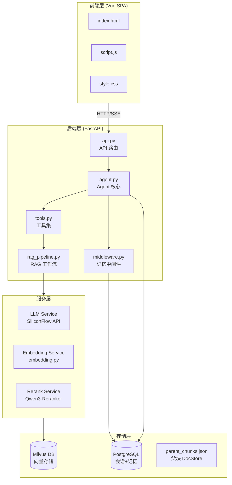
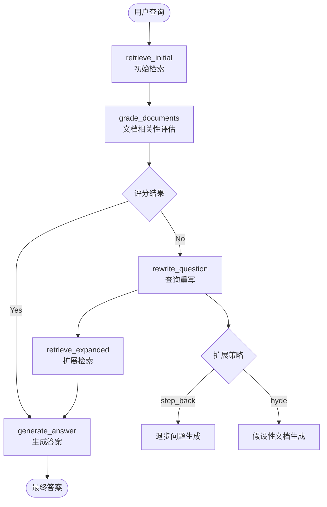
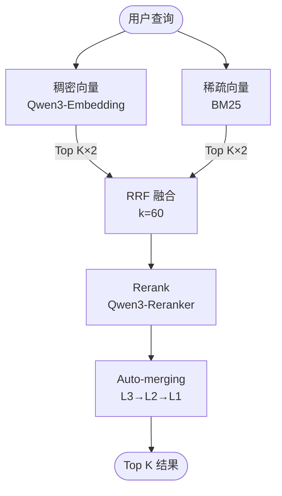
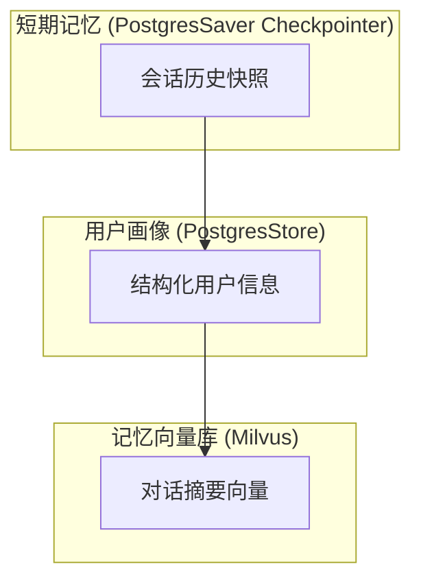

本文档介绍 SuperMew 项目的整体系统架构，涵盖从前端交互到后端推理、从向量检索到记忆管理的完整技术栈。作为项目的核心概览页面，本文旨在帮助开发者快速建立对系统各组件及其交互关系的全局认知，为后续深入学习各个子模块奠定基础。

## 系统技术栈

SuperMew 基于 **FastAPI + LangChain + LangGraph + Milvus** 技术栈构建，集成了 RAG（检索增强生成）技术与 Agent 记忆管理系统。系统采用分层架构设计，每一层职责明确，层间通过标准接口通信。

### 后端技术选型

| 层级 | 技术选型 | 版本要求 | 核心职责 |
|------|----------|----------|----------|
| Web 框架 | FastAPI | ≥0.115.0 | REST API 服务与路由管理 |
| Agent 框架 | LangChain | ≥0.3 | Agent 构建与工具调用编排 |
| 工作流引擎 | LangGraph | ≥0.2.31 | RAG 管道状态机编排 |
| 会话持久化 | langgraph-checkpoint-postgres | ≥0.1.0 | 短期会话状态快照存储 |
| 长期记忆 | langchain-postgres | ≥0.0.17 | 用户画像结构化存储 |
| 向量数据库 | Milvus | 2.5+ | 混合向量存储与检索 |
| 嵌入模型 | Qwen3-Embedding-4B | — | 稠密向量生成 |
| 重排序模型 | Qwen3-Reranker-4B | — | 检索结果精排 |
| LLM 推理 | Qwen3.5-122B-A10B | — | 主模型对话生成 |

Sources: [sys-doc.md](sys-doc.md#L29-L52)

### 前端技术选型

前端采用轻量化方案，使用原生 HTML/CSS/JavaScript 配合 Vue 3 CDN 实现单页应用。这种设计避免了复杂的构建流程，使前端代码可以直接在浏览器中运行，同时通过 Vue 的响应式特性实现了流畅的实时交互体验。

| 技术 | 用途 |
|------|------|
| Vue 3 (CDN) | 响应式 UI 框架 |
| Marked.js | Markdown 渲染 |
| Highlight.js | 代码语法高亮 |
| SSE | 服务器推送事件（流式输出） |

Sources: [sys-doc.md](sys-doc.md#L54-L61)

### 基础设施组件

Docker Compose 编排了系统的核心依赖服务，包括 PostgreSQL 用于结构化数据存储，以及 Milvus 向量数据库及其配套组件（etcd 元数据存储、MinIO 对象存储）。

```yaml
# 核心服务组件
services:
  postgres:      # PostgreSQL 16 - 会话与记忆存储
  etcd:          # etcd v3.5 - Milvus 元数据
  minio:         # MinIO - Milvus 对象存储
  standalone:    # Milvus 2.5 - 向量数据库
  attu:          # Attu - Milvus 可视化管理
```

Sources: [docker-compose.yml](docker-compose.yml#L1-L94)

## 整体架构设计

SuperMew 采用经典的分层架构设计，从上到下依次为前端层、后端层、服务层和存储层。各层之间通过明确定义的接口进行通信，保持了良好的模块化与可维护性。



### 前端层职责

前端位于 `frontend/` 目录，采用纯静态文件形式部署。`index.html` 挂载 Vue 3 应用，`script.js` 实现了聊天界面逻辑、流式响应处理和 RAG 步骤展示，`style.css` 定义了整体视觉风格。

前端核心功能包括：用户消息发送与展示、流式响应渲染（RAG 步骤实时显示）、会话历史管理、文档上传与管理。流式响应通过 SSE（Server-Sent Events）实现，后端使用 `StreamingResponse` 返回 SSE 格式数据，前端通过 `fetch` + `ReadableStream` 逐块读取并渲染。

Sources: [frontend/script.js](frontend/script.js#L85-L140)

### 后端层职责

后端代码位于 `backend/` 目录，是系统的核心逻辑所在。各模块职责划分如下：

| 模块 | 职责 |
|------|------|
| `app.py` | FastAPI 应用创建、CORS 配置、静态文件挂载、启动事件 |
| `api.py` | REST API 路由定义（聊天、会话、文档、记忆） |
| `agent.py` | LangChain Agent 实例化、会话管理、流式响应处理 |
| `middleware.py` | 记忆中间件（用户画像、会话摘要、动态系统提示词） |
| `tools.py` | 工具函数定义（天气查询、知识库检索、记忆检索） |
| `rag_pipeline.py` | LangGraph RAG 工作流编排 |
| `config.py` | 环境变量配置管理 |

Sources: [CLAUDE.md](CLAUDE.md#L9-L22)

## Agent 核心架构

Agent 是系统的智能核心，基于 LangChain 的 `create_agent` 函数构建，集成了会话持久化、记忆管理和工具调用能力。

### Agent 创建流程

```python
# agent.py 中的核心创建逻辑
agent = create_agent(
    model=model,                           # LLM 实例
    tools=[get_current_weather, search_knowledge_base, search_memory],  # 工具集
    checkpointer=checkpointer,             # 会话状态持久化
    store=store,                            # 长期记忆存储
    context_schema=Context,                 # 上下文类型定义
    middleware=[...]                        # 中间件列表
)
```

Sources: [backend/agent.py](backend/agent.py#L105-L130)

### 中间件机制

Agent 使用了三层中间件实现记忆功能，每层职责明确：

| 中间件 | 功能 | 触发时机 |
|--------|------|----------|
| `SummarizationMiddleware` | 对话摘要 | 每 8000 token 自动触发 |
| `memory_summary_hook` | 摘要写入 Milvus | 每 25 轮用户对话触发 |
| `system_prompt_middleware` | 动态系统提示词 | 每次模型调用前 |

Sources: [backend/middleware.py](backend/middleware.py#L275-L305)

### 会话持久化

系统使用 `PostgresSaver` 作为 Checkpointer，将 Agent 的中间状态（包括完整的消息历史）持久化到 PostgreSQL。这使得用户可以在不同时间、不同请求中恢复同一会话的上下文。

```python
# 创建 Checkpointer
checkpointer = PostgresSaver(conn)
checkpointer.setup()

# 会话配置（thread_id 标识会话）
config = {"configurable": {"thread_id": f"{user_id}_{session_id}"}}
result = agent.invoke({"messages": messages}, config=config)
```

Sources: [backend/agent.py](backend/agent.py#L20-L35)

## RAG 检索系统架构

RAG（检索增强生成）系统是项目的核心技术亮点之一，采用混合检索策略结合 LangGraph 状态机编排。

### RAG 工作流



Sources: [backend/rag_pipeline.py](backend/rag_pipeline.py#L335-L380)

### 混合检索流程

检索模块采用 Dense（稠密向量）+ Sparse（BM25 稀疏向量）混合检索策略，通过 RRF（Reciprocal Rank Fusion）算法融合两路检索结果。



Sources: [sys-doc.md](sys-doc.md#L95-L115)

### 检索配置参数

| 参数 | 默认值 | 说明 |
|------|--------|------|
| `candidate_k` | top_k × 3 | 候选文档数量 |
| `leaf_retrieve_level` | 3 | 叶子层检索层级 |
| `auto_merge_threshold` | 2 | 自动合并阈值 |
| `rrf_k` | 60 | RRF 融合参数 |

Sources: [backend/config.py](backend/config.py#L28-L33)

## 三层记忆架构

SuperMew 实现了独特的三层记忆架构，分别处理不同时间跨度和类型的记忆需求。

### 记忆层次划分



| 记忆层 | 存储介质 | 数据类型 | 持久化方式 |
|--------|----------|----------|------------|
| 短期记忆 | PostgreSQL | 会话消息历史 | Checkpointer 自动快照 |
| 用户画像 | PostgreSQL | 用户属性结构化数据 | PostgresStore |
| 记忆向量库 | Milvus | 对话摘要、长期记忆 | 混合向量检索 |

Sources: [sys-doc.md](sys-doc.md#L117-L140)

### 用户画像提取

`UserMemoryManager` 组件通过 LLM 自动从用户消息中提取结构化信息，包括姓名、学校、专业、年级、身份、关系、兴趣等字段。提取采用 Pydantic 模型约束输出格式，确保数据的结构化与可解析性。

```python
class UserInfo(BaseModel):
    name: Optional[str]       # 用户名字
    school: Optional[str]      # 学校/公司
    major: Optional[str]      # 专业/领域
    grade: Optional[str]       # 年级
    identity: Optional[str]    # 身份
    relationship: Optional[str]# 重要关系
    interest: Optional[str]   # 兴趣爱好
    location: Optional[str]    # 所在地
```

Sources: [backend/middleware.py](backend/middleware.py#L28-L40)

## 文档处理与向量化

系统支持 PDF 和 Word 文档的自动处理，采用三级滑动窗口分块策略。

### 三级分块架构

| 层级 | 块大小 | 父级 | 存储位置 |
|------|--------|------|----------|
| L1 (根块) | 1200+ chars | — | `parent_chunks.json` |
| L2 (中块) | 600 chars | L1 | `parent_chunks.json` |
| L3 (叶子块) | 300 chars | L2 | Milvus 向量库 |

仅叶子层（L3）生成向量并写入 Milvus，父块（L1/L2）写入本地 DocStore。这种设计既减少了向量冗余，又保留了上下文聚合能力。

Sources: [backend/document_loader.py](backend/document_loader.py#L35-L55)

### 向量化服务

`EmbeddingService` 同时生成稠密向量和稀疏向量。稠密向量通过 Embedding API 生成，稀疏向量采用 BM25 算法计算词项权重。

```python
class EmbeddingService:
    def get_embeddings(self, texts):      # 稠密向量
    def get_sparse_embedding(self, text): # BM25 稀疏向量
    def fit_corpus(self, texts):          # 语料库拟合（计算 IDF）
```

Sources: [backend/embedding.py](backend/embedding.py#L10-L80)

## 数据流与请求处理

### 聊天请求完整流程

1. **前端**：用户输入消息，通过 SSE 发起 POST `/chat/stream` 请求
2. **API 层**：`api.py` 接收请求，调用 `chat_with_agent_stream`
3. **Agent 层**：执行 Agent 流式推理，触发中间件链
4. **工具层**：如需检索，调用 `search_knowledge_base` 工具
5. **RAG 层**：执行混合检索 → RRF 融合 → Rerank → Auto-merging
6. **LLM 层**：生成最终回答，逐 token 流式返回
7. **前端**：逐块渲染响应，实时展示 RAG 检索步骤

Sources: [backend/api.py](backend/api.py#L95-L140)

### 流式响应机制

系统使用线程安全的 `queue.Queue` 在 agent 线程和 asyncio 主循环之间传递数据。RAG 步骤和 LLM 内容片段被包装为 SSE 格式事件，前端通过 `ReadableStream` 逐个解析并渲染。

```python
# 事件类型
{"type": "content", "content": "..."}   # LLM 内容片段
{"type": "rag_step", "step": {...}}    # RAG 检索步骤
{"type": "trace", "rag_trace": {...}}   # RAG 追踪信息
{"type": "error", "content": "..."}     # 错误信息
```

Sources: [backend/agent.py](backend/agent.py#L230-L270)

## 系统启动与初始化

应用启动时执行以下初始化操作：

```python
# backend/app.py
@app.on_event("startup")
def init_memory_collection():
    store = MemoryVectorStore()
    store.init_collection()  # 确保 user_memory collection 存在
```

Sources: [backend/app.py](backend/app.py#L45-L50)

Docker 服务需要在应用启动前就绪：
- PostgreSQL：提供会话和记忆存储
- Milvus 及其依赖（etcd、MinIO）：提供向量检索能力

Sources: [README.md](README.md#L30-L50)

## 下一步阅读建议

完成本篇架构概览后，建议按以下路径深入学习：

1. **[三层记忆架构](6-san-ceng-ji-yi-jia-gou)** — 深入理解三层记忆的设计原理与实现细节
2. **[混合检索原理](12-hun-he-jian-suo-yuan-li)** — 深入学习 Dense+Sparse 混合检索与 RRF 融合算法
3. **[LangChain Agent 实现](9-langchain-agent-shi-xian)** — 深入学习 Agent 的创建、中间件机制和工具系统
4. **[Auto-merging 分块合并](13-auto-merging-fen-kuai-he-bing)** — 深入学习三级分块与自动合并策略