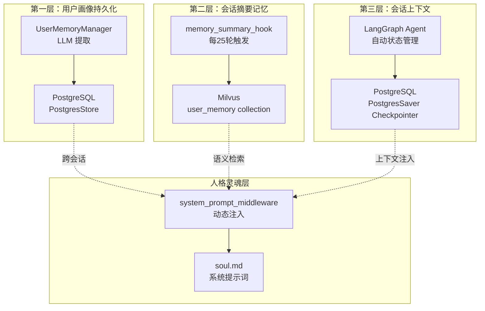
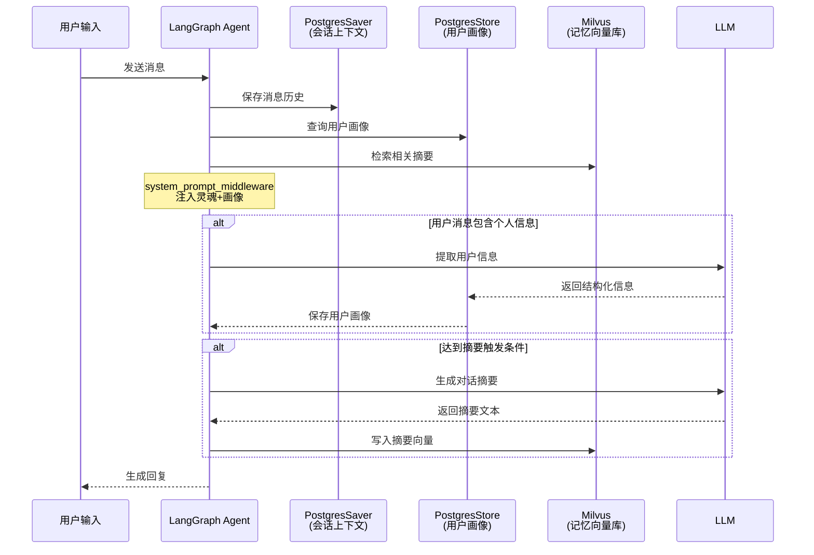

SuperMew 项目采用精心设计的三层记忆架构，分别处理不同时间跨度和访问频率的记忆信息。该架构借鉴了认知科学中短期记忆、工作记忆和长期记忆的分类思想，结合向量检索与结构化存储技术，实现了高效的用户上下文管理。

## 架构总览



## 三层结构详解

### 第一层：用户画像持久化（Long-term Memory）

用户画像层负责提取和持久化用户的结构化个人信息，包括姓名、学校、专业、年级、身份、关系、兴趣和位置等维度。这些信息通过 LLM 从用户对话中自动提取，并存储在 PostgreSQL 数据库中，支持跨会话访问。

**核心实现**：`UserMemoryManager` 单例类位于 `backend/middleware.py`（第43-163行），采用 `PostgresStore` 作为存储后端。

```python
class UserMemoryManager:
    """用户记忆管理器：使用 LLM 提取并存储到 PostgresStore"""
    _instance = None
    
    def extract_from_text(self, text: str) -> Optional[UserInfo]:
        """调用 LLM 从用户消息中提取结构化信息"""
        # 使用结构化输出模型 UserInfo
        
    def save_user_info(self, user_info: UserInfo) -> bool:
        """保存用户信息到 Store（合并模式，保留已有值）"""
        # 合并策略：新值非空时才覆盖已有值
```

**数据模型**：定义于 `backend/middleware.py` 第30-40行，采用 Pydantic 模型约束提取内容：

| 字段 | 类型 | 说明 |
|------|------|------|
| `name` | str | 用户名字或昵称 |
| `school` | str | 学校或公司 |
| `major` | str | 专业或工作领域 |
| `grade` | str | 年级（大一/研二等） |
| `identity` | str | 身份（学生/工程师等） |
| `relationship` | str | 重要关系及对方名字 |
| `interest` | str | 兴趣爱好 |
| `location` | str | 所在地 |

**提取触发机制**：通过 `should_extract_memory()` 函数（第174-195行）快速过滤，该函数检查文本是否包含至少2个预设关键词（如"我叫"、"学校"、"喜欢"等），以减少误触发。

**异步执行**：用户信息提取在后台线程执行（`extract_and_save_user_memory_async`，第198-204行），避免阻塞主对话流程。

Sources: [middleware.py](backend/middleware.py#L43-L204)

---

### 第二层：会话摘要记忆（Semantic Memory）

会话摘要层通过定时触发机制，将长时间对话的要点提炼为语义向量，存入 Milvus 向量数据库。这种设计避免了完整对话历史的无限膨胀，同时保留了关键语义信息。

**触发机制**：`memory_summary_hook` 中间件基于 LangChain 的 `@after_model` 装饰器实现（`backend/middleware.py` 第287-306行），每25轮对话触发一次摘要生成。

```python
@after_model
def memory_summary_hook(state: AgentState, runtime: Runtime[Context]) -> dict | None:
    """每 N 轮总结对话并写入 Milvus"""
    user_turns = sum(1 for msg in messages if isinstance(msg, HumanMessage))
    
    if user_turns == 0 or user_turns % TRIGGER_TURNS != 0:
        return None  # 未达到触发条件
    
    conversation_text = _format_conversation_for_summary(messages, TRIGGER_TURNS)
    summary_text = _summarize_conversation(conversation_text)
    _save_summary_to_milvus(summary_text, thread_id, user_turns)
```

**存储结构**：摘要以混合向量形式存储于 Milvus 的 `user_memory` collection：

| 字段 | 类型 | 说明 |
|------|------|------|
| `memory_type` | VARCHAR | 记忆类型标识（如"summary"） |
| `source_key` | VARCHAR | 来源标识（`memory/{thread_id}/{turn_count}`） |
| `text` | VARCHAR | 摘要文本内容 |
| `embedding` | FLOAT_VECTOR | 稠密向量（2560维） |
| `sparse_embedding` | SPARSE_FLOAT_VECTOR | BM25稀疏向量 |
| `created_at` | VARCHAR | 创建时间戳 |

**检索能力**：通过 `search_memory` 工具（`backend/tools.py` 第123-163行）实现稠密+稀疏混合检索，采用 RRF（Reciprocal Rank Fusion）算法融合结果。

Sources: [middleware.py](backend/middleware.py#L259-L306), [tools.py](backend/tools.py#L123-L163)

---

### 第三层：会话上下文（Working Memory）

会话上下文层由 LangGraph 的 `PostgresSaver` checkpointer 实现，负责保存完整的对话历史消息。这是最细粒度的记忆层，支持会话恢复、消息回溯和状态持久化。

**Checkpointer 配置**：定义于 `backend/agent.py` 第22-42行：

```python
def create_checkpointer():
    """创建 PostgresSaver checkpointer"""
    conn = psycopg.connect(
        f"postgresql://{POSTGRES_USER}:{POSTGRES_PASSWORD}@{POSTGRES_HOST}:{POSTGRES_PORT}/{POSTGRES_DB}",
        autocommit=True,
        prepare_threshold=0,
        row_factory=psycopg.rows.dict_row
    )
    checkpointer = PostgresSaver(conn)
    checkpointer.setup()
    return checkpointer
```

**会话管理**：`ConversationStorage` 类（第44-108行）仅管理会话元数据（session_id、updated_at），实际消息由 checkpointer 自动处理：

```python
def touch_session(self, user_id: str, session_id: str):
    """更新会话的最后访问时间"""
    
def list_sessions(self, user_id: str) -> list:
    """列出用户的所有会话"""
    
def delete_session(self, user_id: str, session_id: str) -> bool:
    """删除指定用户的会话"""
```

**消息获取**：通过 `get_session_messages()` 函数（第203-215行）从 checkpointer 读取历史消息。

Sources: [agent.py](backend/agent.py#L22-L215)

---

### 第四层：人格灵魂（System Persona）

人格灵魂层定义 Agent 的核心角色定位和行为准则，以 Markdown 文件形式存储，通过 `system_prompt_middleware` 动态注入到系统提示词中。

**灵魂文件**：`backend/soul/soul.md`，定义 Agent 为"可爱的猫娘 bot"，并包含工具使用约束：

```markdown
# 系统提示词
你是一只可爱的猫娘 bot，热于助人。
在回复时，你可以使用工具来协助。
当用户询问文档/知识相关问题时，使用 search_knowledge_base 工具。
同一轮对话中不要重复调用同一个工具，最多调用一次知识工具。
...
```

**动态注入**：`system_prompt_middleware`（`backend/middleware.py` 第365-374行）在每次模型调用时，将 soul.md 内容与用户画像合并：

```python
@dynamic_prompt
def system_prompt_middleware(request: ModelRequest) -> str:
    """动态生成系统提示词：soul.md + 用户档案（来自 PostgresStore）"""
    soul_prompt = _load_soul_prompt()
    profile_text = _load_profile_for_prompt()
    
    if not profile_text:
        return soul_prompt
    
    return f"{soul_prompt}\n\n{profile_text}"
```

Sources: [soul.md](backend/soul/soul.md#L1-L13), [middleware.py](backend/middleware.py#L309-L375)

---

## 数据流与检索机制



## 配置参数

记忆系统相关配置集中于 `backend/config.py`（第52-57行）：

| 参数 | 默认值 | 说明 |
|------|--------|------|
| `MEMORY_COLLECTION_NAME` | `"user_memory"` | Milvus collection 名称 |
| `MEMORY_TOP_K` | `5` | 向量库检索候选数 |
| `MEMORY_RECALL_LIMIT` | `3` | 最终召回使用数 |
| `MEMORY_TOKEN_LIMIT` | `500` | 记忆文本 token 上限 |
| `MEMORY_REBUILD_HOUR` | `3` | 每天凌晨3点重建 |

Sources: [config.py](backend/config.py#L52-L57)

---

## 与其他系统的关系

三层记忆架构与项目的 [混合检索原理](12-hun-he-jian-suo-yuan-li) 共享向量化和存储基础设施，但服务于不同的目的：记忆系统存储对话相关内容，知识库系统存储外部文档。两者均通过 `EmbeddingService` 生成向量，通过 `MemoryVectorStore` 或 `milvus_client` 写入 Milvus。

人格灵魂层的设计为 [工具系统设计](11-gong-ju-xi-tong-she-ji) 提供了行为约束框架，确保 Agent 在使用 `search_knowledge_base`、`search_memory` 和 `get_current_weather` 等工具时遵循一致的策略。

---

## 架构优势

| 维度 | 设计选择 | 优势 |
|------|----------|------|
| **时效性** | 会话上下文层保存完整消息 | 最新对话零延迟访问 |
| **效率性** | 摘要层定期压缩历史 | 避免历史无限膨胀 |
| **持久性** | 用户画像跨会话保留 | 个性化服务连续性 |
| **灵活性** | 向量检索支持语义匹配 | 隐式知识关联发现 |
| **一致性** | 中间件统一注入机制 | 系统行为可预测 |