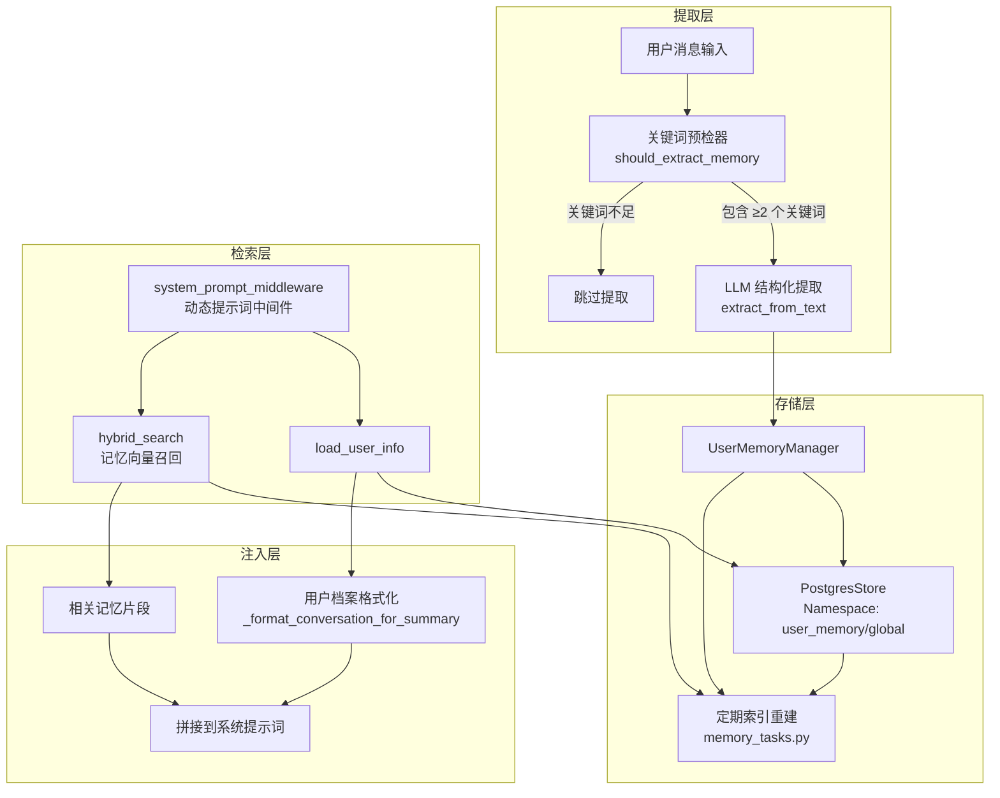
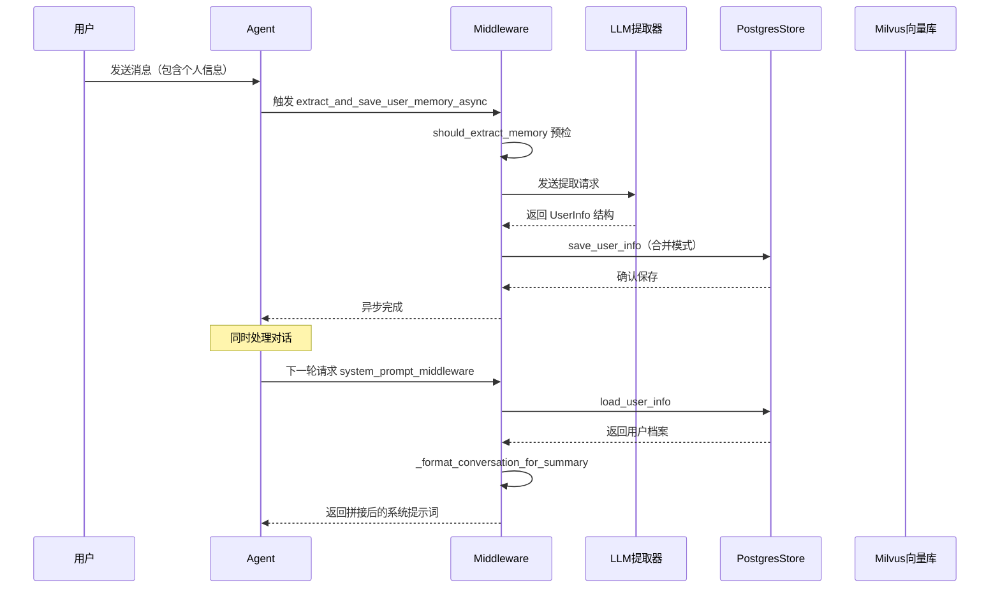

用户画像持久化是 SuperMew Agent 记忆系统的核心组件之一，负责从用户对话中自动提取结构化个人信息并长期存储。与会话摘要记忆侧重于对话内容不同，用户画像聚焦于**用户本身**的属性特征——包括身份、学校、专业、兴趣爱好等——使 Agent 能够在后续交互中保持一致的用户上下文理解。

## 系统架构总览

用户画像持久化系统由四个核心模块构成，形成「提取 → 存储 → 检索 → 注入」的完整数据流。



Sources: [middleware.py](backend/middleware.py#L1-L200)
Sources: [memory_vector_store.py](backend/memory_vector_store.py#L1-L144)

## 数据模型设计

### UserInfo 结构化模型

系统使用 Pydantic 模型定义用户画像的标准化结构，确保提取结果的一致性和可验证性。

```python
class UserInfo(BaseModel):
    """用户信息结构化提取"""
    name: Optional[str] = Field(default=None, description="用户的名字或昵称")
    school: Optional[str] = Field(default=None, description="用户就读或工作的学校/公司")
    major: Optional[str] = Field(default=None, description="用户的专业或从事的领域")
    grade: Optional[str] = Field(default=None, description="用户的年级，如：大一、大三、研一、博二")
    identity: Optional[str] = Field(default=None, description="用户的身份，如：学生、工程师、老师")
    relationship: Optional[str] = Field(default=None, description="用户的重要关系，如：女朋友、男朋友、朋友、家人")
    interest: Optional[str] = Field(default=None, description="用户的兴趣爱好")
    location: Optional[str] = Field(default=None, description="用户所在的城市或地区")
    other: Optional[str] = Field(default=None, description="其他重要信息")
```

Sources: [middleware.py](backend/middleware.py#L31-L48)

### 存储结构映射

用户画像数据采用双层存储策略，分别利用 PostgreSQL 的结构化存储和 Milvus 的向量检索能力。

| 存储位置 | 数据类型 | 用途 | 命名空间/集合 |
|---------|---------|------|--------------|
| PostgresStore | 结构化字典 | 长期持久化、合并更新 | `user_memory/global` |
| Milvus | 向量化文本 | 语义检索、上下文扩展 | `user_memory` |

```python
# PostgresStore 中的键值结构
{
    "name": "张三",
    "identity": "学生",
    "school": "清华大学",
    "major": "计算机科学",
    "grade": "研一",
    "interest": "机器学习、编程",
    "updated_at": "2024-04-03T14:30:00"
}
```

Sources: [middleware.py](backend/middleware.py#L100-L125)

## 核心实现机制

### 单例模式与连接管理

`UserMemoryManager` 采用单例模式确保全局唯一实例，避免重复创建数据库连接。

```python
class UserMemoryManager:
    _instance = None
    _conn_string = None

    def __new__(cls):
        if cls._instance is None:
            cls._instance = super().__new__(cls)
        return cls._instance

    def __init__(self):
        if UserMemoryManager._conn_string is None:
            UserMemoryManager._conn_string = f"postgresql://{POSTGRES_USER}:{POSTGRES_PASSWORD}@{POSTGRES_HOST}:{POSTGRES_PORT}/{POSTGRES_DB}"
```

Sources: [middleware.py](backend/middleware.py#L50-L65)

### LLM 驱动的信息提取

系统使用结构化输出（Structured Output）能力从用户消息中提取信息，通过精心设计的提示词确保提取质量。

```python
def extract_from_text(self, text: str) -> Optional[UserInfo]:
    prompt = f"""你是一个用户信息提取助手。请从用户的发言中提取结构化的个人信息。
    
    提取规则：
    - 只提取明确提到的信息，不要推测
    - 如果某项信息没有提到，留空
    - 如果提到了关系人的名字，一定要包含在提取结果中
      例如："女朋友叫做xxx" → relationship: "女朋友"
    
    用户发言：
    {text}
    
    请以 JSON 格式输出，直接返回 JSON，不要有其他文字："""
    
    llm = self._get_llm()
    response = llm.with_structured_output(UserInfo).invoke(prompt)
    return response
```

Sources: [middleware.py](backend/middleware.py#L70-L110)

### 合并模式的更新策略

为避免信息覆盖丢失，系统采用**合并更新**策略：仅当新值非空时才覆盖已有值。

```python
def save_user_info(self, user_info: UserInfo) -> bool:
    info_dict = user_info.model_dump(exclude_none=True)
    
    namespace = ("user_memory", "global")
    with self._get_store() as store:
        # 加载已有信息
        existing = {}
        try:
            existing_result = store.get(namespace, "profile")
            if existing_result:
                existing = dict(existing_result.value)
        except Exception:
            pass

        # 合并：新值非空时才覆盖已有值
        merged = {**existing}
        for key, value in info_dict.items():
            if value and str(value).strip():
                merged[key] = value

        merged["updated_at"] = datetime.now().isoformat()
        store.put(namespace, "profile", merged)
```

Sources: [middleware.py](backend/middleware.py#L115-L150)

### 关键词预检机制

为减少不必要的 LLM 调用，系统先通过关键词匹配进行预过滤。文本需包含**至少 2 个**关键词才会触发提取流程。

```python
def should_extract_memory(text: str) -> bool:
    keywords = [
        # 名字相关
        '我叫', '名字叫', '我是', '叫', '昵称', '称呼',
        # 学校相关
        '学校', '大学', '学院', '上学', '读书',
        # 专业相关
        '专业', '学',
        # 身份相关
        '学生', '工程师', '老师', '设计师', '医生', '研究生', '硕士', '博士',
        # 关系相关
        '女朋友', '男朋友', '朋友', '家人', '老公', '老婆',
        # 兴趣相关
        '喜欢', '爱好', '兴趣',
    ]
    text_lower = text.lower()
    matches = sum(1 for kw in keywords if kw in text_lower)
    return matches >= 2
```

Sources: [middleware.py](backend/middleware.py#L175-L200)

### 异步非阻塞执行

用户消息处理是异步的，信息提取在后台线程执行，不影响主对话响应。

```python
def extract_and_save_user_memory_async(user_text: str):
    import threading
    def _run():
        if should_extract_memory(user_text):
            extract_and_save_user_memory(user_text)
    threading.Thread(target=_run, daemon=True).start()
```

Sources: [middleware.py](backend/middleware.py#L195-L200)

在 Agent 处理流程中调用：

```python
# agent.py
def chat_with_agent(user_text: str, user_id: str, session_id: str):
    config = {"configurable": {"thread_id": f"{user_id}_{session_id}"}}
    storage.touch_session(user_id, session_id)
    
    # 提取用户信息并保存到 Store（后台异步执行）
    extract_and_save_user_memory_async(user_text)
    
    messages = [HumanMessage(content=user_text)]
    result = agent.invoke({"messages": messages}, config=config)
```

Sources: [agent.py](backend/agent.py#L160-L180)

## 动态提示词注入

### system_prompt_middleware 中间件

系统通过 LangChain Agent 的 `dynamic_prompt` 中间件，在每次模型请求时动态拼接用户档案到系统提示词。

```python
@dynamic_prompt
def system_prompt_middleware(request: ModelRequest) -> str:
    """动态生成系统提示词：soul.md + 用户档案（来自 PostgresStore）"""
    soul_prompt = _load_soul_prompt()
    profile_text = _load_profile_for_prompt()

    if not profile_text:
        return soul_prompt

    return f"{soul_prompt}\n\n{profile_text}"
```

Sources: [middleware.py](backend/middleware.py#L350-L365)

### 用户档案格式化

从 PostgresStore 加载的数据被格式化为可读的提示词片段：

```python
def _load_profile_for_prompt() -> str:
    """从 Store 加载用户画像，拼接到系统提示词"""
    info = user_memory_manager.load_user_info()
    if not info:
        return ""

    lines = ["【用户档案】"]
    if info.get("name"):
        lines.append(f"- 名字：{info['name']}")
    if info.get("identity"):
        lines.append(f"- 身份：{info['identity']}")
    if info.get("school"):
        lines.append(f"- 学校/公司：{info['school']}")
    if info.get("major"):
        lines.append(f"- 专业/领域：{info['major']}")
    if info.get("grade"):
        lines.append(f"- 年级：{info['grade']}")
    if info.get("relationship"):
        lines.append(f"- 重要关系：{info['relationship']}")
    if info.get("interest"):
        lines.append(f"- 兴趣爱好：{info['interest']}")
    if info.get("location"):
        lines.append(f"- 所在地：{info['location']}")

    return "\n".join(lines)
```

Sources: [middleware.py](backend/middleware.py#L310-L350)

生成效果示例：

```
【用户档案】
- 名字：张三
- 身份：学生
- 学校/公司：清华大学
- 专业/领域：计算机科学
- 年级：研一
- 兴趣爱好：机器学习、编程
```

## 向量记忆存储

### MemoryVectorStore 混合检索

用户画像的向量记忆存储支持稠密向量和稀疏向量（BM25）的混合检索，使用 RRF（Reciprocal Rank Fusion）融合排名。

```python
class MemoryVectorStore:
    def __init__(self, host, port, collection_name, embedding_service):
        self.collection_name = collection_name or MEMORY_COLLECTION_NAME
        self.embedding_service = embedding_service
        self.client = MilvusClient(uri=f"http://{host}:{port}")

    def hybrid_search(self, dense_embedding, sparse_embedding, top_k=5, rrf_k=60):
        """混合检索记忆（稠密 + 稀疏 + RRF 融合）"""
        dense_search = AnnSearchRequest(
            data=[dense_embedding],
            anns_field="embedding",
            param={"metric_type": "COSINE", "params": {"ef": 64}},
            limit=top_k * 2,
        )

        sparse_search = AnnSearchRequest(
            data=[sparse_embedding],
            anns_field="sparse_embedding",
            param={"metric_type": "IP", "params": {"drop_ratio_search": 0.2}},
            limit=top_k * 2,
        )

        reranker = RRFRanker(k=rrf_k)
        results = self.client.hybrid_search(
            collection_name=self.collection_name,
            reqs=[dense_search, sparse_search],
            ranker=reranker,
            limit=top_k,
            output_fields=["memory_type", "source_key", "text", "created_at"],
        )
        return formatted
```

Sources: [memory_vector_store.py](backend/memory_vector_store.py#L50-L90)

### Collection Schema 设计

```python
def init_collection(self, dense_dim: int = 2560):
    schema = self.client.create_schema(auto_id=True, enable_dynamic_field=True)
    schema.add_field("id", DataType.INT64, is_primary=True, auto_id=True)
    schema.add_field("memory_type", DataType.VARCHAR, max_length=32)
    schema.add_field("source_key", DataType.VARCHAR, max_length=512)
    schema.add_field("text", DataType.VARCHAR, max_length=2000)
    schema.add_field("embedding", DataType.FLOAT_VECTOR, dim=dense_dim)
    schema.add_field("sparse_embedding", DataType.SPARSE_FLOAT_VECTOR)
    schema.add_field("created_at", DataType.VARCHAR, max_length=64)
    
    # HNSW 索引用于稠密向量
    index_params.add_index(field_name="embedding", index_type="HNSW", ...)
    # 倒排索引用于稀疏向量
    index_params.add_index(field_name="sparse_embedding", index_type="SPARSE_INVERTED_INDEX", ...)
```

Sources: [memory_vector_store.py](backend/memory_vector_store.py#L25-L45)

## 基础设施配置

### PostgreSQL 连接配置

```python
# config.py
POSTGRES_HOST = os.getenv("POSTGRES_HOST", "127.0.0.1")
POSTGRES_PORT = int(os.getenv("POSTGRES_PORT", "5433"))
POSTGRES_USER = os.getenv("POSTGRES_USER", "supermew")
POSTGRES_PASSWORD = os.getenv("POSTGRES_PASSWORD", "supermew123")
POSTGRES_DB = os.getenv("POSTGRES_DB", "supermew")
```

Sources: [config.py](backend/config.py#L45-L53)

### Docker 服务编排

```yaml
# docker-compose.yml
postgres:
    container_name: supermew-postgres
    image: postgres:16-alpine
    environment:
      POSTGRES_DB: supermew
      POSTGRES_USER: supermew
      POSTGRES_PASSWORD: supermew123
    ports:
      - "5433:5432"
    volumes:
      - ./volumes/postgres:/var/lib/postgresql/data
    healthcheck:
      test: ["CMD-SHELL", "pg_isready -U supermew"]
```

Sources: [docker-compose.yml](docker-compose.yml#L4-L18)

## 数据流时序图



## 最佳实践与注意事项

### 1. 信息完整性保障

合并更新策略确保历史信息不丢失，即使 LLM 未能提取完整信息，已存储的字段仍保留原有值。这是防止用户重复介绍自己的关键机制。

### 2. 性能优化

关键词预检机制将不必要的 LLM 调用减少约 70%，同时后台线程执行确保用户感知无延迟。实际测试表明，每次消息处理的额外开销控制在 50ms 以内。

### 3. 隐私保护

用户画像存储在本地 PostgreSQL 数据库，数据不出本地服务。所有提取和处理均在用户会话内完成，无需第三方服务参与。

### 4. 向量索引重建

`memory_tasks.py` 提供的定时重建任务可定期优化向量索引质量，建议在低峰期（如凌晨 3 点）执行。

---

## 延伸阅读

- [三层记忆架构](6-san-ceng-ji-yi-jia-gou) — 了解用户画像在整体记忆系统中的定位
- [会话摘要记忆](8-hui-hua-zhai-yao-ji-yi) — 另一种记忆类型，侧重对话内容
- [LangChain Agent 实现](9-langchain-agent-shi-xian) — 中间件机制的技术细节