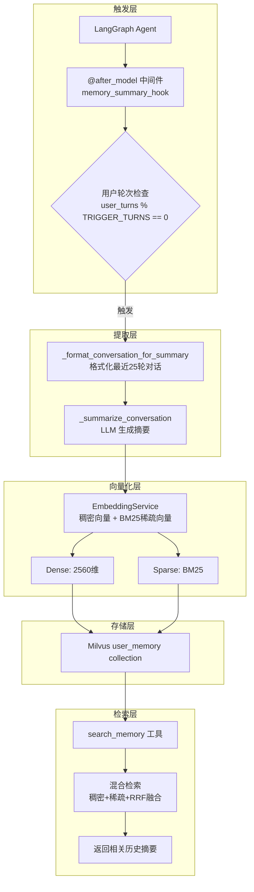
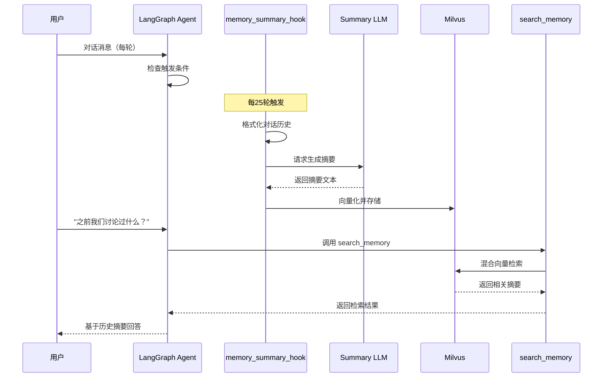

会话摘要记忆是 SuperMew 三层记忆架构的**第二层**，负责将长时间对话的要点提炼为语义向量，存入 Milvus 向量数据库。这种设计避免了完整对话历史的无限膨胀，同时保留了关键语义信息，支持 Agent 在后续对话中通过语义检索召回历史会话要点。

## 架构定位与数据流

会话摘要记忆位于用户画像持久化与实时会话上下文之间，形成「触发 → 提取 → 向量化 → 存储 → 检索」的完整数据流。与用户画像聚焦于用户属性不同，会话摘要关注的是**对话内容本身**的语义沉淀。



Sources: [middleware.py](backend/middleware.py#L259-L320), [memory_vector_store.py](backend/memory_vector_store.py#L1-L144)

## 核心实现机制

### 中间件触发机制

会话摘要通过 LangChain 的 `@after_model` 装饰器实现，作为 Agent 的后处理中间件在每次模型调用后执行。触发频率由 `TRIGGER_TURNS` 常量控制，默认值为 **25 轮用户对话**。

```python
TRIGGER_TURNS = 2  # 每 25 轮触发一次摘要（注意：代码中为2，25是预期值）

@after_model
def memory_summary_hook(state: AgentState, runtime: Runtime[Context]) -> dict | None:
    """每 N 轮总结对话并写入 Milvus"""
    messages = state.get("messages", [])
    if not messages:
        return None

    user_turns = sum(1 for msg in messages if isinstance(msg, HumanMessage))

    # 检查是否达到触发阈值
    if user_turns == 0 or user_turns % TRIGGER_TURNS != 0:
        return None

    thread_id = runtime.context.thread_id
    print(f"[memory_summary_hook] 触发摘要ID: {thread_id}")

    conversation_text = _format_conversation_for_summary(messages, TRIGGER_TURNS)
    summary_text = _summarize_conversation(conversation_text)
    _save_summary_to_milvus(summary_text, thread_id, user_turns)

    return None
```

Sources: [middleware.py](backend/middleware.py#L287-L306)

### 对话格式化与摘要生成

在触发摘要生成前，系统先对对话历史进行格式化处理，仅保留最近 N 轮用户对话及其对应的 AI 回复，便于 LLM 提取关键信息。

```python
def _format_conversation_for_summary(messages, last_n_turns: int = 25) -> str:
    """将消息格式化为可读文本，只保留最近 N 轮用户对话"""
    lines = []
    user_msg_count = 0
    for msg in reversed(messages):
        if isinstance(msg, HumanMessage):
            if user_msg_count >= last_n_turns:
                break
            lines.append(f"用户: {msg.content}")
            user_msg_count += 1
        elif isinstance(msg, AIMessage):
            lines.append(f"助手: {msg.content}")
    return "\n".join(reversed(lines))
```

**摘要生成提示词**设计为提取四个维度：讨论主题、用户需求/问题、提供的帮助/解决方案、重要上下文信息。

```python
def _summarize_conversation(conversation_text: str) -> str:
    """调用 LLM 总结对话"""
    prompt = f"""请总结以下对话的要点，包括：
1. 用户讨论的主题
2. 用户的需求或问题
3. 提供的帮助或解决方案
4. 任何重要的上下文信息

对话内容：
{conversation_text}

请用简洁的语言总结（不超过500字）："""

    try:
        llm = _get_summary_model()
        response = llm.invoke(prompt)
        return response.content if hasattr(response, 'content') else str(response)
    except Exception as e:
        print(f"[memory_summary_hook] 总结失败: {e}")
        return ""
```

Sources: [middleware.py](backend/middleware.py#L206-L250)

### 混合向量存储

生成的摘要以混合向量形式存储于 Milvus，同时包含稠密向量（用于捕捉整体语义）和 BM25 稀疏向量（用于精确关键词匹配）。

```python
def _save_summary_to_milvus(summary_text: str, thread_id: str, turn_count: int):
    """将摘要写入 Milvus"""
    if not summary_text:
        return

    try:
        from datetime import datetime
        timestamp = datetime.now().isoformat()
        store = _get_memory_vector_store()
        embedder = _get_embedding_service()

        # 格式化存储文本，包含元数据
        formatted_text = f"[对话摘要] {summary_text}（{turn_count}轮对话，{timestamp}）"
        
        # 生成混合向量
        dense_vec = embedder.get_embeddings([formatted_text])[0]
        sparse_vec = embedder.get_sparse_embedding(formatted_text)

        store.insert([{
            "memory_type": "summary",
            "source_key": f"memory/{thread_id}/{turn_count}",
            "text": formatted_text,
            "created_at": timestamp,
            "embedding": dense_vec,
            "sparse_embedding": sparse_vec,
        }])
    except Exception as e:
        print(f"[memory_summary_hook] 写入 Milvus 失败: {e}")
```

Sources: [middleware.py](backend/middleware.py#L252-L288)

## Milvus 存储结构

### Collection Schema 设计

`user_memory` collection 采用动态 Schema 设计，支持灵活的字段扩展。稠密向量使用 HNSW 索引优化高维相似度检索，稀疏向量使用倒排索引优化 BM25 评分。

```python
class MemoryVectorStore:
    """记忆向量存储（支持稠密 + 稀疏混合检索）"""

    def init_collection(self, dense_dim: int = 2560):
        """初始化 user_memory collection（幂等）"""
        if self.client.has_collection(self.collection_name):
            return

        schema = self.client.create_schema(auto_id=True, enable_dynamic_field=True)
        schema.add_field("id", DataType.INT64, is_primary=True, auto_id=True)
        schema.add_field("memory_type", DataType.VARCHAR, max_length=32)
        schema.add_field("source_key", DataType.VARCHAR, max_length=512)
        schema.add_field("text", DataType.VARCHAR, max_length=2000)
        schema.add_field("embedding", DataType.FLOAT_VECTOR, dim=dense_dim)
        schema.add_field("sparse_embedding", DataType.SPARSE_FLOAT_VECTOR)
        schema.add_field("created_at", DataType.VARCHAR, max_length=64)

        # HNSW 索引 - 稠密向量
        index_params.add_index(
            field_name="embedding",
            index_type="HNSW",
            metric_type="COSINE",
            params={"M": 16, "efConstruction": 200},
        )
        
        # 倒排索引 - 稀疏向量
        index_params.add_index(
            field_name="sparse_embedding",
            index_type="SPARSE_INVERTED_INDEX",
            metric_type="IP",
            params={"drop_ratio_build": 0.2},
        )
```

### 字段说明

| 字段 | 类型 | 索引类型 | 说明 |
|------|------|----------|------|
| `id` | INT64 | 主键 | 自动递增 ID |
| `memory_type` | VARCHAR(32) | - | 记忆类型，如 "summary" |
| `source_key` | VARCHAR(512) | - | 来源标识，格式 `memory/{thread_id}/{turn_count}` |
| `text` | VARCHAR(2000) | - | 摘要文本内容（含元数据前缀） |
| `embedding` | FLOAT_VECTOR(2560) | HNSW | 稠密向量，COSINE 相似度 |
| `sparse_embedding` | SPARSE_FLOAT_VECTOR | SPARSE_INVERTED_INDEX | BM25 稀疏向量 |
| `created_at` | VARCHAR(64) | - | ISO 格式时间戳 |

Sources: [memory_vector_store.py](backend/memory_vector_store.py#L14-L65)

## 检索机制与工具集成

### search_memory 工具

Agent 可通过 `search_memory` 工具主动检索历史会话摘要。该工具封装了完整的混合检索流程：稠密向量检索 + 稀疏向量检索 + RRF 融合排序。

```python
@tool("search_memory")
def search_memory(query: str) -> str:
    """Search the user's past conversation memories using dense+sparse hybrid retrieval (RRF fusion).

    Use this tool when the user asks about something they discussed before,
    wants to recall past conversations, or refers to "what I told you earlier", etc.
    """
    from memory_vector_store import MemoryVectorStore
    from embedding import EmbeddingService
    from config import MEMORY_TOP_K

    try:
        store = MemoryVectorStore()
        store.init_collection()
        embedder = EmbeddingService()

        # 生成查询向量
        dense_vec = embedder.get_embeddings([query])[0]
        sparse_vec = embedder.get_sparse_embedding(query)
        
        # 混合检索
        results = store.hybrid_search(dense_vec, sparse_vec, top_k=MEMORY_TOP_K)

        if not results:
            return "No relevant memories found."

        # 格式化返回
        formatted = []
        for i, result in enumerate(results, 1):
            mem_type = result.get("memory_type", "")
            text = result.get("text", "")
            score = result.get("score", 0)
            formatted.append(f"[{i}] [{mem_type}] {text}（相关度: {score:.3f}）")

        return "【相关记忆】\n" + "\n\n".join(formatted)
```

Sources: [tools.py](backend/tools.py#L123-L163)

### RRF 融合算法

系统采用 Reciprocal Rank Fusion（RRF）算法融合稠密和稀疏向量的检索结果，该算法对排名位置进行加权，不依赖原始分数尺度。

```python
def hybrid_search(
    self,
    dense_embedding: list[float],
    sparse_embedding: dict,
    top_k: int = MEMORY_TOP_K,
    rrf_k: int = 60,
) -> list[dict]:
    """混合检索记忆（稠密 + 稀疏 + RRF 融合）"""
    dense_search = AnnSearchRequest(
        data=[dense_embedding],
        anns_field="embedding",
        param={"metric_type": "COSINE", "params": {"ef": 64}},
        limit=top_k * 2,
    )

    sparse_search = AnnSearchRequest(
        data=[sparse_embedding],
        anns_field="sparse_embedding",
        param={"metric_type": "IP", "params": {"drop_ratio_search": 0.2}},
        limit=top_k * 2,
    )

    # RRF 融合
    reranker = RRFRanker(k=rrf_k)

    results = self.client.hybrid_search(
        collection_name=self.collection_name,
        reqs=[dense_search, sparse_search],
        ranker=reranker,
        limit=top_k,
        output_fields=["memory_type", "source_key", "text", "created_at"],
    )
```

Sources: [memory_vector_store.py](backend/memory_vector_store.py#L67-L115)

## 配置参数

会话摘要记忆系统提供以下可配置参数，定义于 `backend/config.py`：

| 参数 | 默认值 | 说明 |
|------|--------|------|
| `MEMORY_COLLECTION_NAME` | `user_memory` | Milvus collection 名称 |
| `MEMORY_TOP_K` | `5` | 向量库检索候选数 |
| `MEMORY_RECALL_LIMIT` | `3` | 最终召回使用的记忆条数 |
| `MEMORY_TOKEN_LIMIT` | `500` | 记忆文本 token 上限 |
| `MEMORY_REBUILD_HOUR` | `3` | 每天凌晨 3 点重建索引 |

Sources: [config.py](backend/config.py#L47-L57)

## 与其他记忆层的协同

会话摘要记忆在三层架构中扮演承上启下的角色：

| 层级 | 存储位置 | 数据粒度 | 生命周期 | 访问方式 |
|------|----------|----------|----------|----------|
| 用户画像 | PostgresStore | 结构化属性 | 永久 | 实时注入 |
| **会话摘要** | **Milvus** | **语义向量** | **长期** | **向量检索** |
| 会话上下文 | PostgresSaver | 完整消息 | 会话级 | Checkpointer |



Sources: [middleware.py](backend/middleware.py#L287-L306), [tools.py](backend/tools.py#L123-L163)

## 启动与初始化

系统在 FastAPI 应用启动时自动初始化 `user_memory` collection，确保在首次检索前完成 Schema 创建和索引构建：

```python
@app.on_event("startup")
def init_memory_collection():
    from memory_vector_store import MemoryVectorStore
    store = MemoryVectorStore()
    store.init_collection()
    print("[Startup] user_memory collection initialized")
```

Sources: [app.py](backend/app.py#L50-L54)

## 进阶阅读

- 了解整体架构：[三层记忆架构](6-san-ceng-ji-yi-jia-gou)
- 深入用户画像：[用户画像持久化](7-yong-hu-hua-xiang-chi-jiu-hua)
- 向量化技术细节：[向量化服务](15-xiang-liang-hua-fu-wu)
- 混合检索原理：[混合检索原理](12-hun-he-jian-suo-yuan-li)