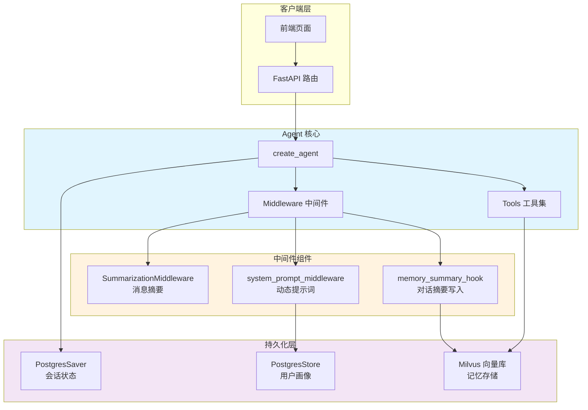
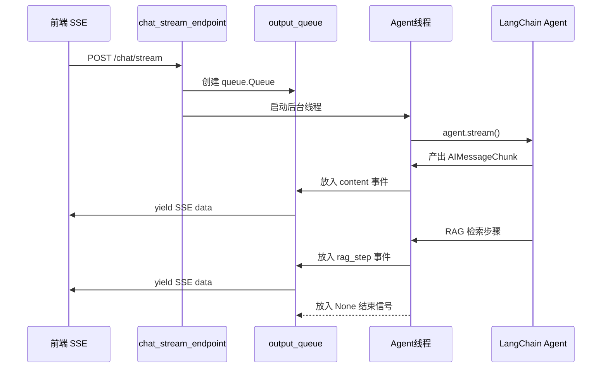

本文档详细解析 SuperMew 项目中 LangChain Agent 的核心架构与实现细节。该项目基于 LangChain 的 `create_agent` API 构建，结合 PostgresSaver Checkpointer 实现会话持久化，并通过自定义中间件实现对话摘要、用户画像持久化和动态系统提示词生成。

## 架构总览



Agent 的核心入口位于 `backend/agent.py` 中的 `create_agent_instance()` 函数。该函数初始化聊天模型、配置检查点器和存储后端，并注册三个中间件组件。模型初始化支持 OpenAI API 兼容格式，可对接 SiliconFlow 等第三方服务商。

Sources: [backend/agent.py](backend/agent.py#L112-L146)

## Agent 实例创建

### 模型配置

```python
model = init_chat_model(
    model=MODEL,
    model_provider="openai",  # 兼容 SiliconFlow 等兼容 OpenAI API 的服务商
    api_key=API_KEY,
    base_url=BASE_URL,
    temperature=0.3,
    stream_usage=True,
)
```

Agent 实例化时采用双模型策略：主模型负责对话生成，摘要模型专门用于消息压缩。两个模型共享相同的 API 配置，但分工明确。主模型 temperature 设置为 0.3 以平衡确定性与创造性，摘要模型则使用默认参数以获得更紧凑的输出。

Sources: [backend/agent.py](backend/agent.py#L113-L128)

### 工具注册

```python
agent = create_agent(
    model=model,
    tools=[get_current_weather, search_knowledge_base, search_memory],
    checkpointer=checkpointer,
    store=store,
    context_schema=Context,
    middleware=[...],
)
```

Agent 注册了三个核心工具：`get_current_weather` 调用高德天气 API，`search_knowledge_base` 执行混合检索（稠密向量 + BM25），`search_memory` 在用户记忆向量库中检索历史对话。这些工具通过 `@tool` 装饰器定义，遵循 LangChain 的标准工具接口。

Sources: [backend/agent.py](backend/agent.py#L130-L145)

## 状态持久化机制

### PostgresSaver Checkpointer

Checkpointer 是 LangGraph 的核心组件，负责持久化 Agent 的运行时状态，包括消息历史、中间变量等。SuperMew 使用 PostgresSaver 将状态存储到 PostgreSQL：

```python
def create_checkpointer():
    conn = psycopg.connect(
        f"postgresql://{POSTGRES_USER}:{POSTGRES_PASSWORD}@{POSTGRES_HOST}:{POSTGRES_PORT}/{POSTGRES_DB}",
        autocommit=True,
        prepare_threshold=0,
        row_factory=psycopg.rows.dict_row
    )
    checkpointer = PostgresSaver(conn)
    checkpointer.setup()
    return checkpointer
```

Checkpointer 以 `thread_id`（格式为 `{user_id}_{session_id}`）作为会话标识，每次 `agent.invoke()` 调用时自动加载历史上下文。这实现了跨请求的会话连续性，用户无需手动管理对话历史。

Sources: [backend/agent.py](backend/agent.py#L22-L32)

### PostgresStore 用户画像

PostgresStore 用于持久化结构化用户信息，与 Checkpointer 的消息存储形成互补：

```python
_store = PostgresStore.from_conn_string(
    f"postgresql://{POSTGRES_USER}:{POSTGRES_PASSWORD}@{POSTGRES_HOST}:{POSTGRES_PORT}/{POSTGRES_DB}"
)
store = _store.__enter__()
store.setup()
```

Store 的命名空间为 `("user_memory", "global")`，键为 `"profile"`，存储格式为 Pydantic Model 序列化后的 JSON。`UserMemoryManager` 类提供提取、保存、加载用户信息的能力，支持合并模式——新值非空时才覆盖已有值。

Sources: [backend/agent.py](backend/agent.py#L37-L42)
Sources: [backend/middleware.py](backend/middleware.py#L111-L147)

## 中间件系统

LangChain Agent 的中间件机制允许在模型调用前后注入自定义逻辑。SuperMew 注册了三个中间件，按执行顺序如下：

```python
middleware=[
    SummarizationMiddleware(
        model=summary_model,
        trigger=("tokens", 8000),
        keep=("messages", 12),
    ),
    memory_summary_hook,
    system_prompt_middleware,
]
```

| 中间件 | 类型 | 触发条件 | 功能 |
|--------|------|----------|------|
| `SummarizationMiddleware` | 内置 | Token 数量达到 8000 | 压缩消息历史，保留最近 12 条 |
| `memory_summary_hook` | 自定义 @after_model | 每 25 轮对话 | 将对话摘要写入 Milvus |
| `system_prompt_middleware` | 自定义 @dynamic_prompt | 每次请求 | 动态拼接系统提示词与用户画像 |

Sources: [backend/agent.py](backend/agent.py#L136-L144)

### SummarizationMiddleware 消息压缩

该中间件来自 LangChain 内置实现，当消息 token 总数达到阈值（8000）时触发。它保留最近 12 条消息，将中间的对话历史压缩为摘要形式，从而控制上下文长度的增长。

### memory_summary_hook 对话摘要

```python
@after_model
def memory_summary_hook(state: AgentState, runtime: Runtime[Context]) -> dict | None:
    messages = state.get("messages", [])
    user_turns = sum(1 for msg in messages if isinstance(msg, HumanMessage))

    if user_turns == 0 or user_turns % TRIGGER_TURNS != 0:
        return None

    conversation_text = _format_conversation_for_summary(messages, TRIGGER_TURNS)
    summary_text = _summarize_conversation(conversation_text)
    _save_summary_to_milvus(summary_text, thread_id, user_turns)

    return None
```

`TRIGGER_TURNS` 设置为 25，意味着每完成 25 轮用户对话，Agent 会自动调用 LLM 提取对话要点，并写入 Milvus 向量库。存储格式为 `[对话摘要] {summary}（{turn_count}轮对话，{timestamp}）`，便于后续通过 `search_memory` 工具检索。

Sources: [backend/middleware.py](backend/middleware.py#L287-L306)

### system_prompt_middleware 动态提示词

```python
@dynamic_prompt
def system_prompt_middleware(request: ModelRequest) -> str:
    soul_prompt = _load_soul_prompt()
    profile_text = _load_profile_for_prompt()

    if not profile_text:
        return soul_prompt

    return f"{soul_prompt}\n\n{profile_text}"
```

该中间件在每次模型调用前动态组装系统提示词。`soul.md` 包含基础的 Agent 人设定义（猫娘设定、工具使用规则等），`_load_profile_for_prompt()` 从 PostgresStore 加载用户画像并格式化为文本。最终将两者拼接后作为系统提示词注入，使 Agent 能够感知用户背景信息。

Sources: [backend/middleware.py](backend/middleware.py#L365-L374)

## 用户画像持久化

### UserMemoryManager 架构

```python
class UserMemoryManager:
    _instance = None

    def __new__(cls):
        if cls._instance is None:
            cls._instance = super().__new__(cls)
        return cls._instance
```

采用单例模式确保全局只有一个 Manager 实例，避免重复连接 PostgreSQL。核心数据结构为 `UserInfo` Pydantic Model，包含 name、school、major、grade、identity、relationship、interest、location 等字段。

Sources: [backend/middleware.py](backend/middleware.py#L43-L77)

### 关键词触发提取

为避免对每条消息都调用 LLM 提取，系统采用关键词预筛策略：

```python
def should_extract_memory(text: str) -> bool:
    keywords = ['我叫', '名字叫', '学校', '大学', '专业', '学生', '女朋友',
                '男朋友', '喜欢', '爱好', ...]
    matches = sum(1 for kw in keywords if kw in text.lower())
    return matches >= 2  # 至少匹配 2 个关键词才触发
```

提取操作在后台线程异步执行，不阻塞主对话流程：

```python
def extract_and_save_user_memory_async(user_text: str):
    def _run():
        if should_extract_memory(user_text):
            extract_and_save_user_memory(user_text)
    threading.Thread(target=_run, daemon=True).start()
```

Sources: [backend/middleware.py](backend/middleware.py#L174-L204)

## 工具系统

### 工具定义模式

项目中的工具使用 `@tool` 装饰器定义，返回类型统一为字符串：

```python
@tool("search_knowledge_base")
def search_knowledge_base(query: str) -> str:
    """Search for information in the knowledge base using hybrid retrieval"""
    global _KNOWLEDGE_TOOL_CALLS_THIS_TURN
    
    # 单轮调用限制
    if _KNOWLEDGE_TOOL_CALLS_THIS_TURN >= 1:
        return "TOOL_CALL_LIMIT_REACHED: ..."
    _KNOWLEDGE_TOOL_CALLS_THIS_TURN += 1

    rag_result = run_rag_graph(query)
    # ... 处理并返回结果
```

`soul.md` 中明确规定了工具使用限制：同一轮对话中不重复调用工具，最多调用一次知识工具，收到检索结果后必须直接生成答案。这些约束通过 Guard 机制在工具层实现。

Sources: [backend/tools.py](backend/tools.py#L166-L206)
Sources: [backend/soul/soul.md](backend/soul/soul.md#L1-L13)

### 工具调用状态管理

工具层通过全局变量管理调用状态：

```python
_KNOWLEDGE_TOOL_CALLS_THIS_TURN = 0
_RAG_STEP_QUEUE = None

def reset_tool_call_guards():
    global _KNOWLEDGE_TOOL_CALLS_THIS_TURN
    _KNOWLEDGE_TOOL_CALLS_THIS_TURN = 0
```

`reset_tool_call_guards()` 在每轮对话开始时调用，确保状态清零。`_RAG_STEP_QUEUE` 用于流式场景下传递 RAG 检索步骤到前端展示。

Sources: [backend/tools.py](backend/tools.py#L10-L47)

## 会话管理

### ConversationStorage 会话元数据

Checkpointer 自动管理消息历史，但会话列表查询需要独立的元数据表：

```python
class ConversationStorage:
    def _ensure_table(self):
        with self._conn.cursor() as cur:
            cur.execute("""
                CREATE TABLE IF NOT EXISTS conversations (
                    id SERIAL PRIMARY KEY,
                    user_id VARCHAR(255) NOT NULL,
                    session_id VARCHAR(255) NOT NULL,
                    updated_at TIMESTAMP NOT NULL DEFAULT NOW(),
                    created_at TIMESTAMP NOT NULL DEFAULT NOW(),
                    UNIQUE(user_id, session_id)
                )
            """)
```

`touch_session()` 方法在每次对话时更新会话访问时间，API 层通过 `updated_at` 排序返回会话列表。

Sources: [backend/agent.py](backend/agent.py#L44-L89)

### 消息获取与删除

```python
def get_session_messages(user_id: str, session_id: str) -> list:
    config = {"configurable": {"thread_id": f"{user_id}_{session_id}"}}
    checkpoint = checkpointer.get(config)
    channel_values = checkpoint.get("channel_values", {})
    return channel_values.get("messages", [])

def delete_session_from_checkpointer(user_id: str, session_id: str):
    config = {"configurable": {"thread_id": f"{user_id}_{session_id}"}}
    checkpointer.delete(config)
```

会话删除需要同时清理 ConversationStorage 中的元数据和 Checkpointer 中的状态。

Sources: [backend/agent.py](backend/agent.py#L203-L221)

## 流式响应实现

### 线程安全的流式架构



流式实现的核心在于 `queue.Queue` 作为线程间通信的桥梁。主线程通过 `asyncio.get_running_loop().run_in_executor()` 从队列读取事件并 yield SSE 格式数据，后台线程运行同步的 `agent.stream()` 并将内容块推入队列。

Sources: [backend/agent.py](backend/agent.py#L224-L329)

### SSE 事件格式

```python
# 内容事件
output_queue.put({"type": "content", "content": "正在检索知识库..."})

# RAG 步骤事件
output_queue.put({"type": "rag_step", "step": {"icon": "🔍", "label": "正在检索记忆..."}})

# 错误事件
output_queue.put({"type": "error", "content": str(e)})

# 结束信号
output_queue.put(None)
```

前端通过解析 `type` 字段区分事件类型，实现不同的 UI 更新：content 用于打字机效果，rag_step 显示检索进度，trace 最终展示完整的 RAG 过程信息。

Sources: [backend/agent.py](backend/agent.py#L246-L294)

## 核心上下文类型

```python
@dataclass
class Context:
    """Agent 运行时上下文 schema"""
    user_id: str
    thread_id: str
```

Context 通过 `context_schema=Context` 注册到 Agent，用于中间件访问当前请求的用户信息。`thread_id` 格式为 `{user_id}_{session_id}`，对应 Checkpointer 的 thread_id。

Sources: [backend/middleware.py](backend/middleware.py#L22-L26)

## 后续学习路径

完成本章节后，建议按以下顺序深入理解系统其他核心模块：

- **[中间件机制](10-zhong-jian-jian-ji-zhi)** — 深入了解 LangChain 中间件的扩展机制与钩子函数
- **[工具系统设计](11-gong-ju-xi-tong-she-ji)** — 掌握自定义工具的开发规范与第三方 API 集成模式
- **[三层记忆架构](6-san-ceng-ji-yi-jia-gou)** — 理解短期会话、用户画像、记忆向量库的整体设计
- **[混合检索原理](12-hun-he-jian-suo-yuan-li)** — 掌握稠密向量与 BM25 混合检索的技术实现