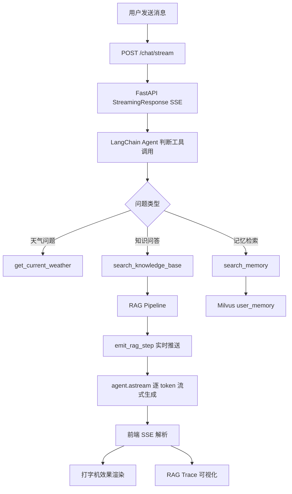
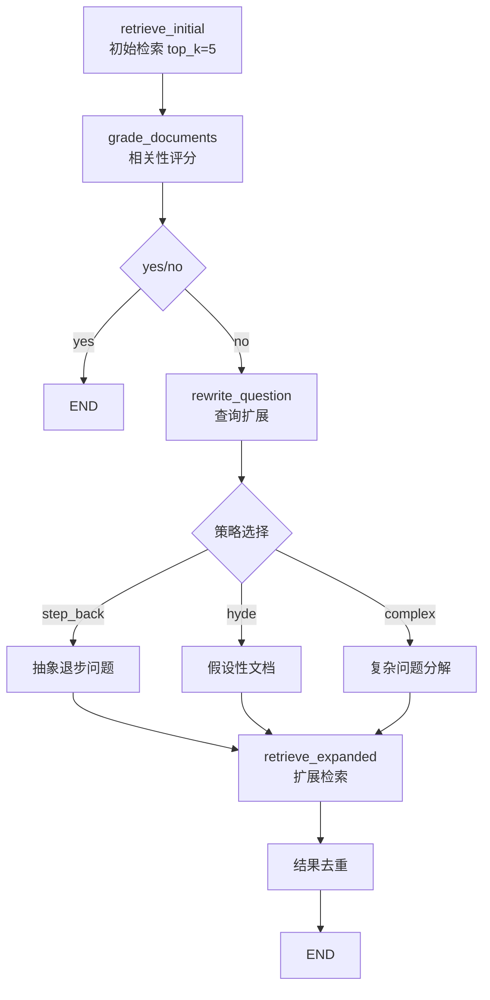
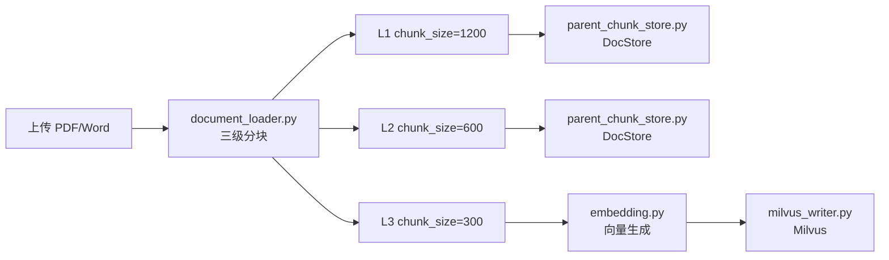
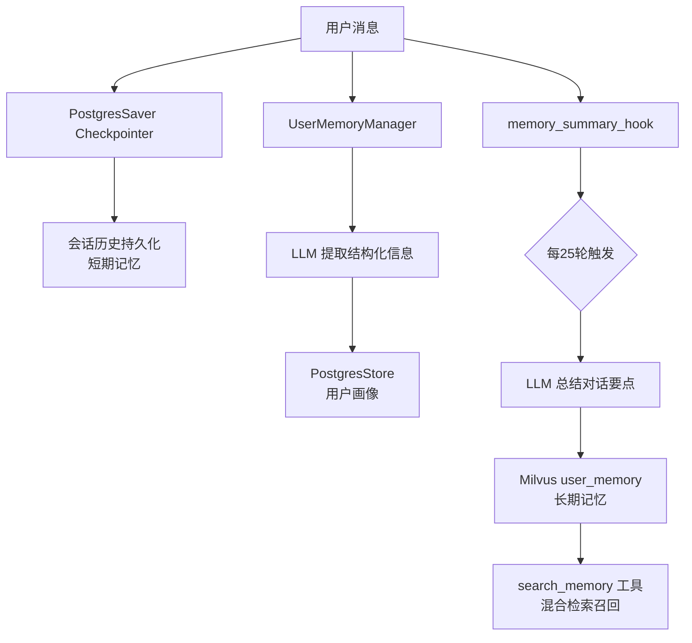
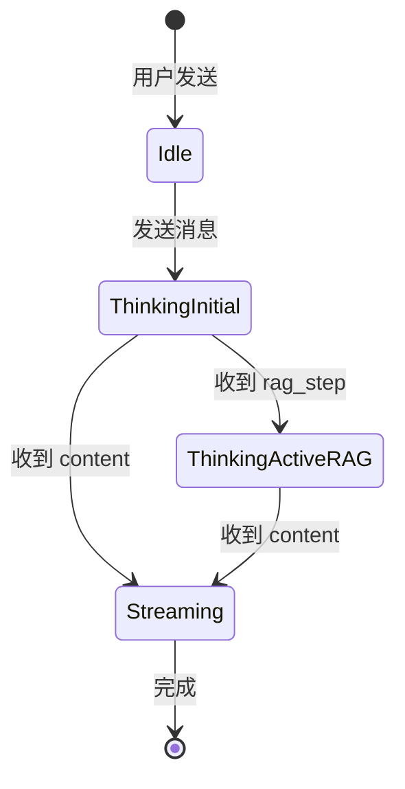

# SuperMew 项目说明

> 本项目是 Chasen 学习和改进原始项目的实验场，主要用于探索 LangChain Agent、LangGraph RAG 等前沿技术的最佳实践。

Agent的项目记录，方便后续持续更新与展示。

## 本地部署

### 1) 环境准备

- Python `3.12+`
- 包管理建议：`uv`（也支持 `pip`）
- Docker / Docker Compose（用于启动 Milvus + PostgreSQL 依赖）

### 2) 使用 pyproject 安装依赖

在项目根目录执行：

```bash
# 方式 A：推荐（uv）
uv sync

# 运行服务
uv run python backend/app.py
# 或
uv run uvicorn backend.app:app --host 0.0.0.0 --port 8000 --reload
```

```bash
# 方式 B：pip
python -m venv .venv
source .venv/bin/activate
pip install -U pip
pip install -e .

# 运行服务
python backend/app.py
# 或
uvicorn backend.app:app --host 0.0.0.0 --port 8000 --reload
```

### 3) 创建 `.env` 文件

在项目根目录新建 `.env`，可直接使用下面模板：

```env
# ===== Model =====
API_KEY=your_api_key
MODEL=Qwen/Qwen3.5-122B-A10B
BASE_URL=https://api.siliconflow.cn/v1
EMBEDDER=Qwen/Qwen3-Embedding-4B

# ===== Rerank (可选，不配则自动降级) =====
RERANK_MODEL=Qwen/Qwen3-Reranker-4B
RERANK_BINDING_HOST=https://your-rerank-host
RERANK_API_KEY=your_rerank_api_key

# ===== Milvus =====
MILVUS_HOST=127.0.0.1
MILVUS_PORT=19530

# ===== PostgreSQL =====
POSTGRES_HOST=127.0.0.1
POSTGRES_PORT=5433
POSTGRES_USER=supermew
POSTGRES_PASSWORD=supermew123
POSTGRES_DB=supermew

# ===== Tools （可选）=====
AMAP_WEATHER_API=https://restapi.amap.com/v3/weather/weatherInfo
AMAP_API_KEY=your_amap_api_key
```

### 4) Docker 部署（Milvus + PostgreSQL）

当前仓库的 `docker-compose.yml` 用于启动 Milvus 相关组件和 PostgreSQL：

```bash
# 启动向量库和数据库依赖
docker compose up -d

# 查看服务状态
docker compose ps

# 查看日志（可选）
docker compose logs -f standalone
```

端口说明：

- Milvus：`19530`
- Milvus 健康检查：`9091`
- MinIO API：`9000`
- MinIO Console：`9001`
- Attu：`8080`
- PostgreSQL：`5433`

### 5) 启动应用并访问

在 Milvus 和 PostgreSQL 启动后，运行后端应用：

```bash
uv run uvicorn backend.app:app --host 127.0.0.1 --port 8000 --reload
```

浏览器访问：

- 前端页面：`http://127.0.0.1:8000/`
- API 文档：`http://127.0.0.1:8000/docs`

---

## 项目概览

- **核心能力**：
  - LangChain Agent + 自定义工具（天气查询、知识库检索、记忆检索）
  - 文档上传后执行三级滑动窗口分块，叶子分块向量化写入 Milvus，父级分块写入本地 DocStore
  - **三层记忆架构**：PostgresSaver 短期会话记忆 + PostgresStore 用户画像 + Milvus 记忆向量库
  - 会话记忆与摘要（PostgresSaver checkpointer），保持长对话上下文
- **运行形态**：FastAPI 后端 + 纯前端（Vue 3 CDN 单页）+ Milvus 向量库 + PostgreSQL

---

## 技术栈

| 层级 | 技术 | 用途 |
|------|------|------|
| **Web 框架** | FastAPI + Uvicorn | 高性能 API 服务 |
| **Agent 框架** | LangChain + LangGraph | Agent 构建和状态管理 |
| **Agent 记忆持久化** | PostgresSaver + PostgresStore | 会话状态和长期记忆 |
| **向量数据库** | Milvus (v2.5.14) | 文档和记忆的向量存储与检索 |
| **关系数据库** | PostgreSQL (v16) | 结构化数据存储 |
| **文本嵌入** | Qwen3-Embedding-4B (SiliconFlow) | 稠密向量生成 |
| **重排序** | Qwen3-Reranker-4B | 检索结果精排 |
| **文档处理** | PyPDFLoader + Docx2txtLoader | PDF/Word 解析 |
| **分块策略** | RecursiveCharacterTextSplitter | 三级分层分块 |
| **网络请求** | requests | 外部 API 调用 |

---

## 关键创新点

- **三层记忆架构**：短期记忆（PostgresSaver Checkpointer）+ 用户画像（PostgresStore）+ 记忆向量库（Milvus），兼顾上下文、结构和语义检索
- **自动摘要钩子**：`memory_summary_hook` 基于 `@after_model` 实现，每25轮自动提取对话摘要写入 Milvus，无需手动重建
- **用户记忆持久化**：基于 LLM 自动提取用户信息（姓名、学校、身份、兴趣等），通过 PostgresStore 持久化到 PostgreSQL，支持跨会话记忆
- **混合检索落地**：稠密向量 + BM25 稀疏向量，Milvus Hybrid Search + RRF 排序，兼顾语义与词匹配
- **Jina Rerank 接入**：Hybrid/Dense 召回后进行 API 级精排，支持返回 `rerank_score` 并在前端可视化
- **双向降级**：稀疏生成或 Hybrid 调用失败时自动降级为纯稠密检索，提升稳定性
- **流式输出（Streaming）**：后端基于 `agent.astream(stream_mode="messages")` 逐 token 推送，前端 SSE + ReadableStream 实现打字机效果
- **回答终止功能**：前端 `AbortController` + 后端 `StreamingResponse` 支持用户随时中断正在生成的回答
- **会话摘要记忆**：PostgresSaver checkpointer 自动持久化会话历史，支持会话切换与恢复
- **文档处理链路**：上传 → 切分 → 稠密/稀疏向量同步生成 → Milvus 入库，支持重复上传自动清理旧 chunk
- **三级分块 + Auto-merging**：L1/L2/L3 三层滑窗切分；检索时优先召回 L3，满足阈值后自动合并到父块（L3->L2->L1）
- **Leaf-only 向量化存储**：仅叶子分块写入 Milvus，父块写入 DocStore，减少向量冗余并保留上下文聚合能力
- **工具可扩展**：天气查询示例 + 知识库检索 + 记忆检索，便于按需增添第三方 API 或企业数据源
- **RAG 过程可观测**：记录检索、评分、重写与来源信息，回答完成后前端可展开查看完整 RAG Trace
- **查询重写体系**：Step-Back 与 HyDE 两种扩展方式 + 路由选择，必要时触发重写检索
- **相关性评分门控**：基于结构化输出的 `grade_documents` 判断是否需要重写检索

---

## 目录与架构

```
SuperMew/
├── backend/
│   ├── app.py                  # FastAPI 入口、CORS、静态资源挂载、定时任务调度
│   ├── api.py                  # REST API（聊天/会话/文档管理）
│   ├── agent.py                # LangChain Agent + PostgresSaver checkpointer + PostgresStore
│   ├── middleware.py           # UserMemoryManager + MemorySummaryMiddleware + system_prompt_middleware
│   ├── memory_vector_store.py  # Milvus user_memory collection 管理
│   ├── memory_tasks.py         # 记忆索引定时重建任务（每日凌晨3点）
│   ├── config.py               # 环境变量配置
│   ├── schemas.py              # Pydantic 请求/响应模型
│   ├── tools.py                # 工具函数（天气/搜索/记忆检索）+ emit_rag_step 跨线程调度
│   ├── rag_pipeline.py         # LangGraph RAG 工作流
│   ├── rag_utils.py            # 检索、查询重写、HyDE、Auto-merging
│   ├── embedding.py            # 稠密向量 API 调用 + BM25 稀疏向量生成
│   ├── milvus_client.py        # Milvus 集合定义、混合检索
│   ├── milvus_writer.py        # 向量写入（稠密+稀疏）
│   ├── document_loader.py      # PDF/Word 加载与三级分块
│   ├── parent_chunk_store.py    # 父级分块 DocStore（用于 Auto-merging）
│   ├── migrate_to_checkpointer.py  # 历史 JSON 数据迁移到 PostgresSaver
│   └── soul/
│       └── soul.md             # Agent 系统提示词
├── frontend/
│   ├── index.html              # Vue 3 单页应用
│   ├── script.js               # SSE 流式处理、状态机
│   └── style.css               # 样式
├── data/
│   ├── documents/              # 上传文档原文件
│   └── parent_chunks.json     # 父级分块存储（L1/L2）
├── docker-compose.yml           # PostgreSQL + Milvus + Attu
├── pyproject.toml              # 项目依赖
└── .env / .env.example         # 环境变量配置
```

---

## 核心流程

### 1) 项目全链路（端到端）



### 2) RAG 全链路（LangGraph 工作流）



**检索实现**：
1. `retrieve_initial`：Hybrid Search（Dense + Sparse + RRF k=60）→ Jina Rerank 精排 → Auto-merging（L3→L2→L1）
2. `grade_documents`：结构化输出 `yes/no` 判断相关性
3. `rewrite_question`：选择策略并生成重写查询
4. `retrieve_expanded`：扩展检索结果合并去重

### 3) 文档入库链路



### 4) 三层记忆架构



---

## API 速览

| 端点 | 方法 | 功能 |
|------|------|------|
| `/chat` | POST | 非流式对话 |
| `/chat/stream` | POST | SSE 流式对话 |
| `/sessions/{user_id}` | GET | 获取用户会话列表 |
| `/sessions/{user_id}/{session_id}` | GET | 获取会话消息历史 |
| `/sessions/{user_id}/{session_id}` | DELETE | 删除会话 |
| `/documents` | GET | 获取文档列表 |
| `/documents/upload` | POST | 上传文档（PDF/Word） |
| `/documents/{filename}` | DELETE | 删除文档向量 |

---

## RAG 检索评测

本项目使用 CMRC 2018（阅读理解）和 CMRC 2019（填空题）公开数据集对检索模块进行消融评测。

### 评测配置

- **检索流程**：Hybrid Search（Dense + BM25）→ RRF(k=60) 融合 → Cross-Encoder 精排 → Auto-merge → Top-5
- **分块策略**：L1(2400) → L2(1024) → L3(512) 三层滑动窗口
- **Ground Truth**：Chunk 与答案 3-gram 重叠度 ≥ 30%

### 评测结果

#### CMRC 2018 阅读理解（n=87）

| 实验 | P@5 | R@5 | MRR | NDCG@5 |
|------|------|------|------|--------|
| Baseline | 0.2023 | 0.3343 | 0.5565 | 0.3143 |
| No Rerank | 0.2023 | 0.3343 | 0.5571 | 0.3145 |
| No Auto-merge | 0.2023 | 0.3343 | **0.5707** | **0.3189** |

#### CMRC 2019 填空题（n=51）

| 实验 | P@5 | R@5 | MRR | NDCG@5 |
|------|------|------|------|--------|
| Baseline | 0.2510 | 0.3693 | **0.9314** | **0.4899** |
| No Rerank | 0.2510 | 0.3693 | 0.9314 | 0.4899 |
| No Auto-merge | 0.2510 | 0.3693 | 0.8039 | 0.4458 |

### 关键发现

| 发现 | 说明 |
|------|------|
| **Rerank 无效** | RRF(k=60) 融合已足够好，Cross-Encoder 未带来额外提升 |
| **Auto-merge 对填空题有正向作用** | CMRC 2019 禁用后 MRR 下降 13.7%，填空题受益于上下文扩展 |
| **任务类型影响显著** | 填空题 MRR 高达 0.93，阅读理解仅 0.56，真实阅读理解检索难度更大 |

### HyDE 检索评测结果

> HyDE 模型：zai-org/GLM-4.5-Air；生成成功率：100%

| 数据集 | 实验 | P@5 | R@5 | MRR | NDCG@5 | 对比 Baseline |
|--------|------|------|------|------|--------|---------------|
| CMRC 2018 | Baseline | 0.2023 | 0.3343 | 0.5565 | 0.3143 | — |
| CMRC 2018 | **HyDE** | 0.1977 | 0.3266 | 0.5523 | 0.3101 | MRR -0.8% |
| CMRC 2019 | Baseline | 0.2510 | 0.3693 | 0.9314 | 0.4899 | — |
| CMRC 2019 | **HyDE** | 0.2510 | 0.3693 | 0.9020 | 0.4797 | MRR -3.2% |
| HotpotQA | Baseline | 0.3640 | 0.7575 | 0.7990 | 0.6955 | — |
| HotpotQA | **HyDE** | 0.3580 | 0.7425 | 0.7828 | 0.6837 | MRR -2.0% |

**结论**：HyDE 在所有三个数据集上**均未带来正向收益**。RRF(k=60) 融合已足够强，HyDE 生成的假设文档反而引入了语义偏差。

---

## 流式输出与 RAG Trace — 技术细节

### 1) 跨线程事件调度（Cross-Thread Event Scheduling）

FastAPI 运行在单线程 asyncio Event Loop 上，LangChain 同步工具在线程池执行。采用 **"Global Loop Capture + Threadsafe Callback"** 模式解决子线程无法访问主线程 Queue 的问题：

```python
# tools.py
def set_rag_step_queue(queue):
    global _RAG_STEP_QUEUE, _RAG_STEP_LOOP
    _RAG_STEP_QUEUE = queue
    _RAG_STEP_LOOP = asyncio.get_running_loop()  # 主线程捕获

def emit_rag_step(icon, label, detail):
    if _RAG_STEP_LOOP and not _RAG_STEP_LOOP.is_closed():
        _RAG_STEP_LOOP.call_soon_threadsafe(  # 线程安全调度
            _RAG_STEP_QUEUE.put_nowait, step_data
        )
```

### 2) 混合检索（Hybrid Search）实现

- **Dense Pathway**：调用 SiliconFlow API 生成 2560 维稠密向量，捕捉语义匹配
- **Sparse Pathway**：基于 jieba 分词的自定义 BM25 算法，生成 `{word_id: tf_idf_score}` 稀疏向量
- **RRF 融合**：采用 `k=60` 的倒数排名融合，无参数化合并稠密和稀疏召回结果

### 3) 前端状态机



---

## 环境变量

| 变量 | 默认值 | 说明 |
|------|--------|------|
| `API_KEY` | — | LLM API 密钥 |
| `MODEL` | `Qwen/Qwen3.5-122B-A10B` | 主模型 |
| `BASE_URL` | `https://api.siliconflow.cn/v1` | API 地址 |
| `EMBEDDER` | `Qwen/Qwen3-Embedding-4B` | 嵌入模型 |
| `RERANK_MODEL` | `Qwen/Qwen3-Reranker-4B` | 重排模型 |
| `MILVUS_HOST` | `127.0.0.1` | Milvus 地址 |
| `MILVUS_PORT` | `19530` | Milvus 端口 |
| `POSTGRES_HOST` | `127.0.0.1` | PostgreSQL 地址 |
| `POSTGRES_PORT` | `5433` | PostgreSQL 端口 |
| `MEMORY_TOP_K` | `5` | 记忆检索候选数 |
| `TRIGGER_TURNS` | `25` | 摘要触发轮数 |

---

## 未来迭代（Todo Lists）

### RAG 部分

#### 数据层、Chunk 分块
- [ ] 按文档结构做粗拆分，再用递归字符分块兜底
- [ ] 代码块、表格、图片特殊处理
- [x] ParentDocument/Auto-merging Retriever 策略

#### 召回层
- [ ] BM25 的 k1 和 b 参数扫描
- [ ] RRF 权重 AB test
- [ ] 小型标注集比较 Dense/Sparse/Hybrid/Rerank 效果

#### 生成层
- [ ] 子问题分解（CoT、专门分解小模型）
- [ ] 多文档 Refine（一次拼接、串行 Refine）
- [ ] 多文档冲突处理

#### 其他
- [ ] 多模态 embedding 能力
- [ ] RAG 评估体系
- [ ] Rerank 策略评估

### 其他能力拓展
- [ ] SQL assistant Skill
- [x] 暂停功能与人工介入机制
- [ ] 问题类型判断，简单问题跳过复杂流程
- [ ] 网络搜索能力扩展
- [ ] 多步骤规划与任务并行执行
- [ ] 路由器节点，LLM 自主判断下一步动作
- [ ] 记忆管理：集成 MemO、LangMem 等方案
- [ ] Multi-agent：工具拆分给专业化 agent
- [ ] 历史会话名称可修改
- [ ] 死循环检测与恢复
- [ ] 记忆向量库按用户隔离
- [ ] 记忆检索结果可视化

### 后端服务建设
- [ ] 用户注册登录、权限管理
- [ ] 聊天记录落地数据库，引入 Redis 缓存

---

## 更新日志

### 2026-03-27 会话列表数据库落地

- **ConversationStorage 迁移**：会话列表元数据从 `customer_service_history.json` 迁移到 PostgreSQL `conversations` 表
- **新增迁移脚本**：`backend/migrate_sessions_to_pg.py`

### 2026-03-22 用户记忆持久化 + RAG 实时显示优化

- **新增用户记忆功能**：通过 `UserMemoryManager` 自动提取用户信息并持久化
- **PostgresSaver checkpointer**：会话记忆迁移到 PostgreSQL
- **RAG 实时显示优化**：RAG 步骤通过可折叠面板展示
- **移除 SystemMessage 冲突**：系统提示词作为文本前缀拼接

### 2026-03-13 三级分块与 Auto-merging 升级

- 新增三级滑动窗口分块（L1/L2/L3）
- Leaf-only 存储策略：L3 写入 Milvus，L1/L2 写入 DocStore
- Auto-merging 从 DocStore 拉取父块

### 2026-02-19 RAG 实时思考链路修复

- 修复同步工具无法获取主线程 asyncio 事件循环的问题
- 采用 `call_soon_threadsafe` 跨线程调度 RAG 步骤事件
