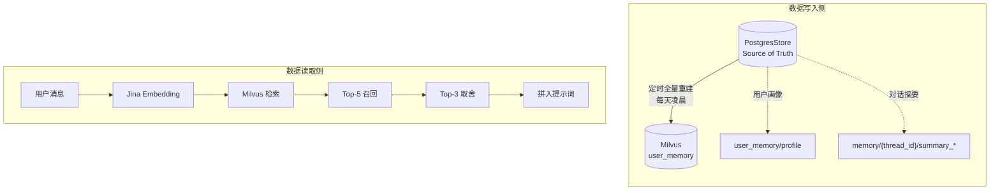
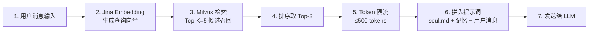
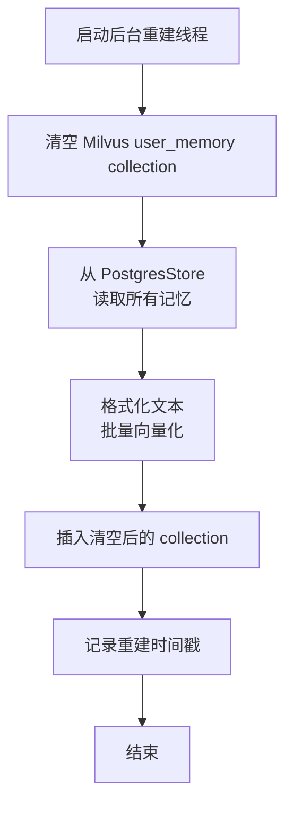

# 记忆检索能力增强 — 设计方案

> 日期：2026-03-23
> 状态：设计中
> 优先级：P0（本轮实施）

---

## 背景

当前记忆系统存在以下问题：
1. **上下文溢出风险**：记忆直接拼接入系统提示词，随记忆增长会导致 LLM 上下文溢出
2. **无法动态检索**：所有记忆一股脑拼入提示词，无法根据当前对话选择性召回
3. **召回粒度粗**：只能整块使用记忆，无法聚焦到最相关的片段

---

## 一、核心设计

### 1.1 数据架构



**关键决策**：
- PostgresStore 是 source of truth，Milvus 只是语义索引层
- 不是实时同步，是**定期全量重建索引**
- 读取时只查 Milvus，不查 PostgresStore（语义检索必须靠向量）

### 1.2 两类记忆的存储策略

| 类型 | 存放位置 | 向量化方式 | 更新策略 |
|------|---------|-----------|---------|
| **用户画像** | PostgresStore (`user_memory/profile`) | 格式化文本 → Jina embedding | 定时全量重建 |
| **对话摘要** | PostgresStore (`memory/{thread_id}/summary_*`) | 摘要全文 → Jina embedding | 每 25 轮自动生成，定时全量重建 |

> 注：本阶段不实现"画像更新后主动触发重建"，仅通过定时 + 手动触发。

**文本格式化示例（用户画像）**：
```
用户名叫张三，就读于清华大学计算机系大三，兴趣爱好是篮球和游泳，女朋友叫李梅。
```

---

## 二、Milvus Collection 设计

### 2.1 Collection Schema

Collection 名称：`user_memory`

| Field | Type | Description |
|-------|------|-------------|
| `id` | int64 | Primary key，自增 |
| `memory_type` | varchar | `"profile"` 或 `"summary"` |
| `source_key` | varchar | PostgresStore 原始 key，便于追踪 |
| `text` | varchar | 原始文本，便于 debug 和展示 |
| `embedding` | dense_vector(dim=1024) | Jina v3 向量 |
| `created_at` | datetime | 创建时间，用于排序 |

### 2.2 Index 配置

- Index 类型：`HNSW`
- Metric type：`COSINE`（余弦相似度，最适合语义检索）
- M：`16`（精度优先）
- efConstruction：`200`

---

## 三、检索流程

### 3.1 每次对话的检索步骤



### 3.2 Token 上限控制

- 召回的记忆片段最多保留 **500 tokens**
- 超出时截断最不相关的片段
- 确保系统提示词总长度可控

---

## 四、索引重建机制

### 4.1 重建触发策略

| 触发条件 | 说明 |
|---------|------|
| **定时触发** | 每天凌晨 3:00 自动执行 |
| **手动触发** | 提供 API 接口，支持即时重建 |

### 4.2 重建流程（In-Place 清空重建）

采用单 collection 原地清空重建，实现简单，适合 MVP：



### 4.3 重建原子性保证

- 重建过程在后台线程执行，不阻塞主服务
- 重建前执行清空（delete_all），重建失败时 collection 为空（可接受，后续可手动重建）
- 重建过程中如有查询，可能返回空结果（降级到拼接 PostgresStore 记忆）

---

## 五、文件变更

| 文件 | 变更内容 |
|------|---------|
| `backend/memory_vector_store.py` | **新增**：Milvus 向量存储操作（检索、清空、插入） |
| `backend/agent.py` | 修改 `build_system_message()`：从向量库检索记忆，失败时降级回拼 PostgresStore |
| `backend/memory_tasks.py` | **新增**：定时重建任务（每天凌晨 3 点） |
| `backend/config.py` | 新增配置项：collection 名、检索参数、重建时间 |
| `backend/api.py` | 新增手动重建 API 接口 |

### 5.1 API 接口设计

**重建记忆向量索引**

```
POST /api/memory/rebuild
```

| 项目 | 说明 |
|------|------|
| Method | POST |
| Path | `/api/memory/rebuild` |
| Auth | 需要管理员权限 |
| Response 200 | `{"status": "ok", "rebuilt_count": 42, "duration_ms": 1234}` |
| Response 400 | `{"error": "rebuild already in progress"}` |
| Response 500 | `{"error": "rebuild failed", "detail": "..."}` |

并发调用时返回 400，防止重复重建。

---

## 六、配置项

```python
# backend/config.py

# 记忆向量库配置
MEMORY_MILVUS_HOST = "127.0.0.1"
MEMORY_MILVUS_PORT = 19530
MEMORY_COLLECTION_NAME = "user_memory"
MEMORY_TOP_K = 5
MEMORY_RECALL_LIMIT = 3
MEMORY_TOKEN_LIMIT = 500  # tokens

# 重建策略
MEMORY_REBUILD_HOUR = 3  # 每天凌晨 3 点
```

---

## 七、其他改进方向（后续）

### B. 触发机制优化
- **问题**：摘要仅按轮数触发（25轮），不区分内容重要性
- **方向**：主题变化检测 + 关键决策点识别，自主触发总结

### C. 遗忘机制
- **问题**：记忆永不删除，向量库无限膨胀
- **方向**：记忆 TTL + 访问频率评分 + 重要性分级

### D. 信息一致性
- **问题**：用户画像和对话摘要是两条独立路径，可能信息冲突
- **方向**：定期将对话摘要中的用户信息合并到用户画像

### E. 提取优化
- **问题**：关键词匹配判断是否提取，太粗糙容易漏识别/误触发
- **方向**：语义相似度判断避免重复提取 + 置信度评分

---

## 八、验收标准

1. 每次对话在提示词中只包含检索到的 Top-3 相关记忆，而非全部记忆
2. 系统提示词总长度不超过 2000 tokens（记忆部分 ≤ 500 tokens）
3. 记忆检索延迟 < 100ms（Milvus 向量检索）
4. 索引重建完成后，所有历史记忆都能被检索到
5. 重启服务后，向量索引能正常加载，不丢失历史记忆

---

## 九、风险与备选

| 风险 | 应对 |
|------|------|
| Milvus 不可用 | 降级：`build_system_message()` 捕获异常，回退到直接拼接 PostgresStore 记忆 |
| 重建时服务中断 | 双 collection 交替策略，重建失败时保留旧 collection 不受影响 |
| 记忆丢失（Milvus 数据丢失） | PostgresStore 是 source of truth，可随时重建 |
