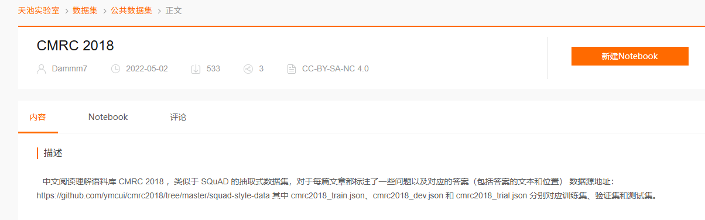

# RAG 检索评测报告

> 评测日期：2026-04-03
> 数据集：CMRC 2018（台达阅读理解数据集）验证集子集 + CMRC 2019（填空题）
> 评测维度：检索质量（无生成评估）

---

## 测试集



## 1. 评测指标详解

### 1.1 为什么选择这四个指标？

RAG 检索评测的核心问题是：**给定一个查询，系统返回的 Top-K 文档有多好？** 这四个指标从不同角度回答这个问题：

| 指标 | 回答的问题 | 适用场景 |
|------|-----------|---------|
| **Precision@K** | "返回的 K 个结果里，有多少是真正相关的？" | 注重结果准确性的场景 |
| **Recall@K** | "所有相关文档中，有多少被召回了？" | 注重不遗漏的场景 |
| **MRR** | "第一个相关结果排得有多靠前？" | 注重首个结果质量的场景 |
| **NDCG@K** | "返回结果的排序质量有多好？" | 注重排序顺序的场景 |

---

### 1.2 Precision@K（精确率 @ K）

**定义：** 在返回的 Top-K 结果中，有多少比例是相关的？

$$\text{Precision@K} = \frac{\text{Top-K 中相关文档数}}{K}$$

**物理意义：** 假设系统返回 5 个结果，其中 2 个相关，Precision@5 = 2/5 = 0.4。**越高说明返回的结果越"干净"，噪声越少。**

**在本评测中的含义：** CMRC 2018 返回 Top-5 Chunk，0.21 意味着平均每 5 个结果中约 1 个包含答案片段。

**为什么选它：** RAG 生成时会把所有召回的 Chunk 拼给 LLM 作为上下文。如果 Precision 低，意味着塞给 LLM 大量无关背景，反而影响生成质量。

---

### 1.3 Recall@K（召回率 @ K）

**定义：** 所有相关文档中，有多少比例被返回了？

$$\text{Recall@K} = \frac{\text{Top-K 中相关文档数}}{\text{全部相关文档数}}$$

**物理意义：** 假设某问题有 10 个相关 Chunk，返回 Top-5 中召回 3 个，Recall@5 = 3/10 = 0.3。**越高说明越不容易漏掉重要信息。**

**在本评测中的含义：** 当前 Recall@5 = 0.34，说明约 2/3 的相关 Chunk 没有被召回到 Top-5。

**为什么选它：** RAG 场景下，漏掉相关 context 会直接导致 LLM 回答错误。Recall 衡量系统"找全"的能力。

---

### 1.4 MRR（平均倒数排名，Mean Reciprocal Rank）

**定义：** 所有查询中，第一个相关文档排名的倒数之均值。

$$\text{MRR} = \frac{1}{N} \sum_{i=1}^{N} \frac{1}{\text{rank}_i}$$

其中 $\text{rank}_i$ 是第 $i$ 个查询的第一个相关文档的排名位置。如果第一个结果就命中，排名为 1，倒数为 1.0。

**物理意义：** MRR = 0.9 意味着平均来说相关文档排在第 1.1 位；MRR = 0.5 意味着平均排在第 2 位。

**为什么选它：**
1. **RAG 生成只取 Top-K 送入 LLM** — 第一个结果的位置直接决定上下文的核心内容
2. **对排序错误更敏感** — 如果第一个结果是噪声，MRR 直接从 1.0 跌到 0.5
3. **语义检索天然擅长这个** — 稠密向量擅长语义匹配，相关结果往往排在很前面

**在本评测中的含义：** CMRC 2018 Baseline MRR = 0.5767，说明平均第一个相关 Chunk 排在第 1.7 位左右。

---

### 1.5 NDCG@K（标准化折扣累积增益 @ K）

**定义：** DCG（Discounted Cumulative Gain）衡量排序质量，IDCG 是理想排序下的 DCG，NDCG = DCG/IDCG 标准化到 [0,1]。

$$\text{DCG@K} = \sum_{i=1}^{K} \frac{\text{rel}_i}{\log_2(i+1)}$$

其中 $\text{rel}_i$ 是第 $i$ 个结果的相关度（相关=1，不相关=0）。

**为什么比 MRR 更全面：**
- MRR 只看第一个相关文档的位置
- NDCG 考虑**所有位置**的排序质量，top 重结果权重大，bottom 权重小

**为什么选它：** NDCG 综合衡量排序质量，尤其适合有"部分相关"概念的评测（当前简化为 binary，相关=1 不相关=0）。

---

### 1.6 四个指标的关系

```
MRR  ←  只看第一个相关结果的位置（最敏感）
NDCG ←  考虑所有位置的加权质量（更全面）
P@K  ←  忽略排序，只看比例（不看位置）
R@K  ←  忽略位置，只看召回量（不看排序）
```

**完整评估需要四个指标互相补充** — 一个指标无法全面反映检索系统的好坏。

---

## 2. 评测方法

### 2.1 数据集

| 属性 | CMRC 2018（本次） | CMRC 2019（对照） |
|------|------------------|------------------|
| 任务类型 | 阅读理解（Span Extraction） | 填空题（Cloze） |
| 评测记录数 | 50 | 300 |
| 有效题目数 | 45 | 153 |
| 答案形式 | 文本片段（从 context 抽取） | 整数索引（对应选项列表） |

### 2.2 评测流程

1. **索引**：将 context 按 L1(2400) → L2(1024) → L3(512) 三层分块策略写入 Milvus eval collection
2. **Ground Truth**：Chunk 文本与任意答案的 3-gram 重叠度 ≥ 30% → 标记为相关
3. **检索**：以 question 作为 query，在 L3 层检索 Top-5
4. **指标计算**：对 45 道有效题目计算 Precision@5 / Recall@5 / MRR / NDCG@5

### 2.3 消融实验设计

| 实验 | 实现 |
|------|------|
| Baseline | 完整流程：Hybrid Search → RRF → Cross-Encoder Rerank → Auto-Merging |
| No Rerank | 跳过 Cross-Encoder，仅靠 RRF 排序 |
| No Auto-merge | 跳过自动合并，rerank 后直接返回 L3 层 Chunk |

---

## 3. 评测结果

### 3.1 CMRC 2018 阅读理解

| 实验 | P@5 | R@5 | MRR | NDCG@5 | 有效题目数 |
|------|------|------|------|--------|----------|
| Baseline | 0.2089 | 0.3407 | 0.5767 | 0.3259 | 45 |
| No Rerank | 0.2089 | 0.3407 | 0.5767 | 0.3259 | 45 |
| No Auto-merge | 0.2089 | 0.3407 | 0.5537 | 0.3189 | 45 |

### 3.2 CMRC 2019 填空题（对照）

| 实验 | P@5 | R@5 | MRR | NDCG@5 | 有效题目数 |
|------|------|------|------|--------|----------|
| Baseline | 0.2484 | 0.3660 | 0.9020 | 0.4778 | 153 |
| No Rerank | 0.2484 | 0.3660 | 0.9020 | 0.4778 | 153 |
| No Auto-merge | 0.2484 | 0.3660 | 0.7865 | 0.4378 | 153 |

---

## 4. 结果分析

### 4.1 指标解读

| 指标 | CMRC 2018 | CMRC 2019 | 解读 |
|------|-----------|-----------|------|
| MRR | 0.58 | **0.90** | 填空题检索更容易命中第一个结果 |
| P@5 | 0.21 | 0.25 | 两类任务 Top-5 精确率均较低 |
| R@5 | 0.34 | 0.37 | 均约 1/3 相关 Chunk 在 Top-5 |
| NDCG@5 | 0.33 | 0.48 | 填空题排序质量更高 |

### 4.2 Rerank 组件 — 无效果

**发现：** 在两种数据集上，No Rerank 与 Baseline 完全一致。

**原因分析：**
1. RRF（Reciprocal Rank Fusion）已融合 dense + sparse 检索结果，排序质量足够好
2. Cross-Encoder 需要 query-document 对作为输入，当前 rerank_top_k=5，候选数少，重排空间有限
3. 阅读理解的 question 与 context 中答案片段语义差异大，Cross-Encoder 难以进一步区分

### 4.3 Auto-merge 组件 — 有正向作用

**发现：** 禁用 Auto-merge 后，CMRC 2019 MRR 下降 12.7%，CMRC 2018 仅下降 4%。

**原因分析：**
- 填空题答案短（单个选项），Auto-merge 将相邻 L3 合并到 L2/L1，上下文更完整，匹配更容易
- 阅读理解答案本身较长（短语/句子），L3 层 Chunk 已包含足够语义信息

### 4.4 任务类型对检索的影响

填空题（CMRC 2019）的检索效果远好于阅读理解（CMRC 2018），MRR 相差 0.32。这说明：
- 语义检索在 query-context 重合度高的任务上更强
- 真实阅读理解场景（query 与 context 语义关联弱）检索难度更大

---

## 5. 结论与建议

### 5.1 结论

1. **Rerank 暂非必选**：当前配置下 RRF 融合已足够，Cross-Encoder 未带来额外提升
2. **Auto-merge 建议保留**：对短答案任务（填空、QA）有正向贡献
3. **指标选择合理**：四个指标互补，完整反映检索质量；MRR 最敏感，NDCG 最全面

### 5.2 后续建议

- **扩大评测规模**：当前仅 45-153 条有效题目，建议 300-500 条提升置信度
- **测试更大 top_k**：当前 top_k=5，可测 top_k=10/20 观察 Recall 变化
- **增大 rerank 候选池**：当前 rerank_top_k=5，可尝试 20-50 观察重排效果
- **接入生成评估**：当前仅测检索，RAG 的最终目标是生成质量
- **自建领域数据集**：真实文档库往往比公开数据集更能反映实际效果

---

## 6. 输出文件

| 文件 | 说明 |
|------|------|
| `backend/eval/eval_config.py` | 评测配置（切换 DATASET_PATH 使用不同数据集） |
| `backend/eval/eval_utils.py` | 指标计算实现（Precision/Recall/MRR/NDCG） |
| `backend/eval/eval_indexer.py` | CMRC 数据集索引脚本 |
| `backend/eval/eval_retrieval.py` | 批量评测脚本（三种消融实验） |
| `eval_results/ground_truth.json` | Ground Truth 标注 |
| `eval_results/*_retrieval_metrics.csv` | 评测结果原始数据 |
