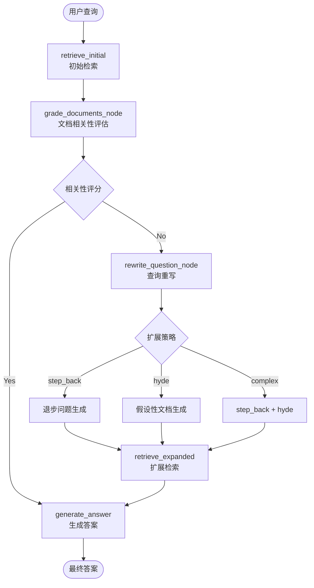
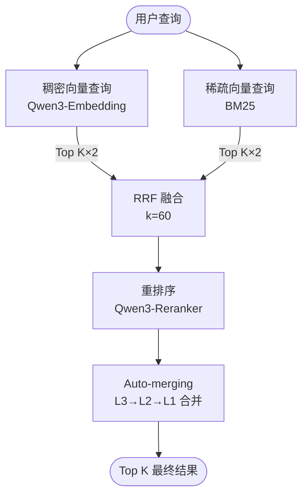
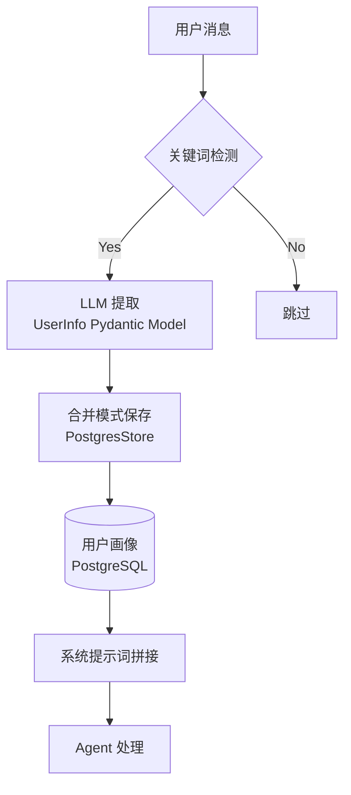
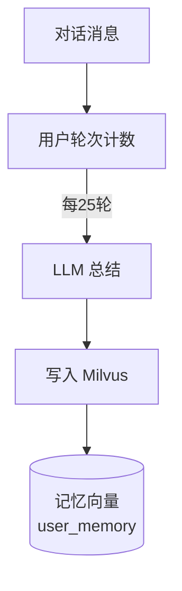
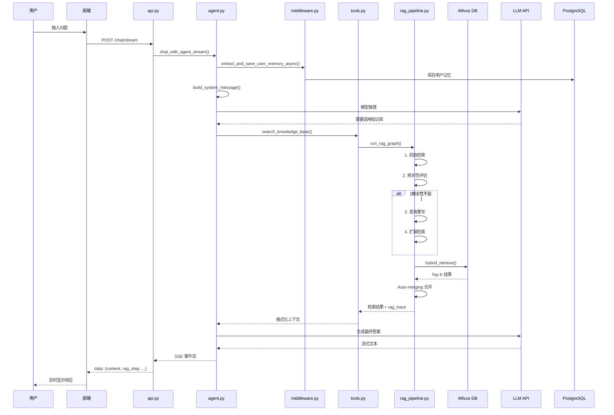
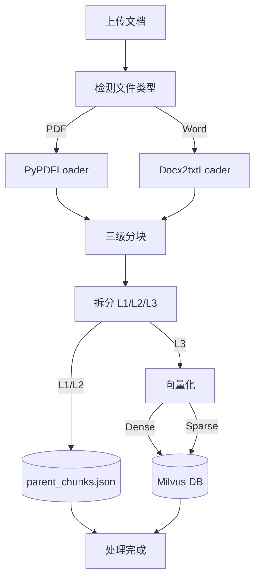

# SuperMew 系统架构文档

## 版本信息

- **文档版本**: v3.0
- **生成日期**: 2026-03-24
- **项目版本**: 0.1.4

---

## 1. 系统概述

### 1.1 项目简介

SuperMew 是一个基于 **FastAPI + LangChain + LangGraph + Milvus** 构建的智能客服助手系统，集成了先进的 **RAG (Retrieval-Augmented Generation)** 技术和 Agent 记忆管理系统，支持混合向量检索、自动文档合并、流式对话输出和用户记忆持久化。

### 1.2 核心能力

- 💬 **智能对话**: 基于大语言模型的自然语言交互（Qwen3.5-122B-A10B）
- 📚 **知识库检索**: 混合检索 (Dense + Sparse + RRF) + Qwen3-Reranker 重排序
- 📄 **文档处理**: 支持 PDF/Word 文档的三级智能分块和向量化
- 🔄 **Auto-merging**: 自动合并相关检索片段（L3→L2→L1），提升上下文完整性
- 🌊 **流式输出**: 实时流式响应 (SSE)，支持 RAG 步骤可视化追踪
- 💾 **会话记忆**: PostgresSaver checkpointer 持久化会话历史
- 🧠 **用户记忆**: LLM 自动提取用户信息并持久化到 PostgreSQL Store
- 🔍 **查询扩展**: Step-back Question + HyDE 假设性文档双重策略

---

## 2. 技术栈

### 2.1 后端技术栈

| 层级 | 技术 | 版本 | 用途 |
|------|------|------|------|
| Web 框架 | FastAPI | ≥0.115.0 | REST API 服务 |
| Agent 框架 | LangChain | ≥0.3 | Agent 构建和工具调用 |
| 工作流引擎 | LangGraph | ≥0.2.31 | RAG 管道编排 |
| 状态持久化 | langgraph-checkpoint-postgres | ≥0.1.0 | 会话状态持久化 |
| 长期记忆 | langchain-postgres | ≥0.0.17 | 用户记忆存储 |
| 向量数据库 | Milvus | 2.5+ | 混合向量存储和检索 |
| 嵌入模型 | Qwen3-Embedding-4B | - | 稠密向量生成 |
| 重排序模型 | Qwen3-Reranker-4B | - | 检索结果重排序 |
| LLM | Qwen3.5-122B-A10B | - | 主模型推理 |
| 数据验证 | Pydantic | ≥2.8.0 | 数据模型定义 |
| 文档解析 | PyPDFLoader, Docx2txt | - | PDF/Word 解析 |

### 2.2 前端技术栈

| 技术 | 用途 |
|------|------|
| 原生 HTML/CSS/JS + Vue | 轻量级单页应用 |
| Marked.js | Markdown 渲染 |
| Highlight.js | 代码高亮 |
| SSE | 服务器推送事件 (流式输出) |

### 2.3 基础设施

| 组件 | 用途 |
|------|------|
| Docker Compose | PostgreSQL + Milvus 容器编排 |
| python-dotenv | 环境变量管理 |
| uvicorn | ASGI 服务器 |
| psycopg | PostgreSQL 驱动 |

---

## 3. 系统架构图

### 3.1 整体架构


### 3.2 RAG 管道架构



### 3.3 文档处理流程


### 3.4 混合检索架构



### 3.5 用户记忆系统架构



### 3.6 对话摘要流程



---

## 4. 核心模块分析

### 4.1 API 层 (`api.py`)

**职责**: HTTP 接口定义和请求处理

**主要端点**:

| 端点 | 方法 | 功能 |
|------|------|------|
| `/chat` | POST | 非流式对话 |
| `/chat/stream` | POST | 流式对话 (SSE) |
| `/sessions/{user_id}` | GET | 获取用户会话列表 |
| `/sessions/{user_id}/{session_id}` | GET | 获取会话消息 |
| `/sessions/{user_id}/{session_id}` | DELETE | 删除会话 |
| `/documents` | GET | 文档列表 |
| `/documents/upload` | POST | 上传文档 |
| `/documents/{filename}` | DELETE | 删除文档 |

**设计模式**:
- RESTful API 设计
- Pydantic 请求/响应模型验证
- SSE (Server-Sent Events) 实现流式输出

### 4.2 Agent 核心 (`agent.py`)

**职责**: LangChain Agent 创建和对话管理

**关键组件**:

```python
checkpointer = PostgresSaver(conn)
checkpointer.setup()

store = PostgresStore.from_conn_string(conn_string)
store.setup()

storage = ConversationStorage()
```

**Agent 配置**:
- 模型: Qwen/Qwen3.5-122B-A10B (SiliconFlow)
- 工具: `get_current_weather`, `search_knowledge_base`, `search_memory`
- 系统提示: `backend/soul/soul.md` + 用户记忆
- 摘要中间件: Token 超过 8000 时触发摘要，保留最近 12 条消息
- 记忆中间件: `memory_summary_hook` - 周期性总结对话历史

### 4.3 RAG 管道 (`rag_pipeline.py`)

**职责**: 基于 LangGraph 的检索增强生成工作流

**状态定义** (`RAGState`):
```python
class RAGState(TypedDict):
    question: str
    query: str
    context: str
    docs: List[dict]
    route: Optional[str]
    expansion_type: Optional[str]
    expanded_query: Optional[str]
    step_back_question: Optional[str]
    step_back_answer: Optional[str]
    hypothetical_doc: Optional[str]
    rag_trace: Optional[dict]
```

**工作流节点**:
1. `retrieve_initial`: 初始检索（L3 叶子层，top_k=5×3=15 候选）
2. `grade_documents_node`: 文档相关性评估
3. `rewrite_question_node`: 查询重写和扩展（step_back/hyde/complex）
4. `retrieve_expanded`: 使用扩展查询重新检索

### 4.4 检索工具 (`rag_utils.py`)

**职责**: 混合检索和文档处理

**混合检索流程**:
1. 生成稠密向量 (Qwen3-Embedding) + 稀疏向量 (BM25)
2. 并行执行两种检索 (AnnSearchRequest)
3. RRF 融合结果 (k=60)
4. 可选重排序 (Qwen3-Reranker)
5. Auto-merging 合并父子块

**Auto-merging 机制**:
- 两段自动合并：L3→L2，再 L2→L1
- threshold=2: 连续 2 个以上子块则合并到父块

### 4.5 向量服务 (`embedding.py`)

**职责**: 文本向量化和 BM25 计算

| 向量类型 | 维度 | 用途 | 算法 |
|---------|------|------|------|
| 稠密向量 | 2560 | 语义相似性 | Qwen3-Embedding-4B API |
| 稀疏向量 | 动态 | 关键词匹配 | BM25 |

**BM25 参数**:
- `k1 = 1.5`: 词频饱和参数
- `b = 0.75`: 文档长度归一化参数

### 4.6 Milvus 客户端 (`milvus_client.py`)

**职责**: 向量数据库操作

**集合 Schema**:
```python
{
    "id": INT64,                    # 主键 (auto_id)
    "dense_embedding": FLOAT_VECTOR[2560],
    "sparse_embedding": SPARSE_FLOAT_VECTOR,
    "text": VARCHAR[2000],
    "filename": VARCHAR[255],
    "file_type": VARCHAR[50],
    "page_number": INT64,
    "chunk_idx": INT64,
    "chunk_id": VARCHAR[512],
    "parent_chunk_id": VARCHAR[512],
    "root_chunk_id": VARCHAR[512],
    "chunk_level": INT64,
}
```

**索引配置**:
- Dense: HNSW (M=16, efConstruction=256, metric=IP)
- Sparse: SPARSE_INVERTED_INDEX (drop_ratio_build=0.2, metric=IP)

### 4.7 文档加载器 (`document_loader.py`)

**职责**: PDF/Word 文档解析和三级分块

**三级滑动窗口**:

| 层级 | 块大小 | 重叠 | 存储位置 |
|------|--------|------|----------|
| L1 父块 | 1200+ chars | 240+ chars | parent_chunks.json |
| L2 中块 | 600 chars | 120 chars | parent_chunks.json |
| L3 叶子块 | 300 chars | 60 chars | Milvus DB |

### 4.8 工具集 (`tools.py`)

**职责**: Agent 可调用的外部工具

| 工具 | 功能 |
|------|------|
| `get_current_weather` | 天气查询 (高德地图 API) |
| `search_knowledge_base` | 知识库检索 (RAG Pipeline) |
| `search_memory` | 记忆向量检索 |
| `get_last_rag_context` | 获取最近 RAG 上下文 |

### 4.9 中间件 (`middleware.py`)

**职责**: Agent 中间件和用户记忆管理

**组件**:

| 组件 | 功能 |
|------|------|
| `UserMemoryManager` | LLM 提取用户信息并存入 PostgresStore |
| `memory_summary_hook` | 每25轮总结对话并写入 Milvus |
| `system_prompt_middleware` | 动态拼接系统提示词 (soul.md + 用户画像) |

**用户信息提取字段**:
- `name`, `school`, `major`, `grade`
- `identity`, `relationship`, `interest`, `location`, `other`

### 4.10 记忆向量存储 (`memory_vector_store.py`)

**职责**: 管理 user_memory collection

**特点**:
- 混合检索支持 (稠密 + 稀疏 + RRF)
- 用于存储对话摘要和用户记忆

### 4.11 前端 (`frontend/`)

**职责**: 用户界面和交互逻辑

**核心功能**:
1. 流式对话处理 (SSE)
2. 会话管理 (localStorage 持久化)
3. Markdown 渲染 (Marked.js + Highlight.js)
4. 文档上传和管理

---

## 5. 数据流分析

### 5.1 对话请求流程



### 5.2 文档上传流程



---

## 6. API 详细文档

### 6.1 聊天接口

#### POST `/chat`

非流式对话接口

**请求**:
```json
{
    "message": "用户问题",
    "user_id": "user_123",
    "session_id": "session_456"
}
```

**响应**:
```json
{
    "response": "AI 回复内容",
    "rag_trace": {
        "tool_used": true,
        "tool_name": "search_knowledge_base",
        "query": "用户问题",
        "retrieved_chunks": [...]
    }
}
```

#### POST `/chat/stream`

流式对话接口 (SSE)

**请求**: 同 `/chat`

**响应格式**:
```
data: {"type": "content", "content": "部分文本"}
data: {"type": "rag_step", "step": {"icon": "🔍", "label": "检索中..."}}
data: {"type": "trace", "rag_trace": {...}}
data: {"type": "error", "content": "错误信息"}
data: [DONE]
```

### 6.2 会话管理

#### GET `/sessions/{user_id}`

获取用户所有会话

#### GET `/sessions/{user_id}/{session_id}`

获取指定会话消息

#### DELETE `/sessions/{user_id}/{session_id}`

删除指定会话

### 6.3 文档管理

#### GET `/documents`

获取文档列表

#### POST `/documents/upload`

上传文档 (multipart/form-data)

#### DELETE `/documents/{filename}`

删除文档

---

## 7. 配置管理

### 7.1 环境变量 (`.env`)

```bash
# ===== API 配置 =====
API_KEY=your_api_key_here
BASE_URL=https://api.siliconflow.cn/v1

# ===== 模型配置 =====
MODEL=Qwen/Qwen3.5-122B-A10B
EMBEDDER=Qwen/Qwen3-Embedding-4B
RERANK_MODEL=Qwen/Qwen3-Reranker-4B
GRADE_MODEL=Qwen/Qwen3.5-122B-A10B

# ===== Milvus =====
MILVUS_HOST=127.0.0.1
MILVUS_PORT=19530
MILVUS_COLLECTION=embeddings_collection

# ===== Auto-merging =====
AUTO_MERGE_ENABLED=true
AUTO_MERGE_THRESHOLD=2
LEAF_RETRIEVE_LEVEL=3

# ===== PostgreSQL =====
POSTGRES_HOST=127.0.0.1
POSTGRES_PORT=5433
POSTGRES_USER=supermew
POSTGRES_PASSWORD=supermew123
POSTGRES_DB=supermew

# ===== 记忆向量库 =====
MEMORY_COLLECTION_NAME=user_memory
MEMORY_TOP_K=5
MEMORY_RECALL_LIMIT=3
MEMORY_TOKEN_LIMIT=500
MEMORY_REBUILD_HOUR=3
```

---

## 8. 部署架构

### 8.1 开发环境

```bash
# 1. 安装依赖
uv sync

# 2. 启动 PostgreSQL + Milvus
docker compose up -d

# 3. 启动后端
uv run uvicorn backend.app:app --host 127.0.0.1 --port 8000 --reload

# 4. 访问
# 前端: http://127.0.0.1:8000/
# API 文档: http://127.0.0.1:8000/docs
```

### 8.2 Docker Compose 服务

| 服务 | 端口 | 用途 |
|------|------|------|
| postgres | 5433 | PostgreSQL 数据库 |
| etcd | 2379 | Milvus 元数据存储 |
| minio | 9000/9001 | 对象存储 |
| milvus | 19530 | 向量数据库 |
| attu | 8080 | Milvus 管理界面 |

---

## 9. 目录结构

```
SuperMew/
├── backend/
│   ├── __init__.py
│   ├── app.py                   # FastAPI 应用入口
│   ├── api.py                   # API 路由定义
│   ├── agent.py                 # LangChain Agent 核心
│   ├── config.py                # 配置管理
│   ├── schemas.py               # Pydantic 数据模型
│   ├── tools.py                 # Agent 工具集
│   ├── middleware.py             # 记忆中间件
│   ├── soul/
│   │   └── soul.md              # Agent 系统提示词
│   ├── rag_pipeline.py          # LangGraph RAG 工作流
│   ├── rag_utils.py             # 检索工具函数
│   ├── embedding.py             # 稠密 + BM25 向量化
│   ├── milvus_client.py         # Milvus 客户端
│   ├── milvus_writer.py         # 向量写入器
│   ├── document_loader.py       # 文档解析和分块
│   ├── parent_chunk_store.py    # 父级分块存储
│   ├── memory_vector_store.py   # 记忆向量存储
│   └── migrate_to_checkpointer.py
├── frontend/
│   ├── index.html
│   ├── script.js
│   └── style.css
├── data/
│   ├── documents/
│   ├── parent_chunks.json
│   └── customer_service_history.json
├── docs/
│   ├── superpowers/
│   │   ├── plans/
│   │   └── specs/
├── langchain-study/             # 学习示例
├── docker-compose.yml
├── pyproject.toml
└── CLAUDE.md
```

---

## 10. 故障排查

### 10.1 常见问题

| 问题 | 可能原因 | 解决方案 |
|------|---------|---------|
| 检索结果为空 | Milvus 集合未初始化 | 调用 `init_collection()` |
| 会话历史丢失 | PostgreSQL 连接失败 | 检查 POSTGRES_* 配置 |
| 文档上传失败 | 文件类型不支持 | 仅支持 .pdf, .docx, .doc |
| 流式响应中断 | 网络超时 | 检查 LLM API 可用性 |
| 429 限流错误 | 上游 API 限流 | 降低请求频率或升级配额 |

### 10.2 调试日志

| 模块 | 日志前缀 |
|------|---------|
| Agent 调用 | `[get_session]` |
| 用户记忆 | `[UserMemory]` |
| RAG 管道 | `emit_rag_step()` |
| 中间件状态 | `[memory_summary_hook]` |

---

## 11. 更新日志

| 日期 | 版本 | 更新内容 |
|------|------|---------|
| 2026-03-24 | v3.0 | 完善架构图，更新模块分析 |
| 2026-03-22 | v2.0 | 添加 RAG 管道和混合检索架构 |
| 2026-03-20 | v1.0 | 初始版本 |
