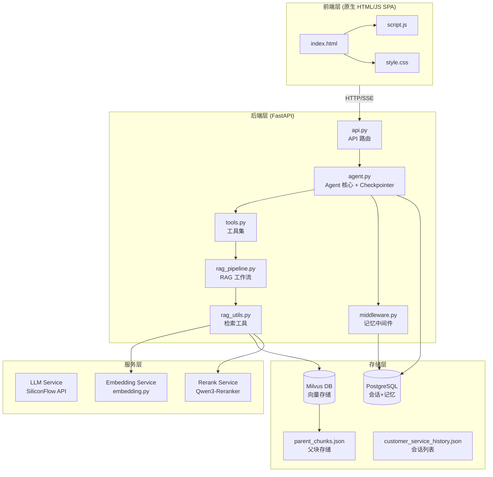
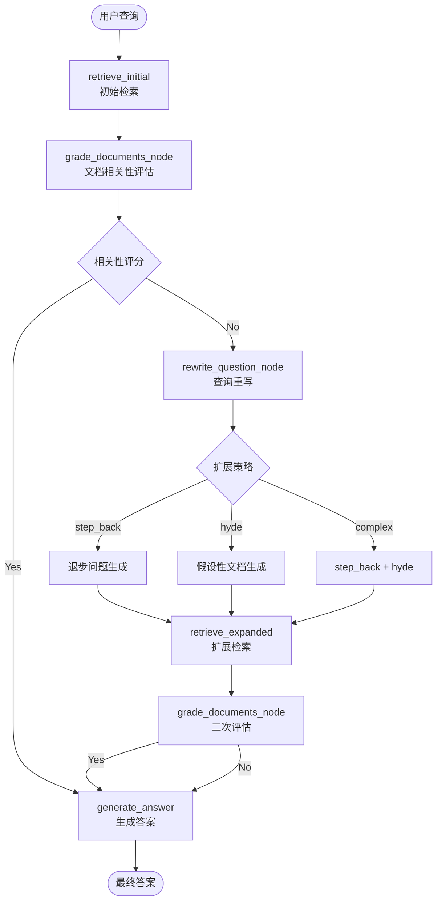
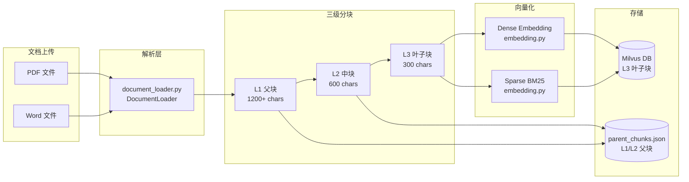
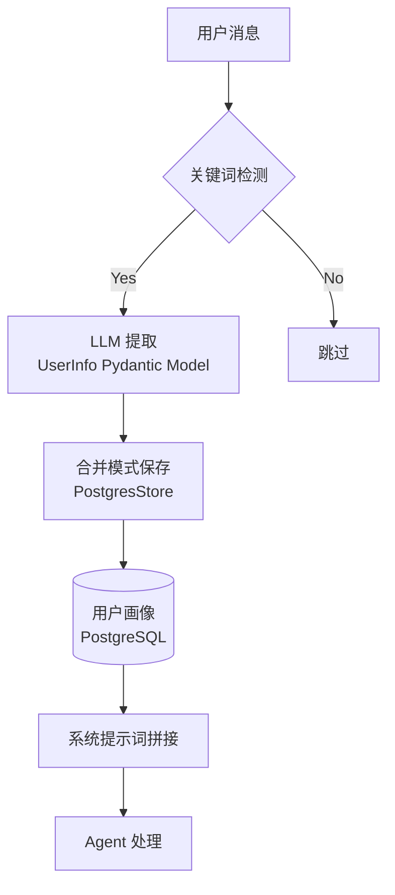
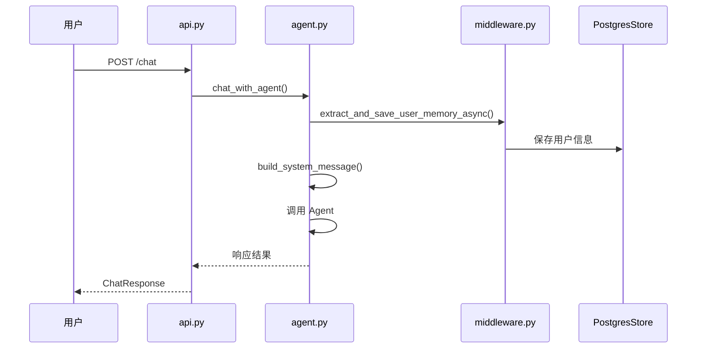
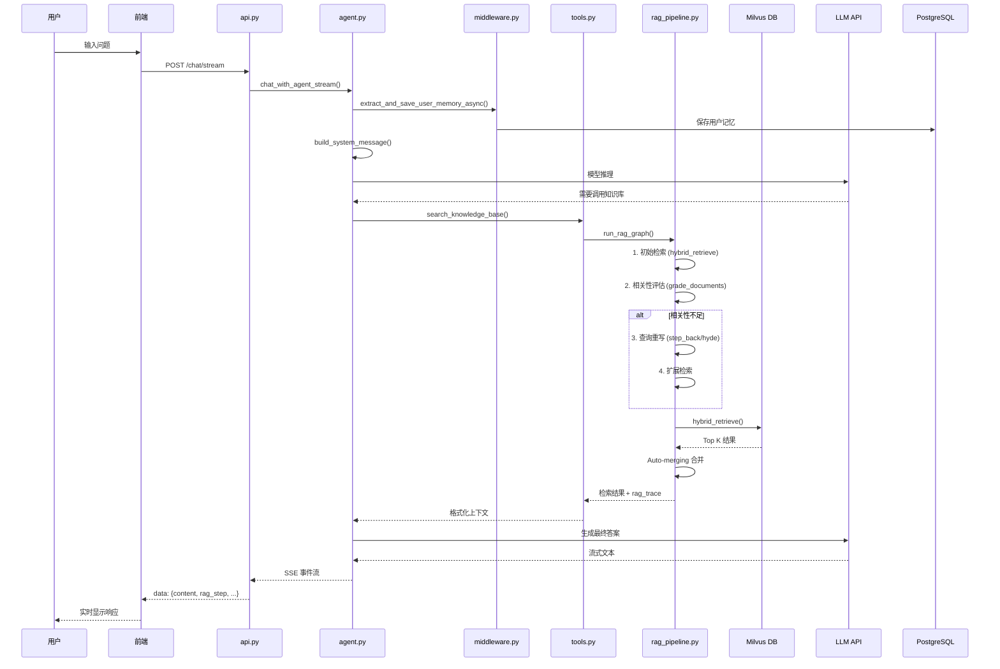
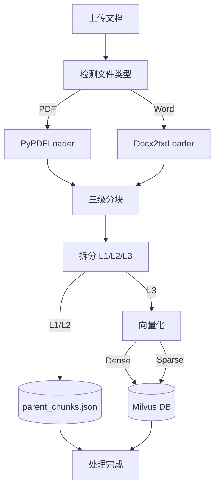

# SuperMew 系统架构文档

## 版本信息

- **文档版本**: v2.0
- **生成日期**: 2026-03-22
- **项目版本**: 0.1.0

---

## 1. 系统概述

### 1.1 项目简介

SuperMew 是一个基于 **FastAPI + LangChain + LangGraph + Milvus** 构建的智能客服助手系统，集成了先进的 **RAG (Retrieval-Augmented Generation)** 技术和 Agent 记忆管理系统，支持混合向量检索、自动文档合并、流式对话输出和用户记忆持久化。

### 1.2 核心能力

- 💬 **智能对话**: 基于大语言模型的自然语言交互（Qwen3.5-122B-A10B）
- 📚 **知识库检索**: 混合检索 (Dense + Sparse + RRF) + Jina 重排序
- 📄 **文档处理**: 支持 PDF/Word 文档的三级智能分块和向量化
- 🔄 **Auto-merging**: 自动合并相关检索片段（L3→L2→L1），提升上下文完整性
- 🌊 **流式输出**: 实时流式响应 (SSE)，支持 RAG 步骤可视化追踪
- 💾 **会话记忆**: PostgresSaver checkpointer 持久化会话历史
- 🧠 **用户记忆**: LLM 自动提取用户信息并持久化到 PostgreSQL Store
- 🔍 **查询扩展**: Step-back Question + HyDE 假设性文档双重策略

---

## 2. 技术栈

### 2.1 后端技术栈

| 层级 | 技术 | 版本 | 用途 |
|------|------|------|------|
| Web 框架 | FastAPI | ≥0.115.0 | REST API 服务 |
| Agent 框架 | LangChain | ≥0.3 | Agent 构建和工具调用 |
| 工作流引擎 | LangGraph | ≥0.2.31 | RAG 管道编排 |
| 状态持久化 | langgraph-checkpoint-postgres | ≥0.1.0 | 会话状态持久化 |
| 长期记忆 | langchain-postgres | ≥0.0.17 | 用户记忆存储 |
| 向量数据库 | Milvus | 2.5+ | 混合向量存储和检索 |
| 嵌入模型 | Qwen3-Embedding-4B | - | 稠密向量生成 |
| 重排序模型 | Qwen3-Reranker-4B | - | 检索结果重排序 |
| LLM | Qwen3.5-122B-A10B | - | 主模型推理 |
| 数据验证 | Pydantic | ≥2.8.0 | 数据模型定义 |
| 文档解析 | PyPDFLoader, Docx2txt | - | PDF/Word 解析 |

### 2.2 前端技术栈

| 技术 | 用途 |
|------|------|
| 原生 HTML/CSS/JS | 轻量级单页应用 |
| Marked.js | Markdown 渲染 |
| Highlight.js | 代码高亮 |
| SSE | 服务器推送事件 (流式输出) |

### 2.3 基础设施

| 组件 | 用途 |
|------|------|
| Docker Compose | PostgreSQL + Milvus 容器编排 |
| python-dotenv | 环境变量管理 |
| uvicorn | ASGI 服务器 |
| psycopg | PostgreSQL 驱动 |

---

## 3. 系统架构图

### 3.1 整体架构



### 3.2 RAG 管道架构



### 3.3 文档处理流程



### 3.4 混合检索架构


### 3.5 用户记忆系统架构



---

## 4. 核心模块分析

### 4.1 API 层 (`api.py`)

**职责**: HTTP 接口定义和请求处理

**主要端点**:

| 端点 | 方法 | 功能 |
|------|------|------|
| `/chat` | POST | 非流式对话 |
| `/chat/stream` | POST | 流式对话 (SSE) |
| `/sessions/{user_id}` | GET | 获取用户会话列表 |
| `/sessions/{user_id}/{session_id}` | GET | 获取会话消息 |
| `/sessions/{user_id}/{session_id}` | DELETE | 删除会话 |
| `/documents` | GET | 文档列表 |
| `/documents/upload` | POST | 上传文档 |
| `/documents/{filename}` | DELETE | 删除文档 |

**设计模式**:
- RESTful API 设计
- Pydantic 请求/响应模型验证
- SSE (Server-Sent Events) 实现流式输出

### 4.2 Agent 核心 (`agent.py`)

**职责**: LangChain Agent 创建和对话管理

**关键组件**:

```python
# PostgresSaver Checkpointer - 会话状态持久化
checkpointer = PostgresSaver(conn)
checkpointer.setup()

# PostgresStore - 长期记忆存储
store = PostgresStore.from_conn_string(conn_string)
store.setup()

# ConversationStorage - 会话列表元数据管理
storage = ConversationStorage()
```

**Agent 配置**:
- 模型: Qwen/Qwen3.5-122B-A10B (SiliconFlow)
- 工具: `get_current_weather`, `search_knowledge_base`
- 系统提示: `backend/soul/soul.md` + 用户记忆
- 摘要中间件: Token 超过 80000 时触发摘要，保留最近 12 条消息
- 记忆中间件: `memory_summary_middleware` - 周期性总结对话历史

**对话流程**:


### 4.3 RAG 管道 (`rag_pipeline.py`)

**职责**: 基于 LangGraph 的检索增强生成工作流

**状态定义** (`RAGState`):
```python
class RAGState(TypedDict):
    question: str              # 原始问题
    query: str                 # 检索查询
    context: str               # 格式化上下文
    docs: List[dict]           # 检索文档
    route: Optional[str]       # 路由决策
    expansion_type: Optional[str]  # 扩展策略 (step_back/hyde/complex)
    expanded_query: Optional[str]  # 扩展后查询
    step_back_question: Optional[str]  # 退步问题
    step_back_answer: Optional[str]   # 退步答案
    hypothetical_doc: Optional[str]    # HyDE 假设文档
    rag_trace: Optional[dict]         # 追踪信息
```

**工作流节点**:
1. `retrieve_initial`: 初始检索（L3 叶子层，top_k=5×3=15 候选）
2. `grade_documents_node`: 文档相关性评估（Grader Model）
3. `rewrite_question_node`: 查询重写和扩展（step_back/hyde/complex）
4. `retrieve_expanded`: 使用扩展查询重新检索
5. `generate_answer`: 答案生成

**Grader Prompt**:
```
You are a grader assessing relevance of a retrieved document to a user question.
If the document contains keyword(s) or semantic meaning related to the user question,
grade it as relevant. Give a binary score 'yes' or 'no'.
```

### 4.4 检索工具 (`rag_utils.py`)

**职责**: 混合检索和文档处理

#### 4.4.1 混合检索 (`hybrid_retrieve`)
```python
def hybrid_retrieve(query: str, top_k: int = 5) -> dict:
    # 1. 生成稠密向量 (Qwen3-Embedding) + 稀疏向量 (BM25)
    # 2. 并行执行两种检索 (AnnSearchRequest)
    # 3. RRF 融合结果 (k=60)
    # 4. 可选重排序 (Qwen3-Reranker)
    # 5. Auto-merging 合并父子块
```

#### 4.4.2 Auto-merging 机制
```python
def _auto_merge_documents(docs: List[dict], top_k: int) -> Tuple[List[dict], dict]:
    # 两段自动合并：L3->L2，再 L2->L1
    # threshold=2: 连续 2 个以上子块则合并到父块
    merged_docs, steps = _merge_to_parent_level(docs, threshold=2)
```

#### 4.4.3 查询扩展
- **Step-back**: 生成退步问题，理解通用原理
- **HyDE**: 生成假设性文档，用于检索
- **Complex**: 同时使用 step_back + hyde

### 4.5 向量服务 (`embedding.py`)

**职责**: 文本向量化和 BM25 计算

**双向量策略**:

| 向量类型 | 维度 | 用途 | 算法 |
|---------|------|------|------|
| 稠密向量 | 2560 | 语义相似性 | Qwen3-Embedding-4B API |
| 稀疏向量 | 动态 | 关键词匹配 | BM25 |

**BM25 参数**:
- `k1 = 1.5`: 词频饱和参数
- `b = 0.75`: 文档长度归一化参数

### 4.6 Milvus 客户端 (`milvus_client.py`)

**职责**: 向量数据库操作

**集合 Schema**:
```python
{
    "id": INT64,                    # 主键 (auto_id)
    "dense_embedding": FLOAT_VECTOR[2560],  # 稠密向量
    "sparse_embedding": SPARSE_FLOAT_VECTOR,  # BM25 稀疏向量
    "text": VARCHAR[2000],          # 原始文本
    "filename": VARCHAR[255],      # 文件名
    "file_type": VARCHAR[50],      # 文件类型
    "page_number": INT64,           # 页码
    "chunk_idx": INT64,            # 块索引
    "chunk_id": VARCHAR[512],      # 块 ID (格式: filename::p{n}::l{level}::{idx})
    "parent_chunk_id": VARCHAR[512],  # 父块 ID
    "root_chunk_id": VARCHAR[512],   # 根块 ID
    "chunk_level": INT64,           # 层级 (1/2/3)
}
```

**索引配置**:
- Dense: HNSW (M=16, efConstruction=256, metric=IP)
- Sparse: SPARSE_INVERTED_INDEX (drop_ratio_build=0.2, metric=IP)

**混合检索参数**:
- `ef=64`: 密集向量搜索参数
- `drop_ratio_search=0.2`: 稀疏向量搜索参数
- `rrf_k=60`: RRF 融合参数

### 4.7 文档加载器 (`document_loader.py`)

**职责**: PDF/Word 文档解析和三级分块

**三级滑动窗口**:

| 层级 | 块大小 | 重叠 | 存储位置 |
|------|--------|------|----------|
| L1 父块 | 1200+ chars | 240+ chars | parent_chunks.json |
| L2 中块 | 600 chars | 120 chars | parent_chunks.json |
| L3 叶子块 | 300 chars | 60 chars | Milvus DB |

**分块标识格式**:
```python
chunk_id = "{filename}::p{page_number}::l{level}::{index}"
# 示例: "document.pdf::p1::l3::5"
```

**存储策略**:
- L1/L2: 写入 `parent_chunks.json` (用于 Auto-merging 合并)
- L3: 写入 Milvus (用于检索)

### 4.8 工具集 (`tools.py`)

**职责**: Agent 可调用的外部工具

| 工具 | 功能 | 数据源 |
|------|------|--------|
| `get_current_weather` | 天气查询 | 高德地图 API |
| `search_knowledge_base` | 知识库检索 | RAG Pipeline |

**RAG 步骤推送机制**:
```python
def emit_rag_step(icon: str, label: str, detail: str):
    """跨线程安全地推送 RAG 步骤到 SSE 队列"""
    # 使用 call_soon_threadsafe 确保线程安全
```

**工具调用限制**:
- 每轮对话最多调用 1 次 `search_knowledge_base`
- 达到限制后返回提示信息，不再重复调用

### 4.9 中间件 (`middleware.py`)

**职责**: Agent 中间件和用户记忆管理

#### 4.9.1 用户记忆管理系统

```python
class UserMemoryManager:
    """使用 LLM 提取并存储到 PostgresStore"""

    def extract_from_text(self, text: str) -> Optional[UserInfo]:
        """从用户消息中提取结构化信息"""

    def save_user_info(self, user_info: UserInfo) -> bool:
        """保存用户信息（合并模式，保留已有值）"""

    def load_user_info(self) -> dict:
        """从 Store 加载用户信息"""

    def format_for_system_prompt(self) -> str:
        """格式化用户信息为系统提示词字符串"""
```

**提取字段**:
- `name`: 名字/昵称
- `school`: 学校或公司
- `major`: 专业或工作领域
- `grade`: 年级
- `identity`: 身份（学生/工程师等）
- `relationship`: 重要关系及对方名字
- `interest`: 兴趣爱好
- `location`: 所在地
- `other`: 其他重要信息

**关键词触发检测**:
```python
def should_extract_memory(text: str) -> bool:
    # 检测是否包含至少 2 个关键词
    keywords = ['我叫', '学校', '专业', '学生', '女朋友', '男朋友', '喜欢', ...]
```

#### 4.9.2 记忆总结中间件

```python
class MemorySummaryMiddleware(AgentMiddleware):
    """每隔指定轮次对对话历史进行总结"""

    # 每 25 轮触发一次总结
    # 总结存入 PostgresStore 作为长期记忆
```

### 4.10 前端 (`frontend/`)

**职责**: 用户界面和交互逻辑

**核心功能**:

1. **流式对话处理**
   ```javascript
   // SSE 事件类型
   - content: 文本片段
   - rag_step: RAG 步骤更新
   - trace: RAG 追踪信息
   - error: 错误信息
   ```

2. **会话管理**
   - 用户/会话 ID 生成和持久化 (localStorage)
   - 历史消息加载和展示

3. **Markdown 渲染**
   - Marked.js 解析
   - Highlight.js 代码高亮

4. **文档管理**
   - PDF/Word 文件上传
   - 上传进度显示

---

## 5. 数据流分析

### 5.1 对话请求流程



### 5.2 文档上传流程



---

## 6. API 详细文档

### 6.1 聊天接口

#### POST `/chat`

非流式对话接口

**请求**:
```json
{
    "message": "用户问题",
    "user_id": "user_123",
    "session_id": "session_456"
}
```

**响应**:
```json
{
    "response": "AI 回复内容",
    "rag_trace": {
        "tool_used": true,
        "tool_name": "search_knowledge_base",
        "query": "用户问题",
        "retrieved_chunks": [...]
    }
}
```

#### POST `/chat/stream`

流式对话接口 (SSE)

**请求**: 同 `/chat`

**响应格式**:
```
data: {"type": "content", "content": "部分文本"}
data: {"type": "rag_step", "step": {"icon": "🔍", "label": "检索中..."}}
data: {"type": "trace", "rag_trace": {...}}
data: {"type": "error", "content": "错误信息"}
data: [DONE]
```

### 6.2 会话管理

#### GET `/sessions/{user_id}`

获取用户所有会话

**响应**:
```json
{
    "sessions": [
        {
            "session_id": "session_1",
            "updated_at": "2026-03-20T10:00:00",
            "message_count": 10
        }
    ]
}
```

#### GET `/sessions/{user_id}/{session_id}`

获取指定会话消息

**响应**:
```json
{
    "messages": [
        {
            "type": "human",
            "content": "用户消息",
            "timestamp": "2026-03-20T10:00:00",
            "rag_trace": null
        },
        {
            "type": "ai",
            "content": "AI回复",
            "timestamp": "2026-03-20T10:00:01",
            "rag_trace": {...}
        }
    ]
}
```

#### DELETE `/sessions/{user_id}/{session_id}`

删除指定会话

**响应**:
```json
{
    "session_id": "session_1",
    "message": "成功删除会话"
}
```

### 6.3 文档管理

#### POST `/documents/upload`

上传文档

**请求**: `multipart/form-data`
- `file`: PDF 或 Word 文件

**响应**:
```json
{
    "filename": "document.pdf",
    "chunks_processed": 150,
    "message": "成功上传并处理 document.pdf，叶子分块 150 个，父级分块 45 个"
}
```

#### GET `/documents`

获取文档列表

**响应**:
```json
{
    "documents": [
        {
            "filename": "product_manual.pdf",
            "file_type": "PDF",
            "chunk_count": 150
        }
    ]
}
```

#### DELETE `/documents/{filename}`

删除文档

**响应**:
```json
{
    "filename": "document.pdf",
    "chunks_deleted": 150,
    "message": "成功删除文档 document.pdf 的向量数据"
}
```

---

## 7. 配置管理

### 7.1 环境变量 (`.env`)

```bash
# ===== API 配置 =====
API_KEY=your_api_key_here
BASE_URL=https://api.siliconflow.cn/v1

# ===== 模型配置 =====
MODEL=Qwen/Qwen3.5-122B-A10B
EMBEDDER=Qwen/Qwen3-Embedding-4B
RERANK_MODEL=Qwen/Qwen3-Reranker-4B
GRADE_MODEL=Qwen/Qwen3.5-122B-A10B

# ===== Milvus =====
MILVUS_HOST=127.0.0.1
MILVUS_PORT=19530
MILVUS_COLLECTION=embeddings_collection

# ===== Auto-merging =====
AUTO_MERGE_ENABLED=true
AUTO_MERGE_THRESHOLD=2
LEAF_RETRIEVE_LEVEL=3

# ===== 天气服务 =====
AMAP_WEATHER_API=https://restapi.amap.com/v3/weather
AMAP_API_KEY=your_amap_key

# ===== 服务器 =====
HOST=127.0.0.1
PORT=8000

# ===== PostgreSQL (checkpointer) =====
POSTGRES_HOST=127.0.0.1
POSTGRES_PORT=5433
POSTGRES_USER=supermew
POSTGRES_PASSWORD=supermew123
POSTGRES_DB=supermew
```

---

## 8. 部署架构

### 8.1 开发环境

```bash
# 1. 安装依赖
uv sync

# 2. 启动 PostgreSQL + Milvus
docker compose up -d

# 3. 启动后端
uv run uvicorn backend.app:app --host 127.0.0.1 --port 8000 --reload

# 4. 访问
# 前端: http://127.0.0.1:8000/
# API 文档: http://127.0.0.1:8000/docs
```

### 8.2 Docker Compose 配置

```yaml
# docker-compose.yml
services:
  postgres:
    image: postgres:16-alpine
    environment:
      POSTGRES_DB: supermew
      POSTGRES_USER: supermew
      POSTGRES_PASSWORD: supermew123
    ports:
      - "5433:5432"
    volumes:
      - ./volumes/postgres:/var/lib/postgresql/data

  etcd:
    image: quay.io/coreos/etcd:v3.5.18
    environment:
      - ETCD_AUTO_COMPACTION_MODE=revision
      - ETCD_AUTO_COMPACTION_RETENTION=1000
    volumes:
      - ./volumes/etcd:/etcd

  minio:
    image: minio/minio:RELEASE.2024-05-28T17-19-04Z
    environment:
      MINIO_ACCESS_KEY: minioadmin
      MINIO_SECRET_KEY: minioadmin
    ports:
      - "9001:9001"
      - "9000:9000"

  standalone:
    image: milvusdb/milvus:v2.5.14
    environment:
      ETCD_ENDPOINTS: etcd:2379
      MINIO_ADDRESS: minio:9000
    ports:
      - "19530:19530"
      - "9091:9091"
    depends_on:
      - etcd

  attu:
    image: zilliz/attu:v2.5.11
    environment:
      MILVUS_URL: standalone:19530
      PORT: 3000
    ports:
      - "8080:3000"
```

---

## 9. 目录结构

```
SuperMew/
├── backend/                     # FastAPI 后端
│   ├── __init__.py
│   ├── app.py                   # FastAPI 应用入口
│   ├── api.py                   # API 路由定义
│   ├── agent.py                 # LangChain Agent 核心
│   ├── config.py                # 配置管理
│   ├── schemas.py               # Pydantic 数据模型
│   ├── tools.py                 # Agent 工具集
│   ├── middleware.py             # 记忆中间件和用户记忆管理
│   ├── soul/
│   │   └── soul.md              # Agent 系统提示词
│   ├── rag_pipeline.py          # LangGraph RAG 工作流
│   ├── rag_utils.py             # 检索工具函数
│   ├── embedding.py             # 稠密 + BM25 向量化
│   ├── milvus_client.py         # Milvus 客户端
│   ├── milvus_writer.py         # 向量写入器
│   ├── document_loader.py       # 文档解析和分块
│   ├── parent_chunk_store.py     # 父级分块存储
│   └── migrate_to_checkpointer.py # 旧数据迁移脚本
├── frontend/                    # 原生 HTML/JS SPA
│   ├── index.html
│   ├── script.js
│   └── style.css
├── data/                       # 本地数据存储
│   ├── documents/              # 上传的文档
│   ├── parent_chunks.json      # 父级分块
│   └── customer_service_history.json  # 会话列表
├── docker-compose.yml          # PostgreSQL + Milvus + Attu
├── pyproject.toml              # Python 依赖
└── CLAUDE.md                   # 项目指南
```

---

## 10. 安全考虑

### 10.1 API 安全
- CORS 配置允许所有来源（生产环境应限制）
- 请求参数验证（Pydantic 模型）

### 10.2 数据安全
- PostgreSQL 密码硬编码在配置中（生产环境应使用环境变量或密钥管理）
- 文件上传仅支持 PDF 和 Word 格式

### 10.3 错误处理
- 429 限流错误特殊处理
- 401/403 认证错误透传
- 通用 500 错误返回

---

## 11. 性能优化

### 11.1 向量检索
- HNSW 索引加速密集向量检索
- 稀疏向量使用倒排索引
- RRF 融合时多取 2 倍结果保证召回

### 11.2 文档处理
- 批量写入 Milvus（batch_size=50）
- 异步保存用户记忆（后台线程）

### 11.3 中间件优化
- 摘要模型复用（单例模式）
- LLM 提取模型复用
- 关键词快速预检减少不必要的 LLM 调用

---

## 12. 故障排查

### 12.1 常见问题

| 问题 | 可能原因 | 解决方案 |
|------|---------|---------|
| 检索结果为空 | Milvus 集合未初始化 | 调用 `milvus_manager.init_collection()` |
| 会话历史丢失 | PostgreSQL 连接失败 | 检查 POSTGRES_* 配置 |
| 文档上传失败 | 文件类型不支持 | 仅支持 .pdf, .docx, .doc |
| 流式响应中断 | 网络超时 | 检查 LLM API 可用性 |

### 12.2 调试日志
- Agent 调用日志：`[get_session]`, `[UserMemory]`
- RAG 管道步骤：`emit_rag_step()` 输出
- 中间件状态：`memory_summary_middleware` 日志
